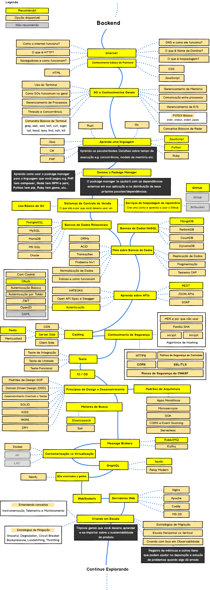

> # Semana de Estudos com o NestJS

> ## Links do portfólio no GitHub

> - [Portfólio](https://github.com/estevam5s/road-nestjs)
 

> ## Links do portfólio no Notion

> - [Portfólio](https://www.notion.so/estevam5s/Portf-lio-1c1e1b1b5c5a4b8e9b1c1b1b5c5a4b8e)

  

Aqui está um exemplo de rotina de estudos para o NestJS, começando às 06h30 da manhã e terminando às 17h00, com intervalos para refeições e descanso:

- Separar a rotina em blocos de 10 Minutos, com intervalos de 30 minutos para descanso e refeições.
- Lembre-se de que a rotina é apenas um guia, e você deve adaptá-la às suas necessidades.
- Lembre-se de que a rotina é apenas um guia, Deve-se adicionar ao Notion essa Rotina.
- Semana Normal de um Dev em Desenvolvimento

**Segunda-feira:**

---

 

> ### **05h00-08h30: Preparação pessoal e alongamento leve**
>
      > - Antes de começar o dia, é importante dedicar algum tempo para cuidar da saúde física e mental, com uma rotina matinal de alongamento e respiração.
      > - Café da manhã leve e cuidar do priminho
      > 
      > 5h: Acordar
            > 
            > - Comece o dia com uma respiração profunda e estique-se.
            > - Beba um copo grande de água para hidratar seu corpo.
      >
      > 5h15: Meditação
            > 
            > - Encontre um lugar tranquilo para meditar por pelo menos 10 minutos.
            > - Se você é novo na meditação, use aplicativos para ajudá-lo a guiá-lo.
      >
      > 5h30: Exercício
            >
            > - Reserve 30 minutos para fazer exercícios aeróbicos leves, como caminhar, correr ou andar de bicicleta.
            > - Também é uma boa ideia adicionar algum exercício de força, como levantamento de peso ou flexões.
      >
      > 6h: Banho e higiene pessoal
            >
            > - Tome um banho quente para ajudar a despertar seu corpo e sua mente.
            > - Escove os dentes, lave o rosto e arrume o cabelo.
      >
      > 6h30: Café da manhã saudável
            >
            > - Coma um café da manhã saudável e equilibrado, que inclua proteínas, carboidratos complexos e gorduras saudáveis.
            > - Algumas opções incluem ovos, aveia, iogurte grego, frutas e nozes.
      >
      > 7h: Planejamento do dia
            >
            > - Faça uma lista de tarefas para o dia, estabelecendo prioridades e metas.
            > - Verifique o calendário e programe compromissos importantes.
      > 
      > 7h30: Aprender algo novo
            >
            > - Reserve 30 minutos para aprender algo novo, como ler um livro, assistir a um tutorial ou ouvir um podcast.
      >
      > 8h: Hora de começar o trabalho ou estudo
            >
            > - Comece a trabalhar ou estudar, focando nas tarefas mais importantes e difíceis primeiro.
            > - Use técnicas de produtividade, como o Pomodoro, para maximizar o tempo e a eficiência.
            > - Essa é apenas uma sugestão de rotina, mas você pode personalizá-la de acordo com suas próprias necessidades e preferências. Lembre-se de manter um equilíbrio saudável entre trabalho, lazer e descanso.

 

> ### **08h30-09h00: Revisão do dia anterior e introdução ao NestJS**

      Nesta primeira parte da rotina, vamos nos concentrar em aprender os fundamentos do Nestjs. Começando com o que é o framework, a instalação e configuração, seguindo para os módulos, controladores e serviços.
      Pré-requisito: Conhecimento básico em Node.js, TypeScript e REST APIs.
      
      Introdução ao NestJS: O que é, por que usar e suas vantagens.

            O que é o Nestjs e por que usá-lo?
            Visão geral do framework e como ele funciona
            Recursos e benefícios do Nestjs
            Arquitetura de pastas do NestJS.
            Módulos, controladores e serviços no NestJS.
            Injeção de dependência.
            Middlewares.
            
      Fundamentos do Nestjs:

            Arquitetura do Nestjs
            Conceitos básicos do Nestjs, como Módulos, Controladores, Provedores, etc.
            Como usar o CLI do Nestjs

            Recursos úteis:

                  Aprenda Nestjs com exemplos: [aqui](https://wanago.io/courses/nestjs-fundamentals/) para ver o conteúdo.
                  Curso básico de Nestjs: https://www.youtube.com/watch?v=wqhNoDE6pb4

      Pré-requisito:

            Conhecimento prévio de programação em JavaScript.
            Conhecimento prévio de Node.js.
            Familiaridade com o terminal.
            Leitura do material de introdução ao NestJS

      Inspiração de como chegar ao próximo nível:

            Revisar conceitos de Nestjs
            Rever exemplos de código
            Realizar exercícios de fixação
            Revisão dos tópicos abordados no dia anterior
            Preparação para o estudo do dia
            Anotação de dúvidas e pontos a serem aprofundados
            Prepare o ambiente de estudo, verificando se todos os softwares necessários para a realização dos exercícios estão instalados corretamente.
            Revise conceitos básicos de programação e de Node.js.

      Recapitulação e revisão:

            Resumo dos tópicos abordados durante o dia
            Revisão de exemplos e exercícios

      Avançando nos fundamentos do NestJS:

            Criação de APIs com NestJS.
            Rotas no NestJS.
            Autenticação e autorização no NestJS.
            Manipulação de erros no NestJS.
      
      Recursos úteis:
            
            Site oficial do Nestjs: https://nestjs.com/
            Documentação oficial do Nestjs: https://docs.nestjs.com/
            Curso básico do Nestjs: https://www.udemy.com/course/nestjs-zero-to-hero/
            Fóruns da comunidade do Nestjs: https://community.nestjs.com/

 

> ### **09h00-09h20: Instalação e configuração do ambiente de desenvolvimento para NestJS**

      NestJS é um framework Node.js para construir aplicativos de back-end eficientes e escaláveis. Ele usa o poder do TypeScript (JavaScript que escala) e combina elementos de OOP (Programação Orientada a Objetos), FP (Programação Funcional) e FRP (Programação Funcional Reativa) para oferecer uma experiência de desenvolvimento incrível e uma arquitetura baseada em módulos.

      Instalando o NestJS e configurando o ambiente de desenvolvimento:

            - Instalando o Node.js
            - Instalando o NestJS
            - Instalando o TypeScript
            - Instalando o Visual Studio Code

      Pré-requisitos:

            Node.js (v14 ou superior)
            npm (gerenciador de pacotes para o Node.js)

      Instalação:

            Verifique se o Node.js está instalado no seu computador. Abra o terminal e execute o seguinte comando: node -v. Se o Node.js já estiver instalado, a versão será exibida no terminal. Caso contrário, faça o download da versão mais recente em https://nodejs.org/en/download/ e siga as instruções de instalação.

            Verifique se o npm está instalado no seu computador. Abra o terminal e execute o seguinte comando: npm -v. Se o npm já estiver instalado, a versão será exibida no terminal. Caso contrário, o npm vem junto com o Node.js, então você pode instalá-lo seguindo as instruções de instalação do Node.js.

            Instale o Nest CLI. O Nest CLI é uma ferramenta de linha de comando que facilita a criação de projetos NestJS e gera código de boilerplate. Para instalar o Nest CLI, abra o terminal e execute o seguinte comando: npm i -g @nestjs/cli. Isso instalará o Nest CLI globalmente no seu computador.

            Crie um novo projeto NestJS usando o Nest CLI. Para criar um novo projeto, abra o terminal na pasta onde deseja criar o projeto e execute o seguinte comando: nest new <nome-do-projeto>. Isso criará um novo projeto NestJS com a estrutura de arquivos e pastas padrão.

      Execução:

            Execute o servidor de desenvolvimento. Para iniciar o servidor de desenvolvimento, abra o terminal na pasta raiz do projeto e execute o seguinte comando: npm run start:dev. Isso iniciará o servidor de desenvolvimento e fará com que o NestJS assista a quaisquer alterações de código que você fizer e reinicie automaticamente o servidor.

            Acesse o servidor no navegador. Abra o navegador e digite http://localhost:3000 na barra de endereço. Isso deve exibir a página inicial do servidor NestJS.

      Tópicos complexos:

            Configuração do ambiente de produção. O NestJS é projetado para ser facilmente configurável para o ambiente de produção. Você pode configurar variáveis de ambiente, arquivos de configuração, loggers e outras ferramentas para otimizar o desempenho do seu servidor. Para configurar o ambiente de produção, consulte a documentação oficial do NestJS em https://docs.nestjs.com/techniques/performance.

            Uso de bancos de dados. O NestJS suporta vários bancos de dados, incluindo MongoDB, PostgreSQL, MySQL e SQLite. Você pode usar o Nest CLI para gerar código de boilerplate para conectar-se a um banco de dados específico, e a documentação oficial do NestJS oferece exemplos detalhados de como trabalhar com cada tipo de banco de dados.

 

> ### **09h20-09h30: Criação de um projeto básico em NestJS**

      Pré-requisitos:   
      Node.js (v14 ou superior)
      npm (gerenciador de pacotes para o Node.js)
      
      Criação do projeto:
      
            Instale o Nest CLI. O Nest CLI é uma ferramenta de linha de comando que facilita a criação de projetos NestJS e gera código de boilerplate. Para instalar o Nest CLI, abra o terminal e execute o seguinte comando: npm i -g @nestjs/cli. Isso instalará o Nest CLI globalmente no seu computador.

            Crie um novo projeto NestJS usando o Nest CLI. Para criar um novo projeto, abra o terminal na pasta onde deseja criar o projeto e execute o seguinte comando: nest new <nome-do-projeto>. Isso criará um novo projeto NestJS com a estrutura de arquivos e pastas padrão.

      Estrutura do projeto:

            Pasta src: Esta pasta contém o código-fonte do projeto. Você encontrará o arquivo principal do servidor main.ts e uma pasta app que contém o módulo principal do NestJS. Além disso, você pode criar outras pastas para organizar o código do seu projeto.

            Pasta test: Esta pasta contém arquivos de teste para o seu projeto. O NestJS suporta vários frameworks de teste, incluindo Jest e Mocha.

            Arquivo tsconfig.json: Este arquivo contém as configurações do compilador TypeScript. O NestJS é baseado em TypeScript, então você pode definir configurações como o diretório de saída do código compilado, o nível de compatibilidade do ECMAScript e outras opções.

            Arquivo package.json: Este arquivo contém as dependências do projeto e scripts para executar o projeto. O Nest CLI já adicionou algumas dependências e scripts para você, incluindo o script start:dev, que inicia o servidor de desenvolvimento.

      Execução do projeto:

            Execute o servidor de desenvolvimento. Para iniciar o servidor de desenvolvimento, abra o terminal na pasta raiz do projeto e execute o seguinte comando: npm run start:dev. Isso iniciará o servidor de desenvolvimento e fará com que o NestJS assista a quaisquer alterações de código que você fizer e reinicie automaticamente o servidor.

            Acesse o servidor no navegador. Abra o navegador e digite http://localhost:3000 na barra de endereço. Isso deve exibir a página inicial do servidor NestJS.

 

> ### **09h30-10h40: Estudo GraphQL com NestJS**

      Introdução a GraphQL: o que é, para que serve e como funciona

      Nível Iniciante:

            Introdução ao GraphQL e NestJS: uma introdução ao que é o GraphQL e o NestJS, suas vantagens e como eles funcionam juntos.
            Instalação e configuração do NestJS: instruções para instalar o NestJS e configurar um novo projeto.
            Definição de tipos GraphQL: como definir tipos em um schema GraphQL.
            Definição de campos GraphQL: como definir campos para os tipos definidos no schema GraphQL.
            Criação de consultas GraphQL básicas: como criar consultas simples em GraphQL para obter dados do servidor.
            Uso do Playground GraphQL: uma ferramenta de interface gráfica do usuário para testar consultas GraphQL.
            Uso do GraphiQL: uma ferramenta de interface gráfica do usuário para testar consultas GraphQL, semelhante ao Playground.
            
      Nível Intermediário:

            Criação de mutações GraphQL: como criar mutações em GraphQL para modificar dados no servidor.
            Uso de resolvers em GraphQL: como definir e usar resolvers em GraphQL.
            Validação de entrada em GraphQL: como validar a entrada de dados em consultas e mutações GraphQL.
            Paginação em consultas GraphQL: como implementar paginação em consultas GraphQL.
            Integração com bancos de dados em NestJS: como integrar o NestJS com um banco de dados para recuperar e modificar dados.
            Criação de consultas complexas em GraphQL: como criar consultas mais complexas em GraphQL.
            Uso de fragments em GraphQL: como usar fragments em GraphQL para reutilizar partes de uma consulta.

      Nível Avançado:

            Autenticação e autorização em GraphQL com NestJS: como implementar autenticação e autorização em consultas e mutações GraphQL.
            Uso de subscriptions em GraphQL: como usar subscriptions em GraphQL para criar um canal de comunicação em tempo real entre o servidor e o cliente.
            Implementação de cache em GraphQL: como implementar cache em consultas GraphQL para melhorar o desempenho.
            Implementação de versionamento em GraphQL: como implementar versionamento em consultas GraphQL para garantir a compatibilidade com clientes mais antigos.
            Uso de middleware em GraphQL: como usar middleware em consultas GraphQL para modificar ou interceptar solicitações.
            Integração com outras tecnologias em NestJS, como Redis, RabbitMQ, entre outras: como integrar o NestJS com outras tecnologias para melhorar a funcionalidade do aplicativo.
            Testes automatizados em GraphQL com Jest: como escrever testes automatizados em GraphQL usando o Jest.

      Tópicos Especialistas:

            Implementação de GraphQL Federation em NestJS: como implementar o GraphQL Federation em um projeto NestJS para criar um schema federado.
            Uso de Apollo Server em NestJS: como usar o Apollo Server em NestJS para melhorar a funcionalidade do aplicativo.
            Uso de GraphQL Mesh em NestJS: como usar o GraphQL Mesh em NestJS para criar um schema unificado.
            Implementação de GraphQL em arquiteturas de microserviços: como implementar o GraphQL em uma arquitetura de microserviços.

 

> ### **10h40-11h00: Intervalo para pausa para café para pausa para café**

 

> ### **11h00-12h30: TypeScript avançado**

      Pré-requisito:

            Antes de começar a estudar TypeScript avançado, você precisará ter uma compreensão sólida dos seguintes conceitos:

            JavaScript moderno (ES6+)
            Programação orientada a objetos (POO)
            Tipagem estática e dinâmica
            Funcionamento básico do TypeScript
            Se você ainda não possui essas habilidades, é altamente recomendável que você as domine antes de avançar para o TypeScript avançado.

      Nível 1 - Conceitos Avançados de TypeScript

            Revisão de conceitos básicos de TypeScript, como tipos primitivos, uniões, interseções, tipos literais, etc.
            Funções avançadas, incluindo sobrecarga, tipos de retorno e funções genéricas.
            Interfaces avançadas, como tipos condicionais, herança, extensão, e tipos de mapeamento.
            Classes e objetos avançados, como acessores, métodos estáticos, mixins e decoradores.
            Manipulação avançada de tipos, incluindo inferência condicional, tipos recursivos e tipos de inferência de biblioteca.

      Nível 2 - Ferramentas e Recursos Avançados

            Configuração do TypeScript, incluindo o arquivo tsconfig.json, opções de compilação e integração com o ambiente de desenvolvimento.
            Anotações de tipo em tempo de execução com reflect-metadata.
            Integração com ferramentas de build e testes, como Webpack e Jest.
            Uso de namespaces, módulos e namespaces de módulos.
            Integração com bibliotecas JavaScript existentes, incluindo o uso de declarações de tipo e @types.

      Nível 3 - Estudo e prática adicional

            Aprofundamento em tópicos específicos, como programação funcional em TypeScript, padrões de design e desenvolvimento de aplicativos em larga escala.
            Prática de codificação, incluindo a criação de projetos de amostra e contribuição em projetos de código aberto.
            Participação em comunidades e grupos de usuários de TypeScript para discutir tópicos avançados e obter feedback sobre o trabalho em andamento.
                  
      Aqui estão algumas sugestões adicionais para ajudá-lo a se tornar um especialista em TypeScript avançado:

            Acompanhe as atualizações do TypeScript para aprender sobre novos recursos e funcionalidades.
            Leia livros e artigos especializados em TypeScript avançado.
            Assista a tutoriais em vídeo e palestras de especialistas em TypeScript avançado.
            Pratique regularmente para manter suas habilidades atualizadas.

 

> ### **12h30-13h30: Almoço**

 

> ### **13h30-14h30: Estudo de APIs avançadas em Node.js: criação de rotas, parâmetros, middlewares e autenticação**

      Pré-requisitos:

            Conhecimento básico de JavaScript e Node.js
            Compreensão básica de HTTP e RESTful APIs
            Experiência em desenvolvimento web
            
      Tópicos e explicações:

            1. Revisão dos conceitos básicos de Node.js:

                  Módulos e requisições
                  Funções assíncronas e callbacks
                  Manipulação de arquivos e diretórios

            2. Introdução ao Express.js:

                  Instalação e configuração do Express.js
                  Criação de rotas básicas
                  Respostas HTTP e tipos de conteúdo

            3. Criação de rotas avançadas:

                  Criação de rotas parametrizadas
                  Manipulação de requisições e respostas
                  Criação de rotas com expressões regulares

            4. Uso de middlewares:

                  Conceito de middlewares
                  Criação e uso de middlewares
                  Uso de middlewares de terceiros
                  Criação de middlewares globais e locais

            5. Autenticação:

                  Conceito de autenticação
                  Uso de tokens de autenticação
                  Criação de rotas protegidas por autenticação
                  Autenticação com OAuth e JWT

            6. Segurança e otimização:

                  Implementação de SSL e HTTPS
                  Uso de CORS
                  Otimização de desempenho da API

            Novos conceitos e features:

                  1. Uso de TypeScript com Node.js:

                        Configuração do ambiente com TypeScript
                        Criação de rotas e middlewares com TypeScript
                        Uso de tipagem e interfaces

                  2. Testes automatizados de APIs:

                        Introdução ao teste automatizado
                        Uso do Jest e Supertest para testar APIs
                        Testes de integração e testes de unidade

                  3. Uso de GraphQL:

                        Introdução ao GraphQL
                        Configuração do ambiente com GraphQL
                        Criação de esquemas e resolvers
                        Uso de Apollo Server para implementar APIs com GraphQL

                  4. Uso de WebSockets:

                        Introdução ao WebSocket
                        Configuração do ambiente com WebSocket
                        Criação de rotas WebSocket
                        Uso de Socket.IO para implementar APIs com WebSockets

                  5. Integração com bancos de dados NoSQL:

                        Introdução aos bancos de dados NoSQL
                        Uso do MongoDB com Node.js
                        Criação de rotas para acesso ao banco de dados
                        Uso de Mongoose para modelagem de dados

                  Lembre-se de praticar bastante e construir projetos reais para consolidar seu aprendizado! Boa sorte em sua jornada para se tornar um especialista em Estudo de APIs avançadas em Node.js.

      1. Revisão dos conceitos básicos de Node.js:

            Este tópico é fundamental para entender os conceitos básicos de Node.js, que são utilizados em toda a construção de APIs em Node.js.

            Módulos e requisições: O Node.js é baseado em módulos, que são unidades de código independentes que podem ser reutilizadas em diferentes partes do código. O sistema de módulos do Node.js utiliza o método require() para carregar módulos em um arquivo. Além disso, o Node.js utiliza o sistema de eventos para tratar requisições e respostas.

            Funções assíncronas e callbacks: O Node.js é projetado para ser não bloqueante e assíncrono, o que significa que ele pode lidar com várias requisições simultaneamente sem bloquear o processo. As funções assíncronas são usadas para lidar com operações assíncronas, e os callbacks são usados para retornar resultados de funções assíncronas.

            Manipulação de arquivos e diretórios: O Node.js oferece uma biblioteca para manipulação de arquivos e diretórios, que pode ser usada para ler e gravar arquivos, criar e remover diretórios, etc.

      2. Introdução ao Express.js:

            O Express.js é um framework web para Node.js que simplifica a criação de APIs RESTful.

            Instalação e configuração do Express.js: O Express.js pode ser instalado via npm. Após a instalação, é necessário configurar o servidor web e definir as rotas.

            Criação de rotas básicas: O Express.js utiliza o método app.get() para definir rotas HTTP. Uma rota é um endereço URL que é associado a uma função de tratamento de requisição.

            Respostas HTTP e tipos de conteúdo: O Express.js pode retornar diferentes tipos de conteúdo, como HTML, JSON, XML, etc. Além disso, é possível definir códigos de status HTTP para indicar o resultado da operação.

      3. Criação de rotas avançadas:

            A criação de rotas avançadas permite a manipulação de parâmetros e expressões regulares para filtrar requisições.

            Criação de rotas parametrizadas: O Express.js permite a criação de rotas parametrizadas, em que os parâmetros são passados através da URL. Isso permite uma maior flexibilidade na criação de rotas.

            Manipulação de requisições e respostas: O Express.js oferece uma série de métodos e propriedades para manipulação de requisições e respostas, como a propriedade req.params para acessar os parâmetros da URL, o método res.send() para enviar uma resposta, etc.

            Criação de rotas com expressões regulares: O Express.js permite a criação de rotas com expressões regulares, que podem ser usadas para filtrar requisições de acordo com padrões específicos.

      4. Uso de middlewares:

            Os middlewares são funções que são executadas antes ou depois do tratamento de uma requisição. Eles são usados para manipular a requisição ou resposta, validar autenticação, realizar logging, entre outras coisas.

            Uso de middlewares: O Express.js permite a adição de middlewares através da função app.use(). Os middlewares são executados em ordem, ou seja, é possível definir a ordem em que eles serão executados.

            Middlewares de autenticação: É comum o uso de middlewares para autenticação em APIs. O Express.js oferece diversas bibliotecas para autenticação, como o Passport.js.

            Middlewares de logging: Os middlewares de logging são usados para registrar informações sobre as requisições e respostas, como o tempo de resposta, o endereço IP do cliente, entre outras coisas. O Express.js oferece diversas bibliotecas para logging, como o Morgan.

      5. Autenticação em APIs:

            A autenticação é um aspecto importante em APIs, para garantir que somente usuários autorizados tenham acesso aos recursos.

            Autenticação baseada em tokens: A autenticação baseada em tokens é uma técnica comum em APIs RESTful. O processo envolve a geração de um token de acesso, que é enviado pelo cliente em cada requisição. O servidor valida o token antes de permitir o acesso.

            Autenticação baseada em sessões: A autenticação baseada em sessões é outra técnica comum em APIs. Nesse processo, o servidor cria uma sessão para o cliente após a autenticação, e o cliente envia o identificador da sessão em cada requisição.

            Uso de OAuth: O OAuth é um protocolo de autorização que permite que usuários autorizem aplicativos de terceiros a acessar seus recursos sem compartilhar suas credenciais de login. O Express.js oferece diversas bibliotecas para uso do OAuth, como o OAuth2orize.

      Com esses tópicos e conceitos em mente, é possível construir APIs robustas e escaláveis em Node.js. No entanto, é importante lembrar que a construção de APIs envolve muitos aspectos além dos mencionados aqui, como segurança, performance e gerenciamento de erros. Por isso, é importante estar sempre atualizado e buscar aprofundar seus conhecimentos em Node.js e desenvolvimento de APIs.

 

> ### **14h30-15h30: Introdução ao Nestjs GraphQL subscriptions**

      Aprenda sobre GraphQL subscriptions no Nestjs e como pode ser utilizado para desenvolver aplicações em tempo real.
      
      Nesta parte da rotina, vamos aprender sobre GraphQL e como usá-lo no Nestjs, usando a biblioteca Apollo Server.
      Pré-requisito: Conhecimento básico em GraphQL e REST APIs.

      Vamos aprender como usar o Nestjs para implementar APIs com GraphQL, explorando a sintaxe de definição de tipos e resolvers.
      Pré-requisito: Conhecimento básico em APIs RESTful.

      Introdução ao GraphQL
      Como integrar o GraphQL ao Nestjs
      Como criar resolvers no Nestjs
      Recursos úteis:
      Documentação do GraphQL: https://graphql.org/learn/
      Tutorial de GraphQL e Nestjs: https://www.robinwieruch.de/graphql-apollo-server-tutorial

      Introdução ao GraphQL e suas vantagens.
      Configuração do GraphQL no NestJS.
      Criação de esquemas e resolvers com GraphQL.

      
      Links para vídeoaulas de estudos sobre NestJS:

            NestJS + GraphQL: https://www.youtube.com/watch?v=1i2T-TuFw_k

 

> ### **15h30-16h30: Dockerizando uma aplicação NestJS com PostgreSQL e PgAdmin**

      Nesta continuação, vamos aprofundar a configuração do Docker Compose para uma aplicação NestJS com PostgreSQL e PgAdmin. Vamos ajustar a configuração para que a aplicação NestJS se conecte ao banco de dados PostgreSQL usando as variáveis de ambiente definidas anteriormente. Também vamos configurar o PgAdmin para se conectar ao PostgreSQL.
      
      Nesta parte da rotina, vamos aprender a criar e executar aplicações Nestjs em contêineres Docker.

      Pré-requisitos
      
      Conhecimento básico em Docker.

      Antes de começar, é importante ter uma compreensão básica de como funciona o Docker e familiaridade com os seguintes conceitos e tecnologias:

      Docker: conceitos básicos, como imagens e contêineres
      Terminal ou linha de comando
      Node.js e npm
      NestJS: Framework web baseado em Node.js
      PostgreSQL: banco de dados relacional
      PgAdmin: ferramenta de gerenciamento de banco de dados para PostgreSQL
      1. Instalando o Docker
      O primeiro passo para Dockerizar sua aplicação NestJS com PostgreSQL e PgAdmin é instalar o Docker em sua máquina. O Docker é compatível com Windows, macOS e Linux e pode ser baixado em https://www.docker.com/get-started.

      2. Configurando o ambiente
      
            Antes de prosseguir, é preciso definir as configurações de ambiente para sua aplicação NestJS. É possível criar um arquivo .env para armazenar essas configurações, que podem incluir o seguinte:

            POSTGRES_USER: nome de usuário para o banco de dados PostgreSQL
            POSTGRES_PASSWORD: senha do usuário do banco de dados PostgreSQL
            POSTGRES_DB: nome do banco de dados PostgreSQL
            POSTGRES_PORT: porta do servidor PostgreSQL
            PGADMIN_DEFAULT_EMAIL: e-mail padrão para a conta de administrador do PgAdmin
            PGADMIN_DEFAULT_PASSWORD: senha padrão para a conta de administrador do PgAdmin
            PGADMIN_LISTEN_PORT: porta do servidor PgAdmin
            PGADMIN_DEFAULT_SERVER: servidor padrão do PgAdmin

      3. Criando o arquivo Dockerfile

            O próximo passo é criar um arquivo Dockerfile para sua aplicação NestJS. O Dockerfile é um arquivo de configuração que define como sua aplicação será empacotada em uma imagem Docker.

            O arquivo Dockerfile pode incluir as seguintes etapas:

            Definir a imagem base
            Definir o diretório de trabalho da imagem
            Copiar os arquivos da aplicação para o diretório de trabalho
            Instalar as dependências da aplicação com o npm
            Expôr a porta usada pela aplicação
            Definir o comando padrão para iniciar a aplicação
            
      4. Criando o arquivo docker-compose.yml
      
            Em seguida, é preciso criar um arquivo docker-compose.yml para orquestrar os contêineres Docker da aplicação NestJS, PostgreSQL e PgAdmin.

            O arquivo docker-compose.yml pode incluir as seguintes seções:

            Definir as versões do Docker Compose e da linguagem YAML
            Definir os serviços a serem executados, incluindo o serviço NestJS, o serviço PostgreSQL e o serviço PgAdmin
            Configurar as redes usadas pelos serviços
            Configurar as variáveis de ambiente usadas pelos serviços
            Definir os volumes usados pelos serviços

            O que é Docker e por que usá-lo com o Nestjs
            Como criar e executar aplicativos do Nestjs em contêineres do Docker

            Recursos úteis:

                  Tutorial do Docker e Nestjs: https://itnext.io/dockerize-a-nestjs-application-for-production-4a15189d2e7c
                  Documentação do Docker: https://docs.docker.com/

            Introdução ao Docker e suas vantagens.
            Configuração de um ambiente de desenvolvimento com Docker Compose.
            Deploy de uma aplicação com Docker.
      
      Pré-requisitos para os exercícios e conteúdos:

      Links para vídeoaulas de estudos sobre NestJS:

            Docker + NestJS: https://www.youtube.com/watch?v=hEgO047GxaQ

 

> ### **17h30-19h00: Estudo de GraphQL em Nestjs**

      Pré-requisitos:

            Conhecimento em JavaScript/TypeScript
            Conhecimento em Node.js
            Conhecimento básico em RESTful APIs
            Conhecimento básico em bancos de dados

      Tópicos e explicações:

            O que é GraphQL?:

                  Comparação com RESTful APIs
                  Vantagens e desvantagens do GraphQL
                  Estrutura de uma query/mutation

            GraphQL em NestJS:

                  Instalação e configuração
                  Criação de um módulo GraphQL
                  Configuração do schema

            Criação de schemas em GraphQL com NestJS:

                  Tipos de dados em GraphQL
                  Definição de tipos em NestJS
                  Queries e Mutations
                  Resolvers

            Resolvers em GraphQL com NestJS:

                  O que são resolvers?
                  Criação de resolvers em NestJS
                  Uso de serviços e providers em resolvers

            Desenvolvimento de um projeto usando NestJS e GraphQL:

                  Criação de um projeto NestJS
                  Implementação de schemas e resolvers
                  Integração com um banco de dados
                  Implementação de autenticação e autorização

      Novos conceitos e features sobre GraphQL em NestJS:

            Subscriptions:

                  O que são subscriptions?
                  Implementação de subscriptions em NestJS

            Integração com outros serviços:

                  Integração com serviços externos usando o DataLoader
                  Integração com o Apollo Server

            Cache:

                  Configuração de cache em GraphQL com NestJS
                  Uso do Redis para cache

      Com esses tópicos, você terá um conhecimento sólido em GraphQL com NestJS e poderá desenvolver suas próprias aplicações. Lembre-se de sempre praticar e buscar novos conhecimentos para se manter atualizado. Bom estudo!

      1. O que é GraphQL?

            Comparação com RESTful APIs
                  Breve explicação sobre como funcionam as RESTful APIs
                  Diferenças fundamentais entre REST e GraphQL
            Vantagens e desvantagens do GraphQL
                  Vantagens do GraphQL, como flexibilidade e redução de chamadas desnecessárias
                  Desvantagens do GraphQL, como complexidade e falta de padronização
            Estrutura de uma query/mutation
                  Sintaxe básica de uma query/mutation
                  Uso de argumentos em uma query/mutation
                  Uso de aliases e fragments para simplificar a sintaxe
            
      2. GraphQL em NestJS

            Instalação e configuração
                  Como instalar e configurar o módulo @nestjs/graphql
                  Configuração básica do servidor GraphQL
            Criação de um módulo GraphQL
                  Como criar um módulo GraphQL em um projeto NestJS
                  Uso do decorator @Module para configurar o módulo
                  Injeção de dependências em um módulo GraphQL
            Configuração do schema
                  Como definir o schema GraphQL em um módulo NestJS
                  Uso do decorator @ObjectType para definir tipos
                  Uso do decorator @Field para definir campos em um tipo
                  Uso do decorator @Args para definir argumentos em um campo
            
      3. Criação de schemas em GraphQL com NestJS

            Tipos de dados em GraphQL
                  Breve explicação sobre os tipos de dados em GraphQL
                  Uso de tipos escalares em um schema
                  Criação de tipos personalizados em um schema
            Definição de tipos em NestJS
                  Como definir tipos em um módulo NestJS
                  Uso do decorator @ObjectType para definir tipos
                  Uso do decorator @InputType para definir tipos de entrada
            Queries e Mutations
                  Como definir queries e mutations em um schema
                  Uso do decorator @Query para definir queries
                  Uso do decorator @Mutation para definir mutations
            Resolvers
                  Breve explicação sobre o papel dos resolvers em uma aplicação GraphQL
                  Como definir resolvers em um módulo NestJS
                  Uso do decorator @Resolver para definir resolvers
            
      4. Resolvers em GraphQL com NestJS

            O que são resolvers?
                  Explicação mais detalhada sobre o papel dos resolvers em uma aplicação GraphQL
                  Diferença entre resolvers e controllers
            Criação de resolvers em NestJS
                  Como definir resolvers em um módulo NestJS
                  Uso de serviços e providers em resolvers
                  Uso do decorator @Query e @Mutation em resolvers
            Uso de serviços e providers em resolvers
                  Como injetar serviços e providers em resolvers
                  Uso de @Inject() para injetar serviços e providers
            
      5. Desenvolvimento de um projeto usando NestJS e GraphQL

            Criação de um projeto NestJS
                  Como criar um projeto NestJS com suporte a GraphQL
                  Uso do CLI do NestJS para criar um projeto
            Implementação de schemas e resolvers
                  Como implementar schemas e resolvers em um projeto NestJS
            Integração com um banco de dados
                  Como integrar o projeto NestJS com um banco de dados
                  Uso do TypeORM para criar e gerenciar modelos de dados
                  Uso do decorator @Entity para definir modelos de dados
            Autenticação e autorização
                  Como implementar autenticação e autorização em um projeto NestJS
                  Uso do módulo @nestjs/passport para autenticação
                  Uso de guards para autorização
            Testes
                  Como escrever testes automatizados para um projeto NestJS com GraphQL
                  Uso do Jest para escrever testes unitários e de integração
                  Uso do módulo @nestjs/testing para facilitar a escrita de testes
            Deploy
                  Como implantar um projeto NestJS com GraphQL em um ambiente de produção
                  Opções de hospedagem, como Heroku e AWS
                  Uso do módulo @nestjs/platform-fastify para melhorar o desempenho em ambientes de produção
      Conclusão
            Este roadmap deve fornecer uma base sólida para o estudo e desenvolvimento de aplicações usando GraphQL em NestJS. Lembre-se de que este é apenas um ponto de partida, e sempre há mais recursos e tópicos avançados a serem explorados. Boa sorte em sua jornada de aprendizado!

 

> ### **23h00-00h00: Projetos**

      * Uma API para gerenciar tarefas pessoais, com autenticação de usuários e controle de permissões.

            Projeto 1: API para Gerenciamento de Tarefas

                  Objetivos:

                        Criar uma API em GraphQL para gerenciamento de tarefas pessoais.
                        Implementar autenticação de usuários e controle de permissões.

                  Pré-requisitos:

                        Conhecimento básico em NestJS e GraphQL.
                        Ter instalado o Node.js e o NestJS CLI.

                  Etapas:

                        1. Configurar o projeto NestJS

                              Criar um novo projeto NestJS usando o CLI do NestJS.
                              Instalar os módulos necessários para suporte a GraphQL, TypeORM e autenticação.
                        
                        2. Configurar o banco de dados

                              Configurar uma conexão com um banco de dados usando o TypeORM.
                              Criar as tabelas necessárias para armazenar os dados das tarefas e dos usuários.
                        
                        3. Definir os schemas GraphQL

                              Criar os schemas GraphQL para os tipos de dados de tarefas e usuários.
                              Definir as consultas, mutações e subscrições necessárias para a API.
                        
                        4. Implementar os resolvers GraphQL

                              Implementar os resolvers para as consultas, mutações e subscrições definidas anteriormente.
                              Usar o TypeORM para criar, ler, atualizar e excluir os dados das tarefas e dos usuários.
                        
                        5. Implementar autenticação e controle de permissões

                              Usar o módulo @nestjs/passport para autenticar usuários usando email e senha.
                              Usar guards para controlar o acesso aos dados das tarefas, permitindo apenas que o criador da tarefa ou um usuário com permissão de administrador acesse a tarefa.
                        
                        6. Testar a API

                              Escrever testes automatizados usando o Jest e o módulo @nestjs/testing.
                              Testar as consultas, mutações e subscrições da API e os recursos de autenticação e controle de permissões.
                        
                        7. Implantar a API em um ambiente de produção

                              Escolher um provedor de hospedagem, como Heroku ou AWS.
                              Configurar o ambiente de produção para suportar a execução da API.

                  Conclusão:

                        Este roadmap deve fornecer uma estrutura sólida para o desenvolvimento do primeiro projeto. No entanto, lembre-se de que sempre há mais recursos e tópicos avançados a serem explorados. Boa sorte em sua jornada de aprendizado!

      * Um aplicativo de gerenciamento de estoque para uma loja, com integração de banco de dados e autenticação de funcionários.

            Projeto 2: API para Gerenciamento de Livros
            
                  Objetivos

                        Criar uma API em GraphQL para gerenciamento de livros em uma biblioteca.
                        Implementar recursos de pesquisa, ordenação e paginação.
                        Integrar a API com uma API externa para obter informações adicionais sobre os livros.

                  Pré-requisitos

                        Conhecimento intermediário em NestJS e GraphQL.
                        Ter instalado o Node.js e o NestJS CLI.

                  Etapas

                        1. Configurar o projeto NestJS:

                              Criar um novo projeto NestJS usando o CLI do NestJS.
                              Instalar os módulos necessários para suporte a GraphQL, TypeORM e outras dependências.
                              
                        2. Configurar o banco de dados:

                              Configurar uma conexão com um banco de dados usando o TypeORM.
                              Criar as tabelas necessárias para armazenar os dados dos livros.
                              
                        3. Definir os schemas GraphQL:

                              Criar os schemas GraphQL para os tipos de dados de livros e outros tipos relacionados, como autor e editora.
                              Definir as consultas, mutações e subscrições necessárias para a API.
                        
                        4. Implementar os resolvers GraphQL:

                              Implementar os resolvers para as consultas, mutações e subscrições definidas anteriormente.
                              Usar o TypeORM para criar, ler, atualizar e excluir os dados dos livros e outros tipos relacionados.

                        5. Implementar recursos de pesquisa, ordenação e paginação:

                              Implementar consultas GraphQL para pesquisar livros com base em vários critérios, como título, autor e editora.
                              Implementar recursos de ordenação e paginação para as consultas.

                        6. Integrar a API com uma API externa:

                              Integrar a API com uma API externa, como o Goodreads, para obter informações adicionais sobre os livros.
                              Usar o módulo axios para fazer solicitações à API externa.

                        7. Testar a API:

                              Escrever testes automatizados usando o Jest e o módulo @nestjs/testing.
                              Testar as consultas, mutações e subscrições da API e os recursos de pesquisa, ordenação e paginação.

                        8. Implantar a API em um ambiente de produção:

                              Escolher um provedor de hospedagem, como Heroku ou AWS.
                              Configurar o ambiente de produção para suportar a execução da API.

                  Conclusão:

                        Espero que este roadmap seja útil para ajudá-lo a desenvolver seu segundo projeto. Lembre-se de que este é apenas um guia e que você pode modificar ou expandir as etapas conforme necessário. O importante é continuar aprendendo e explorando novos recursos e tópicos avançados. Boa sorte!

      * Um serviço de gerenciamento de clientes para uma empresa, com suporte para pesquisas de clientes e filtros avançados.

            Projeto 3: API de E-Commerce com NestJS e GraphQL

                  Objetivos:

                        Desenvolver uma API de e-commerce em GraphQL usando NestJS.
                        Implementar recursos de carrinho de compras, pedidos e pagamentos.
                        Integrar a API com um gateway de pagamento externo.
                  
                  Pré-requisitos:

                        Conhecimento intermediário em NestJS e GraphQL.
                        Ter instalado o Node.js e o NestJS CLI.

                  Etapas:

                        1. Configurar o projeto NestJS:

                              Criar um novo projeto NestJS usando o CLI do NestJS.
                              Instalar os módulos necessários para suporte a GraphQL, TypeORM e outras dependências.

                        2. Configurar o banco de dados:

                              Configurar uma conexão com um banco de dados usando o TypeORM.
                              Criar as tabelas necessárias para armazenar os dados dos produtos, carrinho de compras e pedidos.

                        3. Definir os schemas GraphQL:

                              Criar os schemas GraphQL para os tipos de dados de produtos, carrinho de compras, pedidos e outros tipos relacionados.
                              Definir as consultas, mutações e subscrições necessárias para a API.

                        4. Implementar os resolvers GraphQL:

                              Implementar os resolvers para as consultas, mutações e subscrições definidas anteriormente.
                              Usar o TypeORM para criar, ler, atualizar e excluir os dados dos produtos, carrinho de compras, pedidos e outros tipos relacionados.

                        5. Implementar recursos de carrinho de compras, pedidos e pagamentos:

                              Implementar consultas e mutações GraphQL para gerenciar o carrinho de compras e os pedidos.
                              Integrar a API com um gateway de pagamento externo, como o Stripe, para processar pagamentos.

                        6. Implementar recursos de pesquisa, ordenação e paginação:

                              Implementar consultas GraphQL para pesquisar produtos com base em vários critérios, como nome e categoria.
                              Implementar recursos de ordenação e paginação para as consultas.

                        7. Testar a API:

                              Escrever testes automatizados usando o Jest e o módulo @nestjs/testing.
                              Testar as consultas, mutações e subscrições da API e os recursos de carrinho de compras, pedidos, pagamentos, pesquisa, ordenação e paginação.

                        8. Implantar a API em um ambiente de produção:

                              Escolher um provedor de hospedagem, como Heroku ou AWS.
                              Configurar o ambiente de produção para suportar a execução da API.
                  Conclusão

                        Espero que este roadmap seja útil para ajudá-lo a desenvolver seu terceiro projeto. Lembre-se de que este é apenas um guia e que você pode modificar ou expandir as etapas conforme necessário. O importante é continuar aprendendo e explorando novos recursos e tópicos avançados. Boa sorte!

      * Uma plataforma de streaming de música, com suporte para pesquisa de artistas, álbuns e faixas, e autenticação de usuários.

      * Uma aplicação de blog, com suporte para publicação de artigos e comentários, pesquisa e filtragem avançada de conteúdo.

      * Um serviço de reserva de hotéis, com suporte para pesquisa de hotéis e quartos, reserva e gerenciamento de reservas.

      * Um sistema de gerenciamento de pedidos para um restaurante, com suporte para pesquisa de cardápio, pedidos e entrega de alimentos.

      * Uma plataforma de e-commerce, com suporte para pesquisa de produtos, adição de itens ao carrinho e finalização de pedidos.

      * Um aplicativo de gerenciamento de finanças pessoais, com suporte para controle de gastos e autenticação de usuários.

      * Um sistema de gerenciamento de escolas, com suporte para pesquisa de alunos, professores e cursos, e controle de notas e faltas.

      Esses projetos são apenas exemplos para te inspirar. Sinta-se à vontade para adaptá-los ou criar seus próprios projetos com base nos conceitos e recursos do roadmap. Lembre-se de sempre praticar e aprimorar suas habilidades, e boa sorte em seus projetos!

 

> ### **23h00-00h00: Revisão - Revisão dos conceitos aprendidos ao longo do dia, estudo e prática adicional.**

      Para se tornar um especialista em NestJS, é necessário seguir um caminho que inclua aprendizado teórico e prático, bem como uma prática consistente. Aqui está um roadmap para se tornar um especialista em NestJS:

            1. Pré-requisitos:

                  Antes de começar a aprender NestJS, é importante ter uma boa compreensão dos seguintes conceitos:

                  TypeScript: NestJS é construído em cima do TypeScript, portanto, é importante ter uma compreensão sólida desse idioma.
                  Node.js: NestJS é baseado no Node.js, então é importante ter uma compreensão sólida dessa tecnologia.
                  Fundamentos da arquitetura de software: NestJS é um framework que segue a arquitetura em camadas, por isso é importante ter uma compreensão sólida dessa arquitetura.

            2. Tópicos e explicações

            Depois de ter uma compreensão sólida dos pré-requisitos, é hora de começar a aprender NestJS. Aqui estão alguns tópicos importantes que você precisa aprender:

            Fundamentos do NestJS:

                  Instalação e configuração do NestJS
                  Módulos e controladores do NestJS
                  Injeção de dependência no NestJS
                  Ciclo de vida dos componentes no NestJS

            Roteamento no NestJS:

                  Introdução ao roteamento no NestJS
                  Criação de rotas no NestJS
                  Utilização de parâmetros de rota no NestJS
                  Aninhamento de rotas no NestJS

            Middleware no NestJS:

                  Introdução ao middleware no NestJS
                  Criação de middleware no NestJS
                  Utilização de middleware no NestJS
                  Criação de middleware global no NestJS
            
            Autenticação e autorização no NestJS:
            
                  Introdução à autenticação e autorização no NestJS
                  Utilização do Passport no NestJS
                  Estratégias de autenticação no NestJS
                  Proteção de rotas no NestJS

            Bancos de dados no NestJS:

                  Introdução aos bancos de dados no NestJS
                  Utilização do TypeORM no NestJS
                  Configuração do TypeORM no NestJS
                  Criação de entidades e relacionamentos no TypeORM

            Testes no NestJS:

                  Introdução aos testes no NestJS
                  Criação de testes unitários no NestJS
                  Criação de testes de integração no NestJS
                  Utilização do Jest no NestJS

            3. Novos conceitos e features

                  Por fim, é importante estar sempre atualizado com os novos recursos e conceitos no NestJS. Aqui estão algumas das últimas novidades no NestJS:

                  Websockets no NestJS
                  GraphQL no NestJS
                  Microsserviços no NestJS
                  Utilização do Fastify no NestJS
                  
            Ao seguir este roadmap, você pode se tornar um especialista em NestJS. Lembre-se de praticar com frequência e manter-se atualizado com as últimas novidades e recursos do framework.

**Terça-feira:**

---

 

> ### **05h00-08h30: Preparação pessoal e alongamento leve**

      Antes de começar o dia, é importante dedicar algum tempo para cuidar da saúde física e mental, com uma rotina matinal de alongamento e respiração.
      Café da manhã leve e cuidar do priminho

      5h: Acordar

            Comece o dia com uma respiração profunda e estique-se.
            Beba um copo grande de água para hidratar seu corpo.

      5h15: Meditação

            Encontre um lugar tranquilo para meditar por pelo menos 10 minutos.
            Se você é novo na meditação, use aplicativos para ajudá-lo a guiá-lo.

      5h30: Exercício

            Reserve 30 minutos para fazer exercícios aeróbicos leves, como caminhar, correr ou andar de bicicleta.
            Também é uma boa ideia adicionar algum exercício de força, como levantamento de peso ou flexões.
      
      6h: Banho e higiene pessoal

            Tome um banho quente para ajudar a despertar seu corpo e sua mente.
            Escove os dentes, lave o rosto e arrume o cabelo.
      
      6h30: Café da manhã saudável

            Coma um café da manhã saudável e equilibrado, que inclua proteínas, carboidratos complexos e gorduras saudáveis.
            Algumas opções incluem ovos, aveia, iogurte grego, frutas e nozes.
      
      7h: Planejamento do dia

            Faça uma lista de tarefas para o dia, estabelecendo prioridades e metas.
            Verifique o calendário e programe compromissos importantes.
      
      7h30: Aprender algo novo

            Reserve 30 minutos para aprender algo novo, como ler um livro, assistir a um tutorial ou ouvir um podcast.
      
      8h: Hora de começar o trabalho ou estudo

            Comece a trabalhar ou estudar, focando nas tarefas mais importantes e difíceis primeiro.
            Use técnicas de produtividade, como o Pomodoro, para maximizar o tempo e a eficiência.
            Essa é apenas uma sugestão de rotina, mas você pode personalizá-la de acordo com suas próprias necessidades e preferências. Lembre-se de manter um equilíbrio saudável entre trabalho, lazer e descanso.

 

> ### **08h30-09h00: Revisão do dia anterior e introdução ao NestJS**

      Nesta primeira parte da rotina, vamos nos concentrar em aprender os fundamentos do Nestjs. Começando com o que é o framework, a instalação e configuração, seguindo para os módulos, controladores e serviços.
      Pré-requisito: Conhecimento básico em Node.js, TypeScript e REST APIs.
      
      Introdução ao NestJS: O que é, por que usar e suas vantagens.

            O que é o Nestjs e por que usá-lo?
            Visão geral do framework e como ele funciona
            Recursos e benefícios do Nestjs
            Arquitetura de pastas do NestJS.
            Módulos, controladores e serviços no NestJS.
            Injeção de dependência.
            Middlewares.
            
      Fundamentos do Nestjs:

            Arquitetura do Nestjs
            Conceitos básicos do Nestjs, como Módulos, Controladores, Provedores, etc.
            Como usar o CLI do Nestjs

            Recursos úteis:

                  Aprenda Nestjs com exemplos: [aqui](https://wanago.io/courses/nestjs-fundamentals/) para ver o conteúdo.
                  Curso básico de Nestjs: https://www.youtube.com/watch?v=wqhNoDE6pb4

      Pré-requisito:

            Conhecimento prévio de programação em JavaScript.
            Conhecimento prévio de Node.js.
            Familiaridade com o terminal.
            Leitura do material de introdução ao NestJS

      Inspiração de como chegar ao próximo nível:

            Revisar conceitos de Nestjs
            Rever exemplos de código
            Realizar exercícios de fixação
            Revisão dos tópicos abordados no dia anterior
            Preparação para o estudo do dia
            Anotação de dúvidas e pontos a serem aprofundados
            Prepare o ambiente de estudo, verificando se todos os softwares necessários para a realização dos exercícios estão instalados corretamente.
            Revise conceitos básicos de programação e de Node.js.

      Recapitulação e revisão:

            Resumo dos tópicos abordados durante o dia
            Revisão de exemplos e exercícios

      Avançando nos fundamentos do NestJS:

            Criação de APIs com NestJS.
            Rotas no NestJS.
            Autenticação e autorização no NestJS.
            Manipulação de erros no NestJS.
      
      Recursos úteis:
            
            Site oficial do Nestjs: https://nestjs.com/
            Documentação oficial do Nestjs: https://docs.nestjs.com/
            Curso básico do Nestjs: https://www.udemy.com/course/nestjs-zero-to-hero/
            Fóruns da comunidade do Nestjs: https://community.nestjs.com/

 

> ### **09h00-09h20: Instalação e configuração do ambiente de desenvolvimento para NestJS**

      NestJS é um framework Node.js para construir aplicativos de back-end eficientes e escaláveis. Ele usa o poder do TypeScript (JavaScript que escala) e combina elementos de OOP (Programação Orientada a Objetos), FP (Programação Funcional) e FRP (Programação Funcional Reativa) para oferecer uma experiência de desenvolvimento incrível e uma arquitetura baseada em módulos.

      Instalando o NestJS e configurando o ambiente de desenvolvimento:

            - Instalando o Node.js
            - Instalando o NestJS
            - Instalando o TypeScript
            - Instalando o Visual Studio Code

      Pré-requisitos:

            Node.js (v14 ou superior)
            npm (gerenciador de pacotes para o Node.js)

      Instalação:

            Verifique se o Node.js está instalado no seu computador. Abra o terminal e execute o seguinte comando: node -v. Se o Node.js já estiver instalado, a versão será exibida no terminal. Caso contrário, faça o download da versão mais recente em https://nodejs.org/en/download/ e siga as instruções de instalação.

            Verifique se o npm está instalado no seu computador. Abra o terminal e execute o seguinte comando: npm -v. Se o npm já estiver instalado, a versão será exibida no terminal. Caso contrário, o npm vem junto com o Node.js, então você pode instalá-lo seguindo as instruções de instalação do Node.js.

            Instale o Nest CLI. O Nest CLI é uma ferramenta de linha de comando que facilita a criação de projetos NestJS e gera código de boilerplate. Para instalar o Nest CLI, abra o terminal e execute o seguinte comando: npm i -g @nestjs/cli. Isso instalará o Nest CLI globalmente no seu computador.

            Crie um novo projeto NestJS usando o Nest CLI. Para criar um novo projeto, abra o terminal na pasta onde deseja criar o projeto e execute o seguinte comando: nest new <nome-do-projeto>. Isso criará um novo projeto NestJS com a estrutura de arquivos e pastas padrão.

      Execução:

            Execute o servidor de desenvolvimento. Para iniciar o servidor de desenvolvimento, abra o terminal na pasta raiz do projeto e execute o seguinte comando: npm run start:dev. Isso iniciará o servidor de desenvolvimento e fará com que o NestJS assista a quaisquer alterações de código que você fizer e reinicie automaticamente o servidor.

            Acesse o servidor no navegador. Abra o navegador e digite http://localhost:3000 na barra de endereço. Isso deve exibir a página inicial do servidor NestJS.

      Tópicos complexos:

            Configuração do ambiente de produção. O NestJS é projetado para ser facilmente configurável para o ambiente de produção. Você pode configurar variáveis de ambiente, arquivos de configuração, loggers e outras ferramentas para otimizar o desempenho do seu servidor. Para configurar o ambiente de produção, consulte a documentação oficial do NestJS em https://docs.nestjs.com/techniques/performance.

            Uso de bancos de dados. O NestJS suporta vários bancos de dados, incluindo MongoDB, PostgreSQL, MySQL e SQLite. Você pode usar o Nest CLI para gerar código de boilerplate para conectar-se a um banco de dados específico, e a documentação oficial do NestJS oferece exemplos detalhados de como trabalhar com cada tipo de banco de dados.

 

> ### **09h20-09h30: Criação de um projeto básico em NestJS**

      Pré-requisitos:   
            Node.js (v14 ou superior)
            npm (gerenciador de pacotes para o Node.js)
            
      Criação do projeto:
      
            Instale o Nest CLI. O Nest CLI é uma ferramenta de linha de comando que facilita a criação de projetos NestJS e gera código de boilerplate. Para instalar o Nest CLI, abra o terminal e execute o seguinte comando: npm i -g @nestjs/cli. Isso instalará o Nest CLI globalmente no seu computador.

            Crie um novo projeto NestJS usando o Nest CLI. Para criar um novo projeto, abra o terminal na pasta onde deseja criar o projeto e execute o seguinte comando: nest new <nome-do-projeto>. Isso criará um novo projeto NestJS com a estrutura de arquivos e pastas padrão.

      Estrutura do projeto:

            Pasta src: Esta pasta contém o código-fonte do projeto. Você encontrará o arquivo principal do servidor main.ts e uma pasta app que contém o módulo principal do NestJS. Além disso, você pode criar outras pastas para organizar o código do seu projeto.

            Pasta test: Esta pasta contém arquivos de teste para o seu projeto. O NestJS suporta vários frameworks de teste, incluindo Jest e Mocha.

            Arquivo tsconfig.json: Este arquivo contém as configurações do compilador TypeScript. O NestJS é baseado em TypeScript, então você pode definir configurações como o diretório de saída do código compilado, o nível de compatibilidade do ECMAScript e outras opções.

            Arquivo package.json: Este arquivo contém as dependências do projeto e scripts para executar o projeto. O Nest CLI já adicionou algumas dependências e scripts para você, incluindo o script start:dev, que inicia o servidor de desenvolvimento.

      Execução do projeto:

            Execute o servidor de desenvolvimento. Para iniciar o servidor de desenvolvimento, abra o terminal na pasta raiz do projeto e execute o seguinte comando: npm run start:dev. Isso iniciará o servidor de desenvolvimento e fará com que o NestJS assista a quaisquer alterações de código que você fizer e reinicie automaticamente o servidor.

            Acesse o servidor no navegador. Abra o navegador e digite http://localhost:3000 na barra de endereço. Isso deve exibir a página inicial do servidor NestJS.

 

> ### **09h30-10h40: Conhecimentos básicos de HTTP e REST**

      Entender o protocolo HTTP
      Princípios do REST
      API RESTful com Node.js

      Introdução ao NestJS: O que é, por que usar e suas vantagens.
            
      Fundamentos do Nestjs:

            Recursos úteis:

      Pré-requisito:

      Inspiração de como chegar ao próximo nível:

      Recapitulação e revisão:

      Avançando nos fundamentos do NestJS:
      
      Recursos úteis:

 

> ### **10h40-11h00: Intervalo para pausa para café para pausa para café**

 

> ### **11h00-12h30: Controllers e Roteamento**

      Entender o papel dos controllers
      Roteamento de requisições
      Criar controllers e rotas básicas

      Introdução ao NestJS: O que é, por que usar e suas vantagens.
            
      Fundamentos do Nestjs:

            Recursos úteis:

      Pré-requisito:

      Inspiração de como chegar ao próximo nível:

      Recapitulação e revisão:

      Avançando nos fundamentos do NestJS:
      
      Recursos úteis:

 

> ### **12h30-13h30: Almoço**

 

> ### **13h30-14h30: Providers e Injeção de Dependências**

      Entender o papel dos providers
      Injeção de dependências
      Criação de providers
      Utilização de filas com NestJS

      Introdução ao NestJS: O que é, por que usar e suas vantagens.
            
      Fundamentos do Nestjs:

            Recursos úteis:

      Pré-requisito:

      Inspiração de como chegar ao próximo nível:

      Recapitulação e revisão:

      Avançando nos fundamentos do NestJS:
      
      Recursos úteis:

 

> ### **14h30-15h30: Deployment**

      Nesta parte da rotina, vamos aprender a fazer o deploy de aplicações Nestjs em ambientes de produção, usando o Docker e a AWS Elastic Beanstalk.
      Pré-requisito: Conhecimento básico em deploy de aplicações web.

      Introdução ao deployment de aplicações NestJS
      Configuração do ambiente de produção
      Uso do PM2 para gerenciamento de processos Node.js
      Integração com serviços de pagamento (exemplo: Stripe)

      Como implantar aplicativos do Nestjs em ambientes de produção
      Estratégias de implantação, como implantação contínua
      Recursos úteis:
      Tutorial de implantação em Nestjs: https://wanago.io/2019/05/20/nestjs-deployment-continuous-integration/
      Documentação do Heroku para Nestjs: https://devcenter.heroku.com/categories/nest

 

> ### **15h30-16h30**

 

> ### **17h30-19h00**

 

> ### **23h00-00h00: Projetos**

      Trabalhar em projeto relacionado ao Nestjs
      Preparação para certificação em Nestjs

      Introdução ao NestJS: O que é, por que usar e suas vantagens.
            
      Fundamentos do Nestjs:

            Recursos úteis:

      Pré-requisito:

      Inspiração de como chegar ao próximo nível:

      Recapitulação e revisão:

      Avançando nos fundamentos do NestJS:
      
      Recursos úteis:

**Quarta-feira:**

---

 

> ### **05h00-08h30: Preparação pessoal e alongamento leve**

      Antes de começar o dia, é importante dedicar algum tempo para cuidar da saúde física e mental, com uma rotina matinal de alongamento e respiração.
      Café da manhã leve e cuidar do priminho

      5h: Acordar

            Comece o dia com uma respiração profunda e estique-se.
            Beba um copo grande de água para hidratar seu corpo.

      5h15: Meditação

            Encontre um lugar tranquilo para meditar por pelo menos 10 minutos.
            Se você é novo na meditação, use aplicativos para ajudá-lo a guiá-lo.

      5h30: Exercício

            Reserve 30 minutos para fazer exercícios aeróbicos leves, como caminhar, correr ou andar de bicicleta.
            Também é uma boa ideia adicionar algum exercício de força, como levantamento de peso ou flexões.
      
      6h: Banho e higiene pessoal

            Tome um banho quente para ajudar a despertar seu corpo e sua mente.
            Escove os dentes, lave o rosto e arrume o cabelo.
      
      6h30: Café da manhã saudável

            Coma um café da manhã saudável e equilibrado, que inclua proteínas, carboidratos complexos e gorduras saudáveis.
            Algumas opções incluem ovos, aveia, iogurte grego, frutas e nozes.
      
      7h: Planejamento do dia

            Faça uma lista de tarefas para o dia, estabelecendo prioridades e metas.
            Verifique o calendário e programe compromissos importantes.
      
      7h30: Aprender algo novo

            Reserve 30 minutos para aprender algo novo, como ler um livro, assistir a um tutorial ou ouvir um podcast.
      
      8h: Hora de começar o trabalho ou estudo

            Comece a trabalhar ou estudar, focando nas tarefas mais importantes e difíceis primeiro.
            Use técnicas de produtividade, como o Pomodoro, para maximizar o tempo e a eficiência.
            Essa é apenas uma sugestão de rotina, mas você pode personalizá-la de acordo com suas próprias necessidades e preferências. Lembre-se de manter um equilíbrio saudável entre trabalho, lazer e descanso.

 

> ### **08h30-09h00: Revisão do dia anterior e introdução ao NestJS**

      Nesta primeira parte da rotina, vamos nos concentrar em aprender os fundamentos do Nestjs. Começando com o que é o framework, a instalação e configuração, seguindo para os módulos, controladores e serviços.
      Pré-requisito: Conhecimento básico em Node.js, TypeScript e REST APIs.
      
      Introdução ao NestJS: O que é, por que usar e suas vantagens.

            O que é o Nestjs e por que usá-lo?
            Visão geral do framework e como ele funciona
            Recursos e benefícios do Nestjs
            Arquitetura de pastas do NestJS.
            Módulos, controladores e serviços no NestJS.
            Injeção de dependência.
            Middlewares.
            
      Fundamentos do Nestjs:

            Arquitetura do Nestjs
            Conceitos básicos do Nestjs, como Módulos, Controladores, Provedores, etc.
            Como usar o CLI do Nestjs

            Recursos úteis:

                  Aprenda Nestjs com exemplos: [aqui](https://wanago.io/courses/nestjs-fundamentals/) para ver o conteúdo.
                  Curso básico de Nestjs: https://www.youtube.com/watch?v=wqhNoDE6pb4

      Pré-requisito:

            Conhecimento prévio de programação em JavaScript.
            Conhecimento prévio de Node.js.
            Familiaridade com o terminal.
            Leitura do material de introdução ao NestJS

      Inspiração de como chegar ao próximo nível:

            Revisar conceitos de Nestjs
            Rever exemplos de código
            Realizar exercícios de fixação
            Revisão dos tópicos abordados no dia anterior
            Preparação para o estudo do dia
            Anotação de dúvidas e pontos a serem aprofundados
            Prepare o ambiente de estudo, verificando se todos os softwares necessários para a realização dos exercícios estão instalados corretamente.
            Revise conceitos básicos de programação e de Node.js.

      Recapitulação e revisão:

            Resumo dos tópicos abordados durante o dia
            Revisão de exemplos e exercícios

      Avançando nos fundamentos do NestJS:

            Criação de APIs com NestJS.
            Rotas no NestJS.
            Autenticação e autorização no NestJS.
            Manipulação de erros no NestJS.
      
      Recursos úteis:
            
            Site oficial do Nestjs: https://nestjs.com/
            Documentação oficial do Nestjs: https://docs.nestjs.com/
            Curso básico do Nestjs: https://www.udemy.com/course/nestjs-zero-to-hero/
            Fóruns da comunidade do Nestjs: https://community.nestjs.com/

 

> ### **09h00-09h20: Instalação e configuração do ambiente de desenvolvimento para NestJS**

      NestJS é um framework Node.js para construir aplicativos de back-end eficientes e escaláveis. Ele usa o poder do TypeScript (JavaScript que escala) e combina elementos de OOP (Programação Orientada a Objetos), FP (Programação Funcional) e FRP (Programação Funcional Reativa) para oferecer uma experiência de desenvolvimento incrível e uma arquitetura baseada em módulos.

      Instalando o NestJS e configurando o ambiente de desenvolvimento:

            - Instalando o Node.js
            - Instalando o NestJS
            - Instalando o TypeScript
            - Instalando o Visual Studio Code

      Pré-requisitos:

            Node.js (v14 ou superior)
            npm (gerenciador de pacotes para o Node.js)

      Instalação:

            Verifique se o Node.js está instalado no seu computador. Abra o terminal e execute o seguinte comando: node -v. Se o Node.js já estiver instalado, a versão será exibida no terminal. Caso contrário, faça o download da versão mais recente em https://nodejs.org/en/download/ e siga as instruções de instalação.

            Verifique se o npm está instalado no seu computador. Abra o terminal e execute o seguinte comando: npm -v. Se o npm já estiver instalado, a versão será exibida no terminal. Caso contrário, o npm vem junto com o Node.js, então você pode instalá-lo seguindo as instruções de instalação do Node.js.

            Instale o Nest CLI. O Nest CLI é uma ferramenta de linha de comando que facilita a criação de projetos NestJS e gera código de boilerplate. Para instalar o Nest CLI, abra o terminal e execute o seguinte comando: npm i -g @nestjs/cli. Isso instalará o Nest CLI globalmente no seu computador.

            Crie um novo projeto NestJS usando o Nest CLI. Para criar um novo projeto, abra o terminal na pasta onde deseja criar o projeto e execute o seguinte comando: nest new <nome-do-projeto>. Isso criará um novo projeto NestJS com a estrutura de arquivos e pastas padrão.

      Execução:

            Execute o servidor de desenvolvimento. Para iniciar o servidor de desenvolvimento, abra o terminal na pasta raiz do projeto e execute o seguinte comando: npm run start:dev. Isso iniciará o servidor de desenvolvimento e fará com que o NestJS assista a quaisquer alterações de código que você fizer e reinicie automaticamente o servidor.

            Acesse o servidor no navegador. Abra o navegador e digite http://localhost:3000 na barra de endereço. Isso deve exibir a página inicial do servidor NestJS.

      Tópicos complexos:

            Configuração do ambiente de produção. O NestJS é projetado para ser facilmente configurável para o ambiente de produção. Você pode configurar variáveis de ambiente, arquivos de configuração, loggers e outras ferramentas para otimizar o desempenho do seu servidor. Para configurar o ambiente de produção, consulte a documentação oficial do NestJS em https://docs.nestjs.com/techniques/performance.

            Uso de bancos de dados. O NestJS suporta vários bancos de dados, incluindo MongoDB, PostgreSQL, MySQL e SQLite. Você pode usar o Nest CLI para gerar código de boilerplate para conectar-se a um banco de dados específico, e a documentação oficial do NestJS oferece exemplos detalhados de como trabalhar com cada tipo de banco de dados.

 

> ### **09h20-09h30: Criação de um projeto básico em NestJS**

      Pré-requisitos:   
      Node.js (v14 ou superior)
      npm (gerenciador de pacotes para o Node.js)
      
      Criação do projeto:
      
            Instale o Nest CLI. O Nest CLI é uma ferramenta de linha de comando que facilita a criação de projetos NestJS e gera código de boilerplate. Para instalar o Nest CLI, abra o terminal e execute o seguinte comando: npm i -g @nestjs/cli. Isso instalará o Nest CLI globalmente no seu computador.

            Crie um novo projeto NestJS usando o Nest CLI. Para criar um novo projeto, abra o terminal na pasta onde deseja criar o projeto e execute o seguinte comando: nest new <nome-do-projeto>. Isso criará um novo projeto NestJS com a estrutura de arquivos e pastas padrão.

      Estrutura do projeto:

            Pasta src: Esta pasta contém o código-fonte do projeto. Você encontrará o arquivo principal do servidor main.ts e uma pasta app que contém o módulo principal do NestJS. Além disso, você pode criar outras pastas para organizar o código do seu projeto.

            Pasta test: Esta pasta contém arquivos de teste para o seu projeto. O NestJS suporta vários frameworks de teste, incluindo Jest e Mocha.

            Arquivo tsconfig.json: Este arquivo contém as configurações do compilador TypeScript. O NestJS é baseado em TypeScript, então você pode definir configurações como o diretório de saída do código compilado, o nível de compatibilidade do ECMAScript e outras opções.

            Arquivo package.json: Este arquivo contém as dependências do projeto e scripts para executar o projeto. O Nest CLI já adicionou algumas dependências e scripts para você, incluindo o script start:dev, que inicia o servidor de desenvolvimento.

      Execução do projeto:

            Execute o servidor de desenvolvimento. Para iniciar o servidor de desenvolvimento, abra o terminal na pasta raiz do projeto e execute o seguinte comando: npm run start:dev. Isso iniciará o servidor de desenvolvimento e fará com que o NestJS assista a quaisquer alterações de código que você fizer e reinicie automaticamente o servidor.

            Acesse o servidor no navegador. Abra o navegador e digite http://localhost:3000 na barra de endereço. Isso deve exibir a página inicial do servidor NestJS.

 

> ### **09h30-10h40: Controllers e Roteamento**

      Criando um controller em NestJS
      Roteamento em NestJS
      Injeção de dependências em controllers

      Introdução ao NestJS: O que é, por que usar e suas vantagens.
            
      Fundamentos do Nestjs:

            Recursos úteis:

      Pré-requisito:

      Inspiração de como chegar ao próximo nível:

      Recapitulação e revisão:

      Avançando nos fundamentos do NestJS:
      
      Recursos úteis:

 

> ### **10h40-11h00: Intervalo para pausa para café para pausa para café**

 

> ### **11h00-12h30: Providers e Serviços**

      O que são providers em NestJS
      Criando um serviço em NestJS
      Injeção de dependências em serviços

      Introdução ao NestJS: O que é, por que usar e suas vantagens.
            
      Fundamentos do Nestjs:

            Recursos úteis:

      Pré-requisito:

      Inspiração de como chegar ao próximo nível:

      Recapitulação e revisão:

      Avançando nos fundamentos do NestJS:
      
      Recursos úteis:

 

> ### **12h30-13h30: Almoço**

 

> ### **13h30-14h30: Middleware**

      Nesta primeira parte da rotina, vamos nos concentrar em aprender como trabalhar com middleware e pipes no Nestjs, para lidar com a lógica de processamento de solicitações e respostas.

      Pré-requisito: Conhecimento básico em Node.js e TypeScript.

      O que são middlewares em NestJS
      Criando um middleware em NestJS
      Uso de middlewares em rotas

      Introdução ao NestJS: O que é, por que usar e suas vantagens.
            
      Fundamentos do Nestjs:

            Recursos úteis:

      Pré-requisito:

      Inspiração de como chegar ao próximo nível:

      Recapitulação e revisão:

      Avançando nos fundamentos do NestJS:
      
      Recursos úteis:

 

> ### **14h30-15h30: Autenticação**

      Autenticação com JWT em NestJS
      Criando um interceptor em NestJS
      Protegendo rotas com autenticação

      Introdução ao NestJS: O que é, por que usar e suas vantagens.
            
      Fundamentos do Nestjs:

            Recursos úteis:

      Pré-requisito:

      Inspiração de como chegar ao próximo nível:

      Recapitulação e revisão:

      Avançando nos fundamentos do NestJS:
      
      Recursos úteis:

 

> ### **15h30-16h30: TypeORM e Banco de Dados**

      Configuração do TypeORM em NestJS
      Criando entidades com o TypeORM
      Criação e execução de queries com o TypeORM

      Nesta parte da rotina, vamos aprender sobre como conectar com bancos de dados no Nestjs, usando TypeORM e MongoDB.
      Pré-requisito: Conhecimento básico em SQL e NoSQL.

      Introdução ao TypeORM
      Como integrar o TypeORM com o Nestjs
      Como criar e usar entidades, repositórios e consultas
      Recursos úteis:
      Documentação do TypeORM: https://typeorm.io/#/
      Tutorial do TypeORM e Nestjs: https://dev.to/nestjs/introducing-the-typeorm-module-for-nestjs-53kh

      Configuração do TypeORM no NestJS.
      Modelos e migrações com TypeORM.
      Relacionamentos entre entidades.

      Introdução ao NestJS: O que é, por que usar e suas vantagens.
            
      Fundamentos do Nestjs:

            Recursos úteis:

      Pré-requisito:

      Inspiração de como chegar ao próximo nível:

      Recapitulação e revisão:

      Avançando nos fundamentos do NestJS:
      
      Recursos úteis:

 

> ### **17h30-19h00: Integração com Serviços de Armazenamento na Nuvem**

      Configuração do AWS S3 em NestJS
      Upload de arquivos com o AWS S3 em NestJS
      Uso do AWS S3 em conjunto com TypeORM
      Integração com serviços de armazenamento na nuvem (exemplo: AWS S3)

      Introdução ao NestJS: O que é, por que usar e suas vantagens.
            
      Fundamentos do Nestjs:

            Recursos úteis:

      Pré-requisito:

      Inspiração de como chegar ao próximo nível:

      Recapitulação e revisão:

      Avançando nos fundamentos do NestJS:
      
      Recursos úteis:

 

> ### **23h00-00h00: Envio de Emails**

      Configuração do serviço de emails em NestJS
      Envio de emails com o NestJS
      Uso de templates em emails

      Introdução ao NestJS: O que é, por que usar e suas vantagens.
            
      Fundamentos do Nestjs:

            Recursos úteis:

      Pré-requisito:

      Inspiração de como chegar ao próximo nível:

      Recapitulação e revisão:

      Avançando nos fundamentos do NestJS:
      
      Recursos úteis:

**Quinta-feira:** **dia de Teste**

---

 

> ### **05h00-08h30: Preparação pessoal e alongamento leve**

      Antes de começar o dia, é importante dedicar algum tempo para cuidar da saúde física e mental, com uma rotina matinal de alongamento e respiração.
      Café da manhã leve e cuidar do priminho

      5h: Acordar

            Comece o dia com uma respiração profunda e estique-se.
            Beba um copo grande de água para hidratar seu corpo.

      5h15: Meditação

            Encontre um lugar tranquilo para meditar por pelo menos 10 minutos.
            Se você é novo na meditação, use aplicativos para ajudá-lo a guiá-lo.

      5h30: Exercício

            Reserve 30 minutos para fazer exercícios aeróbicos leves, como caminhar, correr ou andar de bicicleta.
            Também é uma boa ideia adicionar algum exercício de força, como levantamento de peso ou flexões.
      
      6h: Banho e higiene pessoal

            Tome um banho quente para ajudar a despertar seu corpo e sua mente.
            Escove os dentes, lave o rosto e arrume o cabelo.
      
      6h30: Café da manhã saudável

            Coma um café da manhã saudável e equilibrado, que inclua proteínas, carboidratos complexos e gorduras saudáveis.
            Algumas opções incluem ovos, aveia, iogurte grego, frutas e nozes.
      
      7h: Planejamento do dia

            Faça uma lista de tarefas para o dia, estabelecendo prioridades e metas.
            Verifique o calendário e programe compromissos importantes.
      
      7h30: Aprender algo novo

            Reserve 30 minutos para aprender algo novo, como ler um livro, assistir a um tutorial ou ouvir um podcast.
      
      8h: Hora de começar o trabalho ou estudo

            Comece a trabalhar ou estudar, focando nas tarefas mais importantes e difíceis primeiro.
            Use técnicas de produtividade, como o Pomodoro, para maximizar o tempo e a eficiência.
            Essa é apenas uma sugestão de rotina, mas você pode personalizá-la de acordo com suas próprias necessidades e preferências. Lembre-se de manter um equilíbrio saudável entre trabalho, lazer e descanso.

 

> ### **08h30-09h00: Revisão do dia anterior e introdução ao NestJS**

      Nesta primeira parte da rotina, vamos nos concentrar em aprender os fundamentos do Nestjs. Começando com o que é o framework, a instalação e configuração, seguindo para os módulos, controladores e serviços.
      Pré-requisito: Conhecimento básico em Node.js, TypeScript e REST APIs.
      
      Introdução ao NestJS: O que é, por que usar e suas vantagens.

            O que é o Nestjs e por que usá-lo?
            Visão geral do framework e como ele funciona
            Recursos e benefícios do Nestjs
            Arquitetura de pastas do NestJS.
            Módulos, controladores e serviços no NestJS.
            Injeção de dependência.
            Middlewares.
            
      Fundamentos do Nestjs:

            Arquitetura do Nestjs
            Conceitos básicos do Nestjs, como Módulos, Controladores, Provedores, etc.
            Como usar o CLI do Nestjs

            Recursos úteis:

                  Aprenda Nestjs com exemplos: [aqui](https://wanago.io/courses/nestjs-fundamentals/) para ver o conteúdo.
                  Curso básico de Nestjs: https://www.youtube.com/watch?v=wqhNoDE6pb4

      Pré-requisito:

            Conhecimento prévio de programação em JavaScript.
            Conhecimento prévio de Node.js.
            Familiaridade com o terminal.
            Leitura do material de introdução ao NestJS

      Inspiração de como chegar ao próximo nível:

            Revisar conceitos de Nestjs
            Rever exemplos de código
            Realizar exercícios de fixação
            Revisão dos tópicos abordados no dia anterior
            Preparação para o estudo do dia
            Anotação de dúvidas e pontos a serem aprofundados
            Prepare o ambiente de estudo, verificando se todos os softwares necessários para a realização dos exercícios estão instalados corretamente.
            Revise conceitos básicos de programação e de Node.js.

      Recapitulação e revisão:

            Resumo dos tópicos abordados durante o dia
            Revisão de exemplos e exercícios

      Avançando nos fundamentos do NestJS:

            Criação de APIs com NestJS.
            Rotas no NestJS.
            Autenticação e autorização no NestJS.
            Manipulação de erros no NestJS.
      
      Recursos úteis:
            
            Site oficial do Nestjs: https://nestjs.com/
            Documentação oficial do Nestjs: https://docs.nestjs.com/
            Curso básico do Nestjs: https://www.udemy.com/course/nestjs-zero-to-hero/
            Fóruns da comunidade do Nestjs: https://community.nestjs.com/

 

> ### **09h00-09h20: Instalação e configuração do ambiente de desenvolvimento para NestJS**

      NestJS é um framework Node.js para construir aplicativos de back-end eficientes e escaláveis. Ele usa o poder do TypeScript (JavaScript que escala) e combina elementos de OOP (Programação Orientada a Objetos), FP (Programação Funcional) e FRP (Programação Funcional Reativa) para oferecer uma experiência de desenvolvimento incrível e uma arquitetura baseada em módulos.

      Instalando o NestJS e configurando o ambiente de desenvolvimento:

            - Instalando o Node.js
            - Instalando o NestJS
            - Instalando o TypeScript
            - Instalando o Visual Studio Code

      Pré-requisitos:

            Node.js (v14 ou superior)
            npm (gerenciador de pacotes para o Node.js)

      Instalação:

            Verifique se o Node.js está instalado no seu computador. Abra o terminal e execute o seguinte comando: node -v. Se o Node.js já estiver instalado, a versão será exibida no terminal. Caso contrário, faça o download da versão mais recente em https://nodejs.org/en/download/ e siga as instruções de instalação.

            Verifique se o npm está instalado no seu computador. Abra o terminal e execute o seguinte comando: npm -v. Se o npm já estiver instalado, a versão será exibida no terminal. Caso contrário, o npm vem junto com o Node.js, então você pode instalá-lo seguindo as instruções de instalação do Node.js.

            Instale o Nest CLI. O Nest CLI é uma ferramenta de linha de comando que facilita a criação de projetos NestJS e gera código de boilerplate. Para instalar o Nest CLI, abra o terminal e execute o seguinte comando: npm i -g @nestjs/cli. Isso instalará o Nest CLI globalmente no seu computador.

            Crie um novo projeto NestJS usando o Nest CLI. Para criar um novo projeto, abra o terminal na pasta onde deseja criar o projeto e execute o seguinte comando: nest new <nome-do-projeto>. Isso criará um novo projeto NestJS com a estrutura de arquivos e pastas padrão.

      Execução:

            Execute o servidor de desenvolvimento. Para iniciar o servidor de desenvolvimento, abra o terminal na pasta raiz do projeto e execute o seguinte comando: npm run start:dev. Isso iniciará o servidor de desenvolvimento e fará com que o NestJS assista a quaisquer alterações de código que você fizer e reinicie automaticamente o servidor.

            Acesse o servidor no navegador. Abra o navegador e digite http://localhost:3000 na barra de endereço. Isso deve exibir a página inicial do servidor NestJS.

      Tópicos complexos:

            Configuração do ambiente de produção. O NestJS é projetado para ser facilmente configurável para o ambiente de produção. Você pode configurar variáveis de ambiente, arquivos de configuração, loggers e outras ferramentas para otimizar o desempenho do seu servidor. Para configurar o ambiente de produção, consulte a documentação oficial do NestJS em https://docs.nestjs.com/techniques/performance.

            Uso de bancos de dados. O NestJS suporta vários bancos de dados, incluindo MongoDB, PostgreSQL, MySQL e SQLite. Você pode usar o Nest CLI para gerar código de boilerplate para conectar-se a um banco de dados específico, e a documentação oficial do NestJS oferece exemplos detalhados de como trabalhar com cada tipo de banco de dados.

 

> ### **09h20-09h30: Criação de um projeto básico em NestJS**

      Pré-requisitos:   
      Node.js (v14 ou superior)
      npm (gerenciador de pacotes para o Node.js)
      
      Criação do projeto:
      
            Instale o Nest CLI. O Nest CLI é uma ferramenta de linha de comando que facilita a criação de projetos NestJS e gera código de boilerplate. Para instalar o Nest CLI, abra o terminal e execute o seguinte comando: npm i -g @nestjs/cli. Isso instalará o Nest CLI globalmente no seu computador.

            Crie um novo projeto NestJS usando o Nest CLI. Para criar um novo projeto, abra o terminal na pasta onde deseja criar o projeto e execute o seguinte comando: nest new <nome-do-projeto>. Isso criará um novo projeto NestJS com a estrutura de arquivos e pastas padrão.

      Estrutura do projeto:

            Pasta src: Esta pasta contém o código-fonte do projeto. Você encontrará o arquivo principal do servidor main.ts e uma pasta app que contém o módulo principal do NestJS. Além disso, você pode criar outras pastas para organizar o código do seu projeto.

            Pasta test: Esta pasta contém arquivos de teste para o seu projeto. O NestJS suporta vários frameworks de teste, incluindo Jest e Mocha.

            Arquivo tsconfig.json: Este arquivo contém as configurações do compilador TypeScript. O NestJS é baseado em TypeScript, então você pode definir configurações como o diretório de saída do código compilado, o nível de compatibilidade do ECMAScript e outras opções.

            Arquivo package.json: Este arquivo contém as dependências do projeto e scripts para executar o projeto. O Nest CLI já adicionou algumas dependências e scripts para você, incluindo o script start:dev, que inicia o servidor de desenvolvimento.

      Execução do projeto:

            Execute o servidor de desenvolvimento. Para iniciar o servidor de desenvolvimento, abra o terminal na pasta raiz do projeto e execute o seguinte comando: npm run start:dev. Isso iniciará o servidor de desenvolvimento e fará com que o NestJS assista a quaisquer alterações de código que você fizer e reinicie automaticamente o servidor.

            Acesse o servidor no navegador. Abra o navegador e digite http://localhost:3000 na barra de endereço. Isso deve exibir a página inicial do servidor NestJS.

 

> ### **09h30-10h40: Introdução ao Teste**

      Importância dos testes em aplicações
      Tipos de testes: unidade, integração e e2e
      Criação de testes utilizando Jest e supertest

      Introdução ao NestJS: O que é, por que usar e suas vantagens.
            
      Fundamentos do Nestjs:

            Recursos úteis:

      Pré-requisito:

      Inspiração de como chegar ao próximo nível:

      Recapitulação e revisão:

      Avançando nos fundamentos do NestJS:
      
      Recursos úteis:

 

> ### **10h40-11h00: Intervalo para pausa para café para pausa para café**

 

> ### **11h00-12h30: Testes de Unidade**

      Aprofundamento em testes de unidade
      Cobertura de testes
      Criação de testes para services e controllers

      Introdução ao NestJS: O que é, por que usar e suas vantagens.
            
      Fundamentos do Nestjs:

            Recursos úteis:

      Pré-requisito:

      Inspiração de como chegar ao próximo nível:

      Recapitulação e revisão:

      Avançando nos fundamentos do NestJS:
      
      Recursos úteis:

 

> ### **12h30-13h30: Almoço**

 

> ### **13h30-14h30: Testes de Integração**

      Aprofundamento em testes de integração
      Simulação de requisições HTTP
      Criação de testes para rotas e serviços que envolvem banco de dados

      Introdução ao NestJS: O que é, por que usar e suas vantagens.
            
      Fundamentos do Nestjs:

            Recursos úteis:

      Pré-requisito:

      Inspiração de como chegar ao próximo nível:

      Recapitulação e revisão:

      Avançando nos fundamentos do NestJS:
      
      Recursos úteis:

 

   
> ### **14h30-15h30: Testes E2E**
      
      Vamos aprender a escrever testes automatizados para nossas aplicações Nestjs, usando Jest e Supertest.
      Pré-requisito: Conhecimento básico em testes de software.

      Aprofundamento em testes E2E
      Simulação de interação com a aplicação
      Criação de testes E2E utilizando o NestJS

      Introdução aos testes de unidade e integração
      Como escrever testes para controladores, provedores e módulos em Nestjs
      Recursos úteis:
      Documentação de testes em Nestjs: https://docs.nestjs.com/fundamentals/testing
      Tutorial de testes em Nestjs: https://itnext.io/unit-testing-for-nestjs-controllers-48f422b51858

      Introdução ao NestJS: O que é, por que usar e suas vantagens.
            
      Fundamentos do Nestjs:

            Recursos úteis:

      Pré-requisito:

      Inspiração de como chegar ao próximo nível:

      Recapitulação e revisão:

      Avançando nos fundamentos do NestJS:
      
      Recursos úteis:

 

> ### **15h30-16h30: Documentação da API**

      Importância da documentação da API
      Ferramentas para documentação
      Criação da documentação utilizando o Swagger
      
      Construindo uma aplicação básica do Nestjs:

            Crie um aplicativo básico do Nestjs com um controlador e um provedor
            Teste o aplicativo usando o Postman
            Recursos úteis:
            Tutorial de construção de aplicativos Nestjs: https://www.tutorialspoint.com/nestjs/nestjs_quick_guide.htm

      Introdução ao NestJS: O que é, por que usar e suas vantagens.
            
      Fundamentos do Nestjs:

            Recursos úteis:

      Pré-requisito:

      Inspiração de como chegar ao próximo nível:

      Recapitulação e revisão:

      Avançando nos fundamentos do NestJS:
      
      Recursos úteis:

 

> ### **17h30-19h00: Autenticação e Autorização**

      Vamos explorar a autenticação e autorização em aplicações Nestjs, usando Passport e JWT.
      Pré-requisito: Conhecimento básico em segurança de aplicações web.

      Conceitos de autenticação e autorização
      JWT (JSON Web Token)
      Criação de middleware de autenticação e autorização

      Como implementar autenticação e autorização em aplicativos do Nestjs
      Como usar o Passport.js com o Nestjs
      Recursos úteis:
      Documentação do Passport.js: http://www.passportjs.org/

      Introdução ao NestJS: O que é, por que usar e suas vantagens.
            
      Fundamentos do Nestjs:

            Recursos úteis:

      Pré-requisito:

      Inspiração de como chegar ao próximo nível:

      Recapitulação e revisão:

      Avançando nos fundamentos do NestJS:
      
      Recursos úteis:

 

> ### **23h00-00h00: Encerramento**

      Revisão dos principais tópicos abordados durante o dia
      Anotação de dúvidas e pontos a serem aprofundados
      Preparação para o estudo do próximo dia.

      Microservices em Nestjs

            Nesta parte da rotina, vamos aprender a usar o Nestjs para criar e gerenciar microsserviços, explorando o RabbitMQ e o gRPC.
            Pré-requisito: Conhecimento básico em microsserviços e mensageria.

      Recapitulação e revisão

            Resumo dos tópicos abordados durante o dia
            Revisão de exemplos e exercícios
            Recursos úteis:
            Fóruns da comunidade do Nestjs: https://community.nestjs.com/
            Documentação oficial do Nestjs: https://docs.nestjs.com/

      Exercício: Implementando autenticação e autorização em uma aplicação Nestjs

      Implemente autenticação e autorização em um aplicativo do Nestjs usando o Passport.js
      Teste o aplicativo usando o Postman
      Recursos úteis:
      Tutorial de autenticação e autorização em Nestjs: https://auth0.com/blog/building-modern-web-applications-with-nestjs-and-jwt/

      Projetos avançados em Nestjs

      Exemplos de projetos avançados em Nestjs, como chat em tempo real e monitoramento de microserviços
      Como usar ferramentas como RabbitMQ e Redis com o Nestjs
      Recursos úteis:
      Exemplos de projetos em Nestjs: https://github.com/nestjs/nest/tree/master/sample
      Tutorial de chat em tempo real em Nestjs: https://itnext.io/build-a-realtime-chat-server-with-nestjs-redis-and-websockets-35b9721c7d5b

      Nesta última parte da rotina, vamos trabalhar em projetos e exercícios para aplicar e consolidar o conhecimento adquirido durante o dia.
      Pré-requisito: Todos os tópicos anteriores.
      Links para vídeo aulas de estudos sobre nestjs:

      Fundamentos do Nestjs: https://www.youtube.com/watch?v=wqhNoDE6pb4
      Conexão com bancos de dados: https://www.youtube.com/watch?v=pzB4JQ2q4z0
      Autenticação e autorização com Nestjs: https://www.youtube.com/watch?v=h-l5jJ53Y8g

> ## Segunda semana Normal de um Dev em Desenvolvimento

**segunda-feira** **alterar para ser uma semana de Nestjs**

- [ ] 5:30 - 6:00 | Atividade Física
      Faça um alongamento leve ou exercícios físicos de sua preferência para começar o dia com energia.

- [ ] 06h:00 - 06h:30 | Leitura de artigos sobre Nestjs
      Leia artigos e tutoriais sobre Nestjs em blogs e sites especializados para se manter atualizado sobre as novidades da ferramenta.

- [ ] 6:30 - 7:00 | Revisão de código
      Revise e otimize o código de projetos pessoais ou de outros desenvolvedores em plataformas como o Github.

- [ ] 7:00 - 8:00 | Desenvolvimento de projeto em Nestjs
      Comece a desenvolver um novo projeto em Nestjs utilizando as melhores práticas e técnicas aprendidas anteriormente.

- [ ] 8:00 - 8:30 | Reunião com equipe de desenvolvimento
      Participe de uma reunião com a equipe de desenvolvimento para discutir as tarefas do dia, compartilhar ideias e solucionar possíveis problemas.

- [ ] 8:30 - 9:00 | Pausa para café da manhã

- [ ] 9:00 - 9:30 | Introdução ao Nestjs microservices
      Aprenda sobre microserviços no Nestjs e como podem ser utilizados para desenvolver aplicações escaláveis e modularizadas.

- [ ] 9:30 - 10:00 | Desenvolvimento de microserviços em Nestjs
      Comece a desenvolver um microserviço em Nestjs, utilizando o RabbitMQ como broker de mensagens.

- [ ] 10:00 - 10:10 | Pausa rápida

- [ ] 10:10 - 10:40 | Introdução ao Nestjs serverless
      Aprenda sobre serverless no Nestjs e como pode ser utilizado para desenvolver aplicações sem a necessidade de gerenciar infraestrutura.

- [ ] 10:40 - 11:10 | Desenvolvimento de uma função serverless em Nestjs
      Desenvolva uma função serverless em Nestjs utilizando o framework Serverless e integração com AWS Lambda.

- [ ] 11:10 - 11:20 | Pausa rápida

- [ ] 11:20 - 11:50 | Introdução ao Nestjs GraphQL subscriptions

- [ ] 11:50 - 12:20 | Desenvolvimento de um subscription em Nestjs
      Desenvolva um subscription em Nestjs utilizando o Apollo Server e integração com o GraphQL.

- [ ] 12:20 - 12:30 | Pausa rápida

- [ ] 12:30 - 13:00 | Desenvolvimento de projeto em Nestjs
      Continue o desenvolvimento do projeto em Nestjs iniciado no início do dia, implementando novas funcionalidades.

- [ ] 13:00 - 14:00 | Pausa para almoço

- [ ] 14:00 - 14:30 | Introdução ao Nestjs autenticação com JWT
      Aprenda sobre autenticação com JWT no Nestjs e como pode ser utilizado para proteger as rotas de uma aplicação.

- [ ] 14:30 - 15:00 | Implementação de autenticação com JWT em Nestjs
      Implemente autenticação com JWT em uma aplicação em Nestjs utilizando o pacote @nestjs/jwt.

- [ ] 15:00 - 15:10 | Pausa rápida

- [ ] 15:10 - 15:20 | Continuação: Dockerizando uma aplicação NestJS com PostgreSQL e PgAdmin

- [ ] 15:20 - 15:30 | Início: Testando a aplicação
      Agora que temos nossa aplicação NestJS configurada e executando em um contêiner Docker, é hora de testá-la. Vamos usar o Postman ou o Insomnia para enviar requisições HTTP à API e verificar se ela está funcionando corretamente. Vamos testar todas as rotas e garantir que elas estejam retornando as respostas esperadas.

- [ ] 15:30 - 15:40 | Continuação: Documentando a API com Swagger
      Swagger é uma ferramenta muito útil para documentar APIs. Nesta continuação, vamos adicionar Swagger à nossa aplicação NestJS e configurá-lo para gerar documentação automaticamente a partir do código-fonte. Vamos aprender como definir esquemas de entrada e saída para nossas rotas e como personalizar a aparência da documentação gerada pelo Swagger.

- [ ] 15:40 - 15:50 | Início: Testes automatizados com Jest
      Testes automatizados são essenciais para garantir a qualidade do software e a integridade da API. Nesta seção, vamos aprender como escrever testes automatizados para nossa aplicação NestJS usando a estrutura de teste Jest. Vamos aprender como testar os controladores, os serviços e os provedores da aplicação.

- [ ] 15:50 - 16:00 | Pausa rápida
      Hora de fazer uma pausa rápida para descansar a mente e esticar as pernas. Levante-se, tome uma água e respire fundo por alguns minutos.

- [ ] 16:00 - 16:10 | Continuação: Testes automatizados com Jest
      Nesta continuação, vamos continuar trabalhando com testes automatizados usando a estrutura Jest. Vamos aprender como testar os middlewares da aplicação e como simular solicitações HTTP para testar as rotas. Vamos escrever testes para todas as funcionalidades da nossa aplicação NestJS.

- [ ] 16:10 - 16:20 | Início: Implementando autenticação com JWT
      Agora que já testamos nossa aplicação NestJS, é hora de implementar autenticação usando tokens JWT. Vamos aprender como usar o pacote Passport para autenticar usuários e gerar tokens JWT. Vamos implementar rotas de login e registro e garantir que apenas usuários autenticados possam acessar rotas protegidas.

- [ ] 16:20 - 16:30 | Conclusão: Recapitulação e próximos passos
      Nesta seção final, vamos recapitular tudo o que aprendemos neste dia de estudos sobre NestJS. Vamos revisar os principais conceitos e técnicas que aprendemos e discutir como podemos aplicá-los em nossos projetos futuros. Também vamos discutir quais são os próximos passos para aprofundar nosso conhecimento em NestJS e quais são os recursos disponíveis para ajudar em nosso aprendizado contínuo.

**Semana Hypada de um Dev Pleno**
**Segunda-feira**

- [ ] 5:30 - 6:00: Preparação pessoal e meditação
      Antes de começar o dia, é importante dedicar algum tempo para cuidar da saúde física e mental, com uma rotina matinal de meditação e reflexão.

- [ ] 6:00 - 7:30: Middleware em Nestjs
      Nesta primeira parte da rotina, vamos nos concentrar em aprender como usar middlewares em Nestjs, incluindo a criação e aplicação de middlewares personalizados e o uso de middlewares de terceiros.

      Pré-requisito: Conhecimento intermediário em Node.js e TypeScript.

- [ ] 7:30 - 7:45: Pausa para café da manhã

- [ ] 7:45 - 9:00: Microserviços em Nestjs
      Vamos aprender como criar e gerenciar microserviços em Nestjs, usando o padrão de comunicação RPC e bibliotecas como Nest Microservices.
      
      Pré-requisito: Conhecimento intermediário em arquitetura de sistemas distribuídos.

- [ ] 9:00 - 10:30: Nestjs e Docker
      Nesta parte da rotina, vamos aprender como usar o Docker para empacotar, distribuir e implantar aplicações Nestjs, incluindo a criação de imagens personalizadas e a integração com serviços de orquestração de contêineres.

      Pré-requisito: Conhecimento intermediário em Docker e contêineres.

- [ ] 10:30 - 10:45: Pausa para descanso

- [ ] 10:45 - 12:00: Serverless com Nestjs

      Vamos aprender como criar e implantar aplicações sem servidor usando o Nestjs, usando serviços de nuvem como AWS Lambda e Azure Functions.

      Pré-requisito: Conhecimento intermediário em computação em nuvem e arquitetura serverless.

- [ ] 12:00 - 13:00: Almoço

- [ ] 13:00 - 14:30: Escalabilidade e Desempenho em Nestjs

      Nesta parte da rotina, vamos aprender como escalar e otimizar aplicações Nestjs, incluindo o uso de caches, estratégias de escalabilidade horizontal e vertical e monitoramento de desempenho.
      
      Pré-requisito: Conhecimento intermediário em arquitetura de sistemas distribuídos e otimização de desempenho.

- [ ] 14:30 - 14:45: Pausa para café

- [ ] 14:45 - 16:00: Projetos e exercícios

      Nesta última parte da rotina, vamos trabalhar em projetos e exercícios para aplicar e consolidar o conhecimento adquirido durante o dia.

      Pré-requisito: Todos os tópicos anteriores.

      Links para vídeo aulas de estudos sobre Nestjs:

            Middleware em Nestjs: https://www.youtube.com/watch?v=J65KclgoyPc
            Microserviços em Nestjs: https://www.youtube.com/watch?v=ggvfg8Zw5Vo
            Docker com Nestjs: https://www.youtube.com/watch?v=qe17C1sy1K4
            Lembre-se que esta rotina é apenas um exemplo e pode ser ajustada de acordo com as suas necessidades e objetivos de aprendizagem.

**Terça-feira**

- [ ] 5:30 - 6:00: Preparação pessoal e meditação

      Antes de começar o dia, é importante dedicar algum tempo para cuidar da saúde física e mental, com uma rotina matinal de meditação e reflexão.

- [ ] 6:00 - 7:30: Nestjs com gRPC

      Nesta primeira parte da rotina, vamos nos concentrar em aprender como usar o gRPC para criar serviços de comunicação de alta performance em Nestjs.

      Pré-requisito: Conhecimento avançado em Node.js, TypeScript, e protocolos de comunicação.

- [ ] 7:30 - 7:45: Pausa para café da manhã

- [ ] 7:45 - 9:00: Segurança em Nestjs

      Vamos aprender sobre as melhores práticas de segurança em Nestjs, incluindo autenticação e autorização, proteção contra ataques de injeção de código, e configuração de políticas de segurança.

      Pré-requisito: Conhecimento avançado em segurança de aplicações web.

- [ ] 9:00 - 10:30: Nestjs com Kubernetes

      Nesta parte da rotina, vamos aprender como usar o Kubernetes para orquestrar e gerenciar aplicações Nestjs, incluindo o uso de contêineres, serviços, e configuração de políticas de escalabilidade.
      Pré-requisito: Conhecimento avançado em Kubernetes e arquitetura de sistemas distribuídos.

- [ ] 10:30 - 10:45: Pausa para descanso

- [ ] 10:45 - 12:00: Testes em Nestjs

      Vamos aprender como escrever testes unitários, de integração e de aceitação em Nestjs, usando bibliotecas como Jest e Supertest.

      Pré-requisito: Conhecimento avançado em testes de software e Node.js.

- [ ] 12:00 - 13:00: Almoço

- [ ] 13:00 - 14:30: Nestjs com AWS Lambda

      Nesta parte da rotina, vamos aprender como criar aplicações sem servidor usando o Nestjs e AWS Lambda, incluindo a configuração de eventos, funções Lambda, e uso do API Gateway.

      Pré-requisito: Conhecimento avançado em AWS e arquitetura serverless.

- [ ] 14:30 - 14:45: Pausa para café

- [ ] 14:45 - 16:00: Projetos e exercícios

      Nesta última parte da rotina, vamos trabalhar em projetos e exercícios para aplicar e consolidar o conhecimento adquirido durante o dia.

      Pré-requisito: Todos os tópicos anteriores.

      Dicas para chegar ao próximo nível:

      * Mantenha-se atualizado com as novidades do Nestjs, participe de comunidades e eventos, e leia artigos e documentação.
      * Pratique, pratique e pratique! Crie projetos pessoais, contribua com projetos open source, e experimente novas tecnologias e ferramentas.
      * Compartilhe seu conhecimento com outras pessoas, seja por meio de tutoriais, palestras ou mentorias.
      * Considere obter certificações relacionadas a Nestjs ou outras tecnologias em que você trabalha, isso pode ajudar a validar suas habilidades e conhecimentos.
      * Trabalhe em projetos desafiadores e busque soluções inovadoras, isso pode ajudá-lo a se destacar e mostrar suas habilidades para os empregadores.
      * Aprenda com os erros e desafios encontrados no caminho, não tenha medo de experimentar e cometer erros, pois isso pode ajudá-lo a crescer e aprender ainda mais.
      * Esteja aberto a feedbacks e críticas construtivas, pois eles podem ajudá-lo a identificar áreas de melhoria e aperfeiçoar suas habilidades.
      * Mantenha uma rede de contatos profissionais forte e ativa, isso pode ajudá-lo a se conectar com outras pessoas no mercado e a encontrar novas oportunidades de emprego ou colaboração em projetos.
      * Por fim, não se esqueça de equilibrar suas atividades profissionais com seus hobbies e interesses pessoais, isso pode ajudá-lo a manter um bom estado de espírito e a motivação para seguir em frente.
      * Comece a contribuir para projetos de código aberto em NestJS ou outras tecnologias relacionadas. Isso pode ajudá-lo a desenvolver suas habilidades e conhecimentos, além de aumentar sua visibilidade na comunidade de desenvolvedores.
      * Esteja sempre atualizado sobre as últimas tendências e práticas recomendadas em NestJS. Siga blogs, fóruns de discussão, grupos de redes sociais e eventos relacionados à tecnologia, para estar por dentro das últimas novidades.
      * Explore outras tecnologias complementares a NestJS, como frameworks front-end (Angular, React, Vue), bancos de dados (MongoDB, PostgreSQL, MySQL) e ferramentas de automação (Jenkins, Travis CI, Circle CI). Isso pode ajudá-lo a ampliar seus horizontes e a se tornar um desenvolvedor mais completo.
      * Considere criar sua própria biblioteca ou plugin NestJS. Isso pode ajudá-lo a aprimorar suas habilidades em NestJS e a contribuir para a comunidade de desenvolvedores.
      * Participe de hackathons ou competições de codificação relacionadas a NestJS ou outras tecnologias. Isso pode ajudá-lo a desenvolver suas habilidades em trabalhar sob pressão e em colaboração com outros desenvolvedores.
      * Torne-se um especialista em um tópico específico dentro do NestJS, como autenticação, autorização, segurança, escalabilidade, desempenho ou monitoramento. Isso pode ajudá-lo a se destacar e ser reconhecido como um especialista em uma área específica.
      * Busque a mentoria de desenvolvedores mais experientes em NestJS ou outras tecnologias. Isso pode ajudá-lo a aprimorar suas habilidades e a obter insights valiosos sobre como se destacar no mercado de trabalho como desenvolvedor.

**Quarta-feira**

- [ ] 5:30 - 6:00: Acordar e fazer exercícios de alongamento ou uma caminhada matinal para começar o dia com energia e disposição.

- [ ] 6:00 - 7:00: Revisar e responder e-mails importantes e verificar as últimas notícias e atualizações do mundo da tecnologia, focando em notícias e artigos relacionados ao NestJS.

- [ ] 7:00 - 8:00: Revisar o conteúdo do curso de NestJS que está estudando, assistir a vídeos de treinamento e fazer exercícios práticos para consolidar o aprendizado.

- [ ] 8:00 - 9:00: Participar de um grupo de estudos online ou uma comunidade de desenvolvedores em NestJS para discutir dúvidas e compartilhar conhecimentos.

- [ ] 9:00 - 12:00: Trabalhar em projetos pessoais ou participar de projetos de código aberto em NestJS para aprimorar as habilidades de codificação e aplicar as melhores práticas.

- [ ] 12:00 - 13:00: Almoçar e fazer uma pausa para relaxar e recarregar as energias para a tarde.

- [ ] 13:00 - 14:00: Participar de uma sessão de mentoria com um desenvolvedor sênior experiente em NestJS para obter feedback sobre projetos em andamento e sugestões para melhorar as habilidades.

- [ ] 14:00 - 15:30: Trabalhar em um projeto de conclusão de curso ou projeto pessoal em NestJS para aplicar os conhecimentos adquiridos e demonstrar as habilidades para potenciais empregadores.

- [ ] 15:30 - 16:00: Fazer uma pausa para um lanche e relaxar antes de finalizar o dia.

- [ ] 16:00 - 16:30: Revisar o trabalho do dia e planejar as atividades do dia seguinte, definindo metas e prioridades.

Lembre-se de que, como estudante universitário, é importante equilibrar o aprendizado e a prática em NestJS com outras responsabilidades acadêmicas e pessoais. Também é recomendável participar de atividades extracurriculares e eventos relacionados à tecnologia para ampliar a rede de contatos e explorar outras áreas interessantes.

**Quinta-feira**

- [ ] 5:30 - 6:00: Acordar e fazer exercícios de alongamento ou uma caminhada matinal para começar o dia com energia e disposição.

- [ ] 6:00 - 7:00: Revisar e responder e-mails importantes e verificar as últimas notícias e atualizações do mundo da tecnologia, focando em notícias e artigos relacionados ao NestJS e tecnologias similares, como o ExpressJS e o KoaJS.

- [ ] 7:00 - 8:00: Revisar o conteúdo do curso de NestJS que está estudando, assistir a vídeos de treinamento e fazer exercícios práticos para consolidar o aprendizado. Além disso, estudar os conceitos básicos do ExpressJS e KoaJS e compará-los com o NestJS.

- [ ] 8:00 - 9:00: Participar de um grupo de estudos online ou uma comunidade de desenvolvedores em NestJS, ExpressJS e KoaJS para discutir dúvidas e compartilhar conhecimentos.

- [ ] 9:00 - 12:00: Trabalhar em projetos pessoais ou participar de projetos de código aberto em NestJS, ExpressJS ou KoaJS para aprimorar as habilidades de codificação e aplicar as melhores práticas.

- [ ] 12:00 - 13:00: Almoçar e fazer uma pausa para relaxar e recarregar as energias para a tarde.

- [ ] 13:00 - 14:00: Participar de uma sessão de mentoria com um desenvolvedor sênior experiente em NestJS, ExpressJS ou KoaJS para obter feedback sobre projetos em andamento e sugestões para melhorar as habilidades.

- [ ] 14:00 - 15:30: Trabalhar em um projeto de conclusão de curso ou projeto pessoal em NestJS, ExpressJS ou KoaJS para aplicar os conhecimentos adquiridos e demonstrar as habilidades para potenciais empregadores.

- [ ] 15:30 - 16:00: Fazer uma pausa para um lanche e relaxar antes de finalizar o dia.

- [ ] 16:00 - 16:30: Revisar o trabalho do dia e planejar as atividades do dia seguinte, definindo metas e prioridades.

**Sexta-feira**

Pré-requisito: Conhecimento básico em Node.js e TypeScript.

- [ ] 7:30 - 7:45: Pausa para café da manhã

- [ ] 9:00 - 10:30: Validação de dados em Nestjs

Nesta parte da rotina, vamos aprender como validar dados de entrada em solicitações HTTP usando o Nestjs, usando bibliotecas como class-validator e class-transformer.
Pré-requisito: Conhecimento básico em validação de dados.

- [ ] 10:30 - 10:45: Pausa para descanso

- [ ] 10:45 - 12:00: Autenticação e Autorização em Nestjs

Vamos aprender a implementar sistemas de autenticação e autorização em aplicações Nestjs, usando bibliotecas como Passport e JWT.
Pré-requisito: Conhecimento básico em segurança de aplicações web.

- [ ] 12:00 - 13:00: Almoço

- [ ] 13:00 - 14:30: Relacionamentos entre entidades em Nestjs

Nesta parte da rotina, vamos aprender como modelar e implementar relacionamentos entre entidades em Nestjs, usando bibliotecas como TypeORM e Mongoose.
Pré-requisito: Conhecimento básico em bancos de dados relacionais e NoSQL.

- [ ] 14:30 - 14:45: Pausa para café

- [ ] 14:45 - 16:00: Testes em Nestjs

Vamos aprender como testar aplicações Nestjs usando ferramentas como Jest e Supertest, para garantir a qualidade e robustez do código.
Pré-requisito: Conhecimento básico em testes de software.

- [ ] 16:00 - 16:30: Projetos e exercícios

Nesta última parte da rotina, vamos trabalhar em projetos e exercícios para aplicar e consolidar o conhecimento adquirido durante o dia.
Pré-requisito: Todos os tópicos anteriores.
Links para vídeo aulas de estudos sobre Nestjs:

Fundamentos do Nestjs: https://www.youtube.com/watch?v=F_oOtaxb0L8
GraphQL em Nestjs: https://www.youtube.com/watch?v=zc8V01MxSv4
Validação de dados em Nestjs: https://www.youtube.com/watch?v=q_e1wYRF8W8

---

*Roadmap:*

| Roadmap  | 
| ------- |
|  Aprender os conceitos básicos de JavaScript, TypeScript e Node.js. |
|  Estudar os conceitos básicos de APIs RESTful e GraphQL. |
|  Aprender os conceitos básicos do ExpressJS e compará-los com o NestJS. |
|  Aprender os conceitos básicos do KoaJS e compará-los com o NestJS. |
|  Aprender os conceitos básicos do banco de dados NoSQL MongoDB e compará-lo com o banco de dados relacional SQL. |
|  Aprender os conceitos básicos do Docker e Kubernetes para a implantação de aplicativos. |
|  Participar de projetos de código aberto em NestJS, ExpressJS e KoaJS para aplicar as habilidades adquiridas e aprender com outros desenvolvedores. |
|  Participar de eventos e conferências relacionados a tecnologia para ampliar a rede de contatos e descobrir novas tecnologias e tendências. |
|  Ler blogs e artigos de desenvolvedores e especialistas |
|  Conceitos básicos de JavaScript | 
|  ES6 e posteriores | 
|  Conceitos básicos de TypeScript | 
|  Tipos de dados | 
|  Interfaces e classes | 
|  Decorators | 
|  Introdução ao NestJS | 
|  Arquitetura do NestJS | 
|  Controladores | 
|  Serviços | 
|  Módulos | 
|  Pipes e interceptadores | 
|  Middlewares | 
|  GraphQL com NestJS | 
|  Docker com NestJS | 
|  Microserviços com NestJS | 
|  Testes com NestJS | 
|  Autenticação e autorização com NestJS | 
|  Gerenciamento de erros | 
|  Logging e monitoramento | 
|  Performance e otimização | 

      NestJS:

            O NestJS é um framework de desenvolvimento web Node.js baseado em TypeScript que fornece uma abordagem modular para a construção de aplicativos escaláveis. Abaixo está uma lista com as principais features e conteúdos do NestJS desde sua primeira versão até a última (atualização em setembro de 2021):

                  Versão 1.x:

                        
                        Injeção de dependência (DI) para gerenciamento de dependências;
                        Módulos, Controladores, Serviços e Pipes;
                        Middlewares para manipulação de requisições e respostas;
                        Suporte a TypeScript;
                        Suporte a WebSockets;
                        Suporte a GraphQL;
                        Extensibilidade através de módulos e providers personalizados;
                        Testes unitários e de integração;
                        Logging.

                  Versão 2.x
                  
                        Melhorias na injeção de dependência, com a adição de providers hierárquicos;
                        Suporte a GraphQL integrado através do módulo @nestjs/graphql;
                        Suporte a gRPC integrado através do módulo @nestjs/microservices;
                        Adição de Interceptors para a manipulação de requisições e respostas em tempo de execução;
                        Adição de Guards para a autenticação de rotas e recursos;
                        Adição de Decorators para a manipulação de metadados;
                        Adição de Pipes customizáveis;
                        Adição de TypeORM como ORM padrão.

                  Versão 3.x
                  
                        Adição do módulo @nestjs/common para a compartilhamento de recursos entre diferentes módulos;
                        Adição do módulo @nestjs/core para o gerenciamento da aplicação;
                        Adição do módulo @nestjs/testing para testes automatizados;
                        Adição do módulo @nestjs/swagger para a geração automática de documentação Swagger;
                        Adição do módulo @nestjs/config para o gerenciamento de configurações de aplicação;
                        Adição do módulo @nestjs/platform-express para o suporte ao Express;
                        Melhorias na injeção de dependência;
                        Adição de Exception Filters para o tratamento de erros;
                        Adição de WebSocket Gateways para o suporte a WebSocket em tempo real;
                        Adição de suporte a WebSockets com autenticação.
                  
                  Versão 4.x
                  
                        Adição do módulo @nestjs/websockets para suporte a WebSockets em tempo real;
                        Adição do módulo @nestjs/mongoose para integração com o MongoDB;
                        Adição do módulo @nestjs/passport para autenticação de rotas e recursos;
                        Adição do módulo @nestjs/jwt para a autenticação baseada em tokens JWT;
                        Adição de Async Providers para a injeção de dependência assíncrona;
                        Melhorias na documentação Swagger;
                        Suporte a eventos assíncronos;
                        Adição de Middlewares de escopo global;
                        Melhorias na segurança e proteção contra vulnerabilidades.

                  Versão 5.x

                        Adição do módulo @nestjs/graphql para suporte a GraphQL;
                        Adição do módulo @nestjs/typeorm para integração com o TypeORM;
                        Adição do módulo @nestjs/swagger para a geração de documentação Swagger;
                        Adição do módulo @nestjs/terminus para monitoramento de saúde de aplicação;
                        Adição do módulo @nestjs/config para gerenciamento de configurações de aplicação;
                        Adição de suporte a gRPC com streaming bidirecional;
                        Adição de suporte a WebSockets com streaming bidirecional;
                        Adição de suporte a server-sent events (SSE);
                        Adição de suporte a Fastify como alternativa ao Express;
                        Melhorias na performance e escalabilidade.

                  Versão 6.x

                        Adição do módulo @nestjs/cli para facilitar a criação de projetos e gerenciamento de comandos;
                        Adição do módulo @nestjs/schedule para agendamento de tarefas;
                        Adição do módulo @nestjs/websockets/socket-module para simplificar a criação de WebSocket gateways;
                        Adição do módulo @nestjs/serve-static para servir arquivos estáticos;
                        Adição de suporte a configurações em diferentes formatos (ex: YAML, JSON);
                        Adição de suporte a Teste de API end-to-end com o módulo @nestjs/testing e a biblioteca supertest;
                        Melhorias na compatibilidade com o Ecossistema JavaScript.

                  Versão 7.x

                        Adição de suporte a Async/Await para rotas e controladores;
                        Adição do módulo @nestjs/graphql com novos recursos e melhorias na performance;
                        Adição do módulo @nestjs/swagger com novos recursos e melhorias na performance;
                        Adição do módulo @nestjs/microservices com novos recursos e melhorias na performance;
                        Adição de suporte a OpenTelemetry para monitoramento de métricas e traceamento de operações;
                        Melhorias na performance e escalabilidade.

                  Versão 8.x

                        Adição de suporte a Fastify como servidor HTTP padrão;
                        Adição de suporte a fastify-reply-from para proxy reverso;
                        Adição de suporte a fastify-helmet para melhorias de segurança;
                        Adição do módulo @nestjs/config com melhorias e novos recursos;
                        Adição do módulo @nestjs/event-emitter para manipulação de eventos;
                        Adição do módulo @nestjs/redis para integração com Redis;
                        Adição de suporte a Workers para processamento assíncrono em background;
                        Melhorias na performance e escalabilidade.

                  Versão 8.1.x (Atualização em setembro de 2021)

                        Melhorias na compatibilidade com o Ecossistema JavaScript;
                        Correções de bugs;
                        Melhorias na performance e escalabilidade.

> # Roadmap Nestjs

      Semana 1 - Introdução

Nesta primeira semana, você vai aprender os conceitos básicos do NestJS e como configurar o ambiente de desenvolvimento.

**Versão Nodejs**
Instalação e introdução ao Node.js e Typescript
Configuração do ambiente de desenvolvimento
O que é Node.js e para que serve
Primeiro script Node.js
Executando um "Hello, World!" no Node.js
Sistema de módulos do Node.js
Entrada e saída de dados com o Node.js
Exercícios práticos

**Versão Nestjs**
O que é NestJS e por que usá-lo?
Instalação e configuração do ambiente de desenvolvimento para NestJS.
Visão geral da estrutura de pastas do NestJS.
Exemplo simples de construção de um aplicativo NestJS.

**Pré-requisitos:**

N/A

**Tópicos a serem abordados:**

Introdução ao NestJS
Instalação do NestJS
Conceitos básicos de TypeScript
Criação do primeiro projeto NestJS
Execução do projeto

**Conteúdos:**

Documentação oficial do NestJS
TypeScript Handbook
Primeiros passos com NestJS

**Videoaulas:**

Node.js Crash Course for Beginners
Node.js Tutorial for Beginners: Learn Node in 1 Hour

**Livros:**

Node.js in Action
Node.js, MongoDB and Angular Web Development

**Cursos:**

The Complete Node.js Developer Course (3rd Edition)
Node.js Basics

**PDFs:**

Node.js Starter Kit

**Pré-requisitos antes de começar a fazer os exercícios de Nestjs:**

Antes de começar a fazer os exercícios sobre NestJS, é importante ter algum conhecimento prévio sobre programação em JavaScript e TypeScript, pois o NestJS é construído em cima dessas tecnologias. Além disso, é recomendável ter alguma experiência em desenvolvimento de APIs RESTful e em uso de bancos de dados.

Também é importante ter um ambiente de desenvolvimento configurado com o Node.js e o npm (ou yarn) instalados. É recomendável que você tenha uma IDE ou editor de texto adequado para programar em JavaScript ou TypeScript, como o Visual Studio Code, por exemplo.

Por fim, recomenda-se que você esteja familiarizado com alguns conceitos fundamentais do NestJS, como módulos, controladores, serviços, roteamento, injeção de dependência, middlewares e interceptors. Se você não estiver familiarizado com esses conceitos, é altamente recomendável que você revise a documentação oficial do NestJS antes de prosseguir com os exercícios.

**Exercícios (Nível Básico):**

* Crie um endpoint de API REST simples que retorna uma mensagem de "olá mundo".
* Crie um script simples em Node.js que imprima "Olá, mundo!" no console.
* Crie uma função em Typescript que receba dois números como parâmetros e retorne a soma.
* Criar uma aplicação que execute um servidor web básico no Node.js
* Crie um novo projeto NestJS e configure-o com um banco de dados.
* Crie um programa que leia um arquivo de texto e exiba seu conteúdo no console.
* Crie um programa que leia um arquivo CSV e exiba as informações em formato de tabela no console.
* Experimentar com diferentes tipos de respostas HTTP, como JSON e HTML
* Crie uma aplicação Node.js que utilize a biblioteca Express para criar um servidor web básico.
* Adicione autenticação JWT ao seu aplicativo NestJS.

**Exercícios e desafios:**

* Crie um projeto NestJS a partir do zero.
* Adicione um controlador que retorna um "Olá, Mundo!".
* Crie um novo projeto NestJS usando o comando nest new project-name.
* Crie um novo módulo em seu projeto usando o comando nest generate module module-name.
* Crie um novo controlador em seu projeto usando o comando nest generate controller controller-name.
* Crie uma nova classe de serviço em seu projeto usando o comando nest generate service service-name.
* Crie uma rota GET em seu controlador que retorna uma mensagem simples.
* Crie uma rota POST em seu controlador que recebe dados do corpo da solicitação e os retorna como resposta.
* Crie uma rota PUT em seu controlador que atualiza um recurso existente.
* Crie uma rota DELETE em seu controlador que exclui um recurso existente.
* Crie uma rota GET em seu controlador que retorna uma lista de recursos.
* Use o módulo @nestjs/config para carregar variáveis ​​de ambiente em seu projeto.
* Use o módulo @nestjs/typeorm para se conectar a um banco de dados e executar consultas.
* Use o módulo @nestjs/swagger para documentar sua API REST.
* Use o módulo @nestjs/passport para autenticar usuários.
* Use o módulo @nestjs/jwt para gerar e verificar tokens JWT.
* Use o módulo @nestjs/websockets para criar um servidor WebSocket.
* Crie um interceptor em seu projeto que registra informações sobre solicitações recebidas.
* Crie um middleware em seu projeto que autentica solicitações usando tokens JWT.
* Use o módulo @nestjs/mongoose para se conectar a um banco de dados MongoDB.
* Crie uma rota GET em seu controlador que retorna um único recurso com base em um parâmetro de consulta.
* Crie uma rota GET em seu controlador que retorna uma lista de recursos com base em vários parâmetros de consulta.
* Use o módulo @nestjs/graphql para criar um servidor GraphQL.
* Crie um resolver em seu servidor GraphQL que retorna uma lista de recursos.
* Crie um resolver em seu servidor GraphQL que retorna um único recurso com base em um argumento.
* Use o módulo @nestjs/websockets para criar um cliente WebSocket.
* Use o módulo @nestjs/websockets para transmitir eventos do servidor para o cliente.
* Use o módulo @nestjs/websockets para transmitir eventos do cliente para o servidor.
* Use o módulo @nestjs/terminus para monitorar a integridade de seus serviços.
* Use o módulo @nestjs/testing para escrever testes de unidade para seu projeto.
* Use o módulo @nestjs/swagger para gerar documentação Swagger a partir de seus testes de unidade.
* Use o módulo @nestjs/common para injetar dependências em seus serviços e controladores.
* Adicione uma rota que recebe um parâmetro e o exibe na resposta.
* Adicione um serviço que retorna uma lista de itens.
* Adicione um middleware que exibe o tempo de resposta de uma requisição.
* Adicione uma exceção personalizada e retorne-a quando um erro ocorrer.
* Adicione autenticação básica usando um middleware.
* Adicione validação de entrada para um endpoint.
* Use um ORM para persistir dados em uma base de dados.
* Use um cliente HTTP para chamar uma API externa.

**a que nível deve ter antes de começar a fazer os exercícios?**

Os exercícios que listei anteriormente são considerados básicos e, portanto, são adequados para iniciantes em NestJS que já tenham um conhecimento básico de JavaScript e do desenvolvimento de APIs RESTful.

Para ser mais específico, é recomendável que você tenha conhecimento básico em:

JavaScript e/ou TypeScript
Desenvolvimento de APIs RESTful
Banco de dados
Injeção de dependência
Conceitos básicos de roteamento

Se você é novo em NestJS, é altamente recomendável que você revise a documentação oficial do NestJS e faça alguns tutoriais para se familiarizar com a estrutura e a arquitetura do NestJS antes de começar a trabalhar nos exercícios. Além disso, é importante ter um entendimento básico sobre o funcionamento de um servidor Node.js e como ele pode ser usado para criar aplicativos da web.

**Módulo de Desafio:**

Construa um aplicativo de blog simples com autenticação, usando o NestJS.

**Desafio:**

* Crie uma aplicação Node.js que leia dados de uma API externa e exiba em um formato personalizado no console.
* Crie um projeto NestJS que use o GraphQL para expor uma API com pelo menos uma consulta e uma mutação.

**Módulo de Projeto:**

Construa uma API REST completa para gerenciar produtos.

**Projeto:**

* Crie uma aplicação Node.js que utilize a biblioteca Express para criar uma API REST básica.
* Crie uma API REST simples que forneça informações de um banco de dados, usando o NestJS e o TypeORM.

**continuação do projeto:**

      1- Criando uma API RESTful:

Crie um novo projeto NestJS usando o comando nest new my-api
Crie um novo módulo para a API usando o comando nest generate module api
Crie um novo controlador para a API usando o comando nest generate controller api
Adicione rotas e endpoints ao controlador para lidar com solicitações GET, POST, PUT e DELETE
Use o módulo @nestjs/swagger para documentar a API
Use o módulo @nestjs/typeorm para se conectar a um banco de dados e armazenar dados

      3- Criando uma aplicação de lista de tarefas:

Crie um novo projeto NestJS usando o comando nest new task-list
Crie um novo módulo para as tarefas usando o comando nest generate module task
Crie um novo controlador para as tarefas usando o comando nest generate controller task
Adicione rotas e endpoints ao controlador para lidar com solicitações GET, POST, PUT e DELETE para gerenciar tarefas
Use o módulo @nestjs/swagger para documentar a API
Use o módulo @nestjs/typeorm para se conectar a um banco de dados e armazenar tarefas

      3- Criando um serviço de autenticação:

Crie um novo projeto NestJS usando o comando nest new auth-service
Crie um novo módulo para o serviço de autenticação usando o comando nest generate module auth
Crie um novo controlador para o serviço de autenticação usando o comando nest generate controller auth
Adicione rotas e endpoints ao controlador para lidar com solicitações de login e logout
Use o módulo @nestjs/passport para autenticar usuários
Use o módulo @nestjs/jwt para gerar e verificar tokens JWT
Use o módulo @nestjs/swagger para documentar a API

      4- Criando um servidor WebSocket:

Crie um novo projeto NestJS usando o comando nest new websocket-server
Crie um novo módulo para o servidor WebSocket usando o comando nest generate module websocket
Crie um novo controlador para o servidor WebSocket usando o comando nest generate controller websocket
Use o módulo @nestjs/websockets para criar um servidor WebSocket e lidar com conexões de clientes
Use o módulo @nestjs/swagger para documentar a API WebSocket

      5- Criando um servidor GraphQL:

Crie um novo projeto NestJS usando o comando nest new graphql-server
Crie um novo módulo para o servidor GraphQL usando o comando nest generate module graphql
Crie um novo controlador para o servidor GraphQL usando o comando nest generate controller graphql
Use o módulo @nestjs/graphql para criar um servidor GraphQL e definir os esquemas e resolvers
Use o módulo @nestjs/swagger para documentar a API GraphQL
Esses são apenas alguns exemplos de projetos que você pode criar para praticar seus conhecimentos em NestJS. Eles devem ser adequados para alguém que já tenha algum conhecimento básico em programação e desenvolvimento de APIs RESTful. Lembre-se de sempre revisar a documentação oficial do NestJS para obter mais informações sobre como trabalhar com o framework.

**com base nos projetos e exercícios, quais serão as 30 perguntas abordadas pelos recrutadores para o cargo de Backend Developer Nests?**

Nível Básico:

* O que é o NestJS e quais são suas principais características?
* Qual é a diferença entre módulos e controladores no NestJS?
* Como o NestJS lida com o roteamento de solicitações HTTP?
* O que são middlewares e como são usados no NestJS?
* Como você lidaria com erros em uma aplicação NestJS?
* Como você integraria um banco de dados em uma aplicação NestJS?
* O que são schemas e como eles são usados no TypeORM?
* Como o NestJS lida com testes unitários e de integração?

Nível Intermediário:

* O que é o Swagger e como é usado no NestJS?
* Como o NestJS lida com a autenticação e autorização de usuários?
* O que são tokens JWT e como eles são gerados e verificados no NestJS?
* Como você lidaria com eventos em uma aplicação NestJS?
* O que é WebSocket e como ele pode ser usado no NestJS?
* O que é GraphQL e como ele pode ser usado no NestJS?
* Como você lidaria com cache em uma aplicação NestJS?
* Como você lidaria com internacionalização em uma aplicação NestJS?
* Como você lidaria com a documentação em uma aplicação NestJS?
* Quais são as melhores práticas para o desenvolvimento de uma aplicação NestJS?

Nível Especialista:

* Implementação de padrões de design como Clean Architecture ou CQRS
* Como você lidaria com a escalabilidade de uma aplicação NestJS?
* Como você lidaria com a segurança em uma aplicação NestJS?
* Como você lidaria com o desempenho em uma aplicação NestJS?
* Quais são as principais diferenças entre as abordagens de monolito e microsserviços no NestJS?
* Como você usaria tecnologias de nuvem, como AWS ou Google Cloud Platform, em uma aplicação NestJS?
* Como você lidaria com monitoramento e logs em uma aplicação NestJS?
* Como você otimizaria consultas de banco de dados em uma aplicação NestJS?
* Como você usaria tecnologias de containerização, como Docker, em uma aplicação NestJS?
* Como você usaria tecnologias de orquestração de contêineres, como Kubernetes, em uma aplicação NestJS?
* Como você usaria tecnologias de inteligência artificial e aprendizado de máquina em uma aplicação NestJS?
* Quais são as tendências mais recentes no desenvolvimento de aplicativos NestJS?

**com base nessas perguntas, no geral, quais hard-skill eu tenho**

Com base nas perguntas listadas, as hard-skills que você possui em NestJS podem incluir:

Conhecimento das principais características do NestJS, como módulos, controladores, roteamento, middlewares e gerenciamento de erros.
Habilidade em integrar bancos de dados com TypeORM ou Sequelize, bem como em lidar com testes unitários e de integração.
Conhecimento em autenticação e autorização de usuários, além do uso de tokens JWT e documentação com Swagger.
Habilidade em lidar com eventos, WebSocket, GraphQL, cache, internacionalização e boas práticas no desenvolvimento de aplicações NestJS.
Experiência em implementação de padrões de design como Clean Architecture ou CQRS, escalabilidade, segurança e desempenho.
Conhecimento em microsserviços, uso de serviços de nuvem como AWS ou Google Cloud Platform, monitoramento e logs, otimização de consultas de banco de dados, uso de tecnologias de containerização e orquestração de contêineres, e uso de tecnologias de inteligência artificial e aprendizado de máquina.
Conhecimento das tendências mais recentes no desenvolvimento de aplicações NestJS.
Essas habilidades demonstram uma capacidade de desenvolver aplicações completas em NestJS, com foco em escalabilidade, segurança, desempenho e uso de tecnologias avançadas. É importante destacar que o nível de habilidade pode variar dependendo do contexto e da experiência prática do desenvolvedor, mas as perguntas listadas fornecem uma boa visão geral das competências necessárias para o cargo de Backend Developer NestJS.

**então, eu já possuo conhecimento intermediário ou avançado em nodejs, typescript, prisma e graphQL?**

Com base nas informações que você apresentou sobre seus projetos em Node.js, TypeScript, Prisma e GraphQL, é possível inferir que você possui um conhecimento intermediário ou avançado nessas tecnologias, dependendo do nível de complexidade e maturidade dos projetos que você desenvolveu.

Em resumo, se você já possui conhecimento em Node.js, TypeScript, Prisma e GraphQL, isso pode ser um bom ponto de partida para aprender e desenvolver em NestJS. No entanto, é importante lembrar que o desenvolvimento em NestJS tem suas próprias particularidades, que podem exigir um período de aprendizado e prática para dominar.

      
      Semana 2 - Módulos e Pacotes

Nesta semana, você vai aprender como criar controladores, configurar rotas e usar middlewares para lidar com solicitações HTTP no NestJS.

Como criar e usar módulos no Node.js
O que são pacotes do Node.js
Como usar o npm para gerenciar pacotes
Controladores e Rotas
Middlewares e Pipes
Injeção de Dependência
Configuração de Roteamento
Validação de Entrada
O que são controladores e rotas no NestJS?
Como definir controladores e rotas em NestJS.
Uso de parâmetros de rota e query.
Respostas HTTP e códigos de status.

**Pré-requisitos:**

Conhecimento básico de JavaScript e Node.js
Variáveis, constantes e tipos de dados
Operadores e expressões
Estruturas de controle de fluxo
Funções em JavaScript
Objetos e Arrays
Exercícios práticos

**Conteúdos:**

Controladores e Roteamento no NestJS
Middlewares e Pipes no NestJS
Configuração de Roteamento Avançado no NestJS
Injeção de Dependência no NestJS

**Videoaulas:**

Node.js Modules and npm
Node.js Package Management with npm

**Livros:**

Practical Node.js: Building Real-World Scalable Web Apps

**Cursos:**

Node.js Modules and npm

**PDFs:**

npm Documentation

**Exercícios:**

* Criar um módulo Node.js e usá-lo em uma aplicação
* Usar o npm para instalar e gerenciar pacotes de terceiros em uma aplicação Node.js
* Criar um pacote Node.js e publicá-lo no npm

**Exercícios e desafios:**

* Crie um controlador para manipular solicitações HTTP GET e POST.
* Adicione middlewares de log e autenticação ao controlador.
* Crie um pipe de validação de entrada para garantir que as solicitações POST estejam formatadas corretamente.
* Use a injeção de dependência para criar um serviço de banco de dados e use-o no controlador.
* Adicione uma rota que requer um parâmetro obrigatório e um parâmetro opcional.
* Crie um middleware que registra o tempo de resposta para cada solicitação.
* Use um middleware para lidar com exceções personalizadas.
* Crie um roteador que agrupe rotas relacionadas e use-o no controlador.
* Adicione validação de entrada para um endpoint que requer uma solicitação PUT.
* Use um cliente HTTP para fazer solicitações para outra API a partir de um controlador.

**Exercícios e Desafios:**

* Crie um novo projeto Nestjs usando o CLI
* Adicione um novo módulo ao projeto
* Adicione um controlador ao módulo
* Crie uma rota GET no controlador
* Adicione um serviço ao módulo
* Injete o serviço no controlador
* Implemente uma função no serviço
* Chame a função no controlador
* Crie uma entidade com TypeORM
* Adicione a entidade ao módulo
* Crie um repositório para a entidade
* Injete o repositório no serviço
* Implemente uma função no serviço para criar uma nova entidade
* Chame a função no controlador para criar uma nova entidade
* Implemente uma função no serviço para buscar todas as entidades
* Chame a função no controlador para buscar todas as entidades
* Implemente uma função no serviço para buscar uma única entidade
* Chame a função no controlador para buscar uma única entidade
* Implemente uma função no serviço para atualizar uma entidade
* Chame a função no controlador para atualizar uma entidade
* Implemente uma função no serviço para excluir uma entidade
* Chame a função no controlador para excluir uma entidade
* Adicione um middleware global ao aplicativo
* Adicione um middleware de rota ao controlador
* Crie um pacote npm local para o serviço
* Adicione o pacote npm local ao projeto
* Faça o build do pacote npm local
* Publique o pacote npm local em um repositório npm
* Instale o pacote npm em outro projeto Nestjs
* Use o serviço do pacote npm instalado em outro projeto Nestjs.
* Adicione um novo endpoint de API REST que aceita um parâmetro de rota e retorna uma resposta personalizada.
* Crie um controlador para gerenciar usuários com endpoints para criar, ler, atualizar e excluir usuários.
* Crie um endpoint que retorna um código de status personalizado.

**Módulo de Desafio:**

* Construa um aplicativo de e-commerce com um sistema de gerenciamento de pedidos usando controladores e rotas do NestJS.

Módulo de Projeto:
* Construa uma API REST completa para gerenciar usuários.

**Desafio:**

* Crie um projeto NestJS que use o GraphQL para expor uma API com pelo menos uma consulta e uma mutação, com validação de entrada e manipulação de exceções personalizadas.

**Projeto:**

* Crie uma API REST que use o NestJS e o TypeORM para gerenciar o estoque de uma loja, com autenticação básica, validação de entrada e tratamento de exceções personalizadas.

      Semana 3 - Introdução ao TypeScript em Node.js

Nesta semana, você vai aprender como usar o TypeScript para criar aplicações Node.js.

O que é TypeScript e por que usá-lo em aplicações Node.js
Configurando o ambiente de desenvolvimento para TypeScript em Node.js
Convertendo uma aplicação Node.js existente para TypeScript

**Pré-requisitos:**

Conhecimento intermediário de JavaScript e Node.js

**Videoaulas:**

Getting Started with TypeScript and Node.js
Node.js with TypeScript

**Livros:**

Learning TypeScript 4 - Second Edition: Build enterprise-ready, industrial-strength web applications using TypeScript 4 and JavaScript

**Cursos:**

TypeScript: The Complete Developer's Guide

**PDFs:**

TypeScript Documentation

**Exercícios:**

* Converter uma aplicação Node.js existente para TypeScript
* Utilizar as features do TypeScript em uma aplicação Node.js, como tipagem estática e interfaces

      Semana 4 - Node.js além do básico

Nesta semana, você vai aprender a usar recursos avançados do Node.js, como streams, buffers e eventos.

Recursos avançados do Node.js
Melhorando o desempenho de aplicativos Node.js
Concorrência em aplicativos Node.js

Nesta semana, você aprenderá a usar o Prisma, um ORM moderno e poderoso para Node.js, com o NestJS. Você aprenderá a criar e executar migrações de banco de dados, criar modelos de dados, consultas complexas e relacionamentos.

**Pré-requisitos:**

Conhecimento intermediário a avançado de JavaScript e Node.js

**Tópicos a serem abordados:**

Introdução ao Prisma ORM
Migrações de banco de dados
Criação de modelos de dados
Consultas complexas
Relacionamentos

**Conteúdos:**

Documentação oficial do Prisma
Tutorial do Prisma com o NestJS
Gerenciamento de dados com o Prisma no NestJS
Relacionamentos no Prisma

**Videoaulas:**

Advanced Node.js Concepts
Scaling Node.js Applications

**Livros:**

Node.js 12: The future of server-side JavaScript programming

**Cursos:**

Advanced Node.js: Scaling Applications

**PDFs:**

Node.js Cluster Documentation

**Exercícios:**

* Utilizar recursos avançados do Node.js, como o cluster, para melhorar o desempenho de um aplicativo
* Criar um aplicativo Node.js com suporte a concorrência

**Exercícios e desafios:**

* Crie um modelo de dados para uma tabela de usuários usando o Prisma.
* Crie um modelo de dados para uma tabela de tarefas usando o Prisma.
* Crie uma migração de banco de dados para criar as tabelas de usuários e tarefas.
* Escreva uma consulta complexa que retorne todas as tarefas atribuídas a um usuário específico.
* Escreva uma consulta complexa que retorne todas as tarefas concluídas em uma determinada data.
* Escreva uma consulta que retorne todas as tarefas, incluindo o nome do usuário que as atribuiu.
* Crie um relacionamento entre as tabelas de usuários e tarefas no Prisma.
* Escreva uma consulta que retorne todas as tarefas atribuídas a um usuário, incluindo o nome do usuário.
* Escreva uma consulta que retorne todas as tarefas atribuídas a um usuário, incluindo as informações completas do usuário.
* Escreva uma mutação que crie uma nova tarefa atribuída a um usuário específico.

**Desafio:**

* Crie uma aplicação NestJS completa de gerenciamento de tarefas com autenticação e autorização, validação de entrada, tratamento de exceções personalizadas e gerenciamento de dependências, usando o Prisma ORM para o gerenciamento de dados e o GraphQL para consultas e mutações.

**Projeto:**

* Crie uma aplicação de gerenciamento de tarefas com o NestJS e o Prisma ORM, com autenticação e autorização, validação de entrada, tratamento de exceções personalizadas e gerenciamento de dependências, usando o GraphQL para consultas e mutações. Use o Prisma para gerenciar as tabelas de usuários e tarefas, criando migrações de banco de dados e modelos de dados, consultas complexas e relacionamentos. Use a biblioteca Jest para escrever testes unitários e de integração para controladores, serviços, middleware e resolvers do GraphQL. Use mocks para isolar as dependências e garantir a integridade dos testes.

      Semana 5 - Banco de Dados

Conexão com bancos de dados no Node.js
Como usar o MongoDB com o Node.js
Como usar o Mongoose para modelar dados e executar consultas no MongoDB

**Pré-requisitos:**

Conhecimento básico de JavaScript, Node.js, Typescript, TypeORM e SQL
Modelos e migrações
Node.js assíncrono
Callbacks em Node.js
Promises em Node.js
Async/Await em Node.js
Exercícios práticos

**Videoaulas:**

Node.js MongoDB Tutorial
Mongoose Basics

**Livros:**

MongoDB Applied Design Patterns: Practical Use Cases with the Leading NoSQL Database

**Cursos:**

MongoDB Basics

**PDFs:**

Mongoose Documentation

**Exercícios:**

* Criar uma aplicação Node.js que se conecte a um banco de dados MongoDB e execute consultas básicas
* Usar o Mongoose para modelar dados e executar consultas mais complexas em um banco de dados MongoDB

**Exercícios (Nível Intermediário):**

* Crie um modelo de dados utilizando TypeORM e faça uma migração para criar a tabela no banco de dados.
* Crie um provedor que utilize o TypeORM para buscar dados do banco de dados e retorne em formato JSON.
* Crie um provedor que utilize o TypeORM para inserir, atualizar e excluir dados do banco de dados.
* Crie um serviço que utilize os provedores criados nos exercícios anteriores para buscar, inserir, atualizar e excluir dados do banco de dados.
* Crie uma rota em um controlador que utilize o serviço criado no exercício anterior para executar operações CRUD em um modelo de dados.

**Desafio:**

* Crie uma aplicação NestJS que se comunique com dois bancos de dados diferentes e exiba informações cruzadas em um formato personalizado.

**Projeto:**

* Adicione o suporte a bancos de dados na API REST criada no módulo anterior e utilize os conceitos aprendidos até o momento.

      Semana 6 - Express

O que é o Express e como usá-lo
Roteamento e middleware no Express
Como criar um servidor web completo com o Express

**Pré-requisitos:**

Conhecimento básico de JavaScript, Node.js e HTTP
Manipulação de arquivos e diretórios com Node.js
Acessando arquivos e diretórios com Node.js
Criação e exclusão de arquivos e diretórios
Exercícios práticos

**Videoaulas:**

Node.js Express Tutorial
Express.js Fundamentals

**Livros:**

Express in Action: Writing, building, and testing Node.js applications

**Cursos:**

The Complete Node.js Developer Course (3rd Edition)

**PDFs:**

Express Documentation

**Exercícios:**

* Criar uma aplicação Express que execute um servidor web básico com um único endpoint
* Adicionar roteamento e middleware para criar endpoints adicionais e executar ações em solicitações HTTP específicas

      Semana 7 - Frameworks e Bibliotecas populares do Node.js

Visão geral dos principais frameworks e bibliotecas do Node.js
Como escolher a estrutura certa para uma aplicação Node.js
Como usar frameworks e bibliotecas populares do Node.js

**Pré-requisitos:**

Deploy e Hospedagem de Aplicações
Opções de hospedagem de aplicações Node.js
Deploy de aplicações Node.js
Ferramentas de monitoramento e logging de aplicações Node.js
Exercícios práticos

**Videoaulas:**

Express.js Tutorial: Build RESTful APIs with Node and Express
Introduction to React.js

**Livros:**

Node.js Web Development, 5th Edition

**Cursos:**

Node.js: The Complete Guide to Build RESTful APIs (2018)

**PDFs:**

Express.js Documentation
React Documentation

**Exercícios:**

* Construir uma aplicação web completa usando o framework Express.js
* Construir um aplicativo front-end usando a biblioteca React.js

      Semana 8 - Construindo APIs com Node.js

O que é uma API RESTful
Desenvolvendo uma API com Node.js
Integração com bancos de dados em APIs Node.js
Introdução ao OAuth2
Configuração do OAuth2 Server para autenticação e autorização
Implementação de autenticação e autorização com OAuth2 em aplicações NestJS

**Nível Intermediário (4 a 6 meses):**

Arquitetura do NestJS
Conceitos avançados de injeção de dependência
Ciclo de vida de um módulo e de uma aplicação
Configuração de variáveis de ambiente
Utilização de logs e interceptors
Trabalhando com WebSocket
Avançando no TypeORM
Relacionamentos entre tabelas
Operações de CRUD avançadas
Trabalhando com transações
Autenticação e Autorização
Estratégias de autenticação e autorização
Utilização de JWT e cookies
Implementação de roles e permissões
Testes no NestJS
Testes de integração
Testes end-to-end
Utilização do Jest

**Pré-requisitos:**

Conhecimento intermediário de JavaScript e Node.js
Autenticação e autorização com OAuth2
Conhecimentos básicos de Node.js, Typescript, bancos de dados, autenticação/autorização com JWT, segurança/validação de dados, criação de APIs Restful, integração de serviços, upload de arquivos e envio de emails.

**Videoaulas:**

RESTful API From Scratch Using Node, Express, and MongoDB
Building a Node.js REST API with Express

**Livros:**

RESTful Web API Design with Node.js - Second Edition

**Cursos:**

RESTful Web Services with Node.js and Express

**PDFs:**

Express.js Documentation

**Exercícios:**

* Construir uma API RESTful completa com Node.js e Express
* Integrar a API com um banco de dados, como o MongoDB

**Exercícios (Nível Avançado):**

* Crie um provedor para integração com o OAuth2 Server.
* Configure o provedor para autenticação e autorização com OAuth2.
* Adicione as rotas de login e logout em um controlador.
* Utilize o provedor de autenticação e autorização com OAuth2 nas rotas da API Restful criada nos módulos anteriores.
* Adicione uma rota de autorização para permitir que um usuário conceda permissões de acesso a terceiros.

**Desafio:**

* Crie uma aplicação NestJS que utilize o OAuth2 para autenticação e autorização de usuários e permita que terceiros acessem os dados dos usuários com permissão.

**Projeto:**

* Adicione o provedor de autenticação e autorização com OAuth2 na API REST criada nos módulos anteriores e utilize os conceitos aprendidos até o momento.

      Semana 9 - Construção de API RESTful com Node.js

Nesta semana, você vai aprender como usar o GraphQL com o NestJS. Você aprenderá como definir esquemas e resolvers, como consultar e mutar dados usando o GraphQL e como usar a injeção de dependência para gerenciar a lógica do GraphQL em sua aplicação.

**Pré-requisitos:**

Conhecimento intermediário de JavaScript e Node.js

**Tópicos a serem abordados:**

GraphQL
Definindo Esquemas e Resolvers
Consultas e Mutations
Autenticação e Autorização com GraphQL
Paginação e Ordenação

**Conteúdos:**

Introdução ao GraphQL com NestJS
Definindo Esquemas e Resolvers no NestJS
Consultas e Mutations no NestJS
Autenticação e Autorização com GraphQL no NestJS
Paginação e Ordenação no NestJS

**Videoaulas:**

Node.js REST API with Express & MongoDB
Building a RESTful API with Node.js and MongoDB Atlas

**Livros:**

Building Node.js REST API with TDD Approach

**Cursos:**

RESTful Web API Design with Node.js - Second Edition
Building RESTful APIs with Node.js and Express

**PDFs:**

Express Documentation

**Exercícios:**

* Construir uma API RESTful com o Express
* Integrar o MongoDB com uma API RESTful

**Exercícios e desafios:**

* Crie um esquema GraphQL simples que consulta uma lista de tarefas.
* Crie um resolver que retorna uma lista de tarefas.
* Crie um esquema GraphQL que permite a criação de uma nova tarefa.
* Crie um resolver que cria uma nova tarefa.
* Use a injeção de dependência para injetar um serviço de tarefas no resolver.
* Adicione campos de consulta adicionais ao esquema, como filtros e ordenação.
* Use um guard para proteger consultas ou mutações.
* Crie uma estratégia de autenticação personalizada para o GraphQL.
* Use uma estratégia de autorização para permitir o acesso apenas a usuários com permissões adequadas.
* Adicione paginação a uma consulta de tarefas.

**O que é GraphQL e como ele se integra ao NestJS?**

Como definir schemas e resolvers no NestJS.
Uso de GraphQL para consultas e mutações.

**Exercícios e Desafios:**

* Crie um schema GraphQL que define um tipo de objeto e uma consulta.
* Crie um resolver GraphQL que retorna dados para uma consulta.
* Crie uma mutação GraphQL que atualiza dados em um banco de dados.

**Módulo de Desafio:**

* Construa um aplicativo de blog usando GraphQL no NestJS.

**Desafio:**

* Crie um projeto NestJS que use o GraphQL e o Prisma ORM para criar um esquema GraphQL completo para gerenciamento de tarefas.

**Projeto:**

* Crie uma aplicação de gerenciamento de tarefas com o NestJS e o Prisma ORM, com autenticação e autorização, validação de entrada, tratamento de exceções personalizadas e gerenciamento de dependências, usando o GraphQL para consultas e mutações. Adicione campos de consulta adicionais ao esquema, como filtros e ordenação, e permita que os usuários paginem através de grandes conjuntos de dados. Use a injeção de dependência para gerenciar a lógica do GraphQL em sua aplicação.

**Módulo de Projeto:**

* Construa uma API REST completa com o uso de GraphQL para consultas e mutações.

      Semana 10 - Desenvolvimento de APIs RESTful com Node.js

O que são APIs RESTful e sua importância no desenvolvimento de aplicações web
Construindo uma API RESTful com Node.js e Express
Utilizando o padrão MVC para organizar o código da API

**Videoaulas:**

Building a RESTful API with Node.js
How to Build a RESTful API with Node.js and Express

**Livros:**

RESTful Web API Design with Node.js - Second Edition: Learn to create scalable and reliable RESTful web APIs with Node.js 10

**Cursos:**

Node.js API Masterclass

**PDFs:**

Express Documentation

      Semana 11 - Autenticação e segurança em APIs Node.js

Por que a segurança é importante em APIs
Estratégias de autenticação em APIs Node.js
Implementando segurança em APIs Node.js

**Pré-requisitos:**

Conhecimento intermediário de JavaScript e Node.js

**Videoaulas:**

Securing Your Node.js RESTful APIs with JSON Web Tokens
Securing a Node.js REST API with Passport.js

**Livros:**

Securing Node Applications: Protecting Against Hackers and Other Threats

**Cursos:**

Node.js Security: Pentesting and Exploitation

**PDFs:**

Passport.js Documentation

**Exercícios:**

* Implementar autenticação em uma API Node.js com JSON Web Tokens ou Passport.js
* Melhorar a segurança de uma API Node.js com práticas de segurança recomendadas

      Semana 12 - Node.js e websockets

O que são websockets
Usando websockets em aplicativos Node.js
Construindo um aplicativo de bate-papo em tempo real com Node.js e websockets
Introdução à integração de serviços externos
Configuração do Axios para integração com serviços externos
Utilização de Webhooks para integração com serviços externos

**Pré-requisitos:**

Conhecimentos básicos de Node.js, Typescript, bancos de dados, autenticação/autorização com JWT, segurança/validação de dados, criação de APIs Restful, integração de serviços, upload de arquivos, envio de emails e autenticação e autorização com OAuth2.

**Videoaulas:**

Node.js WebSocket Tutorial: Build a Chat App
Real Time Chat With Users & Rooms - Socket.io, Node & Express

**Livros:**

WebSocket Essentials: Building Apps with HTML5 WebSockets

**Cursos:**

[Build a Real Time Chat App with Node.js and Socket.io](https://www.udemy.com/course/build-a-real
Integração com serviços externos

**Exercícios (Nível Avançado):**

* Crie um provedor para integração com um serviço externo.
* Configure o provedor para realizar requisições utilizando o Axios.
* Utilize o provedor para realizar operações com o serviço externo em rotas da API Restful criada nos módulos anteriores.
* Adicione uma rota para receber notificações por meio de Webhooks de um serviço externo.
* Utilize a rota de notificação para atualizar dados da aplicação NestJS.

**Desafio:**

* Crie uma aplicação NestJS que utilize o provedor de integração com serviços externos para acessar dados de serviços de terceiros.

**Projeto:**

* Adicione o provedor de integração com serviços externos na API REST criada nos módulos anteriores e utilize os conceitos aprendidos até o momento.

      Semana 13 - Arquitetura de microservices com Node.js

Neste módulo, você aprenderá sobre a arquitetura de microserviços e como implementá-la em seu aplicativo NestJS. Você aprenderá a separar seu aplicativo em serviços menores e independentes que se comunicam por meio de uma rede, usando protocolos como HTTP, gRPC ou AMQP. Você aprenderá a usar o NestJS Microservices para implementar serviços e clientes, configurar o balanceamento de carga e o escalonamento horizontal e monitorar a saúde dos serviços.

O que são microservices e sua importância na arquitetura de aplicações modernas
Como construir uma aplicação baseada em microservices com Node.js
Utilizando ferramentas como Docker e Kubernetes para orquestrar os microservices
Introdução aos bancos de dados relacionais
Configuração do TypeORM para integração com uma aplicação NestJS
Implementação de operações CRUD em bancos de dados relacionais

**Pré-requisitos:**

Conhecimento avançado de JavaScript e Node.js
Conhecimento básico de Docker e Kubernetes
Integração com bancos de dados relacionais
Conhecimentos básicos de Node.js, Typescript, bancos de dados relacionais e não relacionais, autenticação/autorização com JWT, segurança/validação de dados, criação de APIs Restful, integração de serviços, upload de arquivos, envio de emails e autenticação e autorização com OAuth2.

**Tópicos a serem abordados:**

Arquitetura de microserviços
NestJS Microservices
Balanceamento de carga
Escalonamento horizontal
Monitoramento da saúde dos serviços

**Conteúdos:**

Arquitetura de Microserviços - Martin Fowler
NestJS Microservices
Introdução ao gRPC com Node.js
Protocolos de mensagens assíncronas com NestJS e RabbitMQ
Gerenciando o Balanceamento de Carga no NestJS

**Videoaulas:**

Microservices with Node JS and React
Microservices with Node.js and React: Build, deploy, and scale microservices with Node.js and React

**Livros:**

Node.js Microservices: Learn how to develop, deploy, and test microservices with Node.js

**Cursos:**

Node.js Microservices with NestJS and Kubernetes

**PDFs:**

Docker Documentation
Kubernetes Documentation

**Exercícios:**

* Construir uma aplicação baseada em microservices com Node.js
* Utilizar Docker e Kubernetes para orquestrar os microservices

**Exercícios (Nível Intermediário):**

* Crie um módulo para integração com o MySQL utilizando o TypeORM.
* Configure o TypeORM para conexão com o MySQL.
* Implemente as operações CRUD em rotas da API Restful criada nos módulos anteriores utilizando o módulo criado no exercício 1.
* Utilize validações de dados no TypeORM para garantir a integridade dos dados.

**Exercícios e desafios:**

* Crie um serviço simples usando o NestJS Microservices e faça uma chamada usando um cliente.
* Use o NestJS Microservices para implementar uma arquitetura de microsserviços com vários serviços independentes, se comunicando por meio de uma rede, usando protocolos como HTTP, gRPC ou AMQP.
*Configure o balanceamento de carga e o escalonamento horizontal para lidar com o aumento de tráfego e cargas de trabalho.
*Implemente o monitoramento da saúde dos serviços para garantir a integridade do sistema.

**Desafio:**

* Crie uma arquitetura de microserviços para uma aplicação de comércio eletrônico usando o NestJS e o gRPC. Separe a aplicação em serviços menores e independentes, como catálogo de produtos, carrinho de compras e processamento de pedidos. Configure o balanceamento de carga e o escalonamento horizontal para lidar com o aumento de tráfego e cargas de trabalho. Implemente o monitoramento da saúde dos serviços para garantir a integridade do sistema.

**Projeto:**

* Crie uma aplicação de chat em tempo real com o NestJS e o Socket.io, usando a arquitetura de microserviços. Separe a aplicação em serviços menores e independentes, como autenticação, gerenciamento de salas e processamento de mensagens. Use o NestJS Microservices para implementar serviços e clientes, configurar o balanceamento de carga e o escalonamento horizontal e monitorar a saúde dos serviços. Use o Socket.io para implementar a comunicação em tempo real e a troca de mensagens entre os usuários. Empacote seu aplicativo em um contêiner Docker e implante-o em um serviço de hospedagem em nuvem, como o Heroku ou o AWS ECS. Configure as variáveis de ambiente para armazenar informações confidenciais, como senhas de banco de dados e chaves de API. Configure o registro de log e o monitor

**Desafio:**

* Crie uma aplicação NestJS que utilize o MySQL para persistência de dados.

**Projeto:**

* Adicione o módulo de integração com o MySQL na API REST criada nos módulos anteriores e utilize os conceitos aprendidos até o momento.

      Semana 14 - Testes

Por que e como testar o código do Node.js
Ferramentas para testar o código do Node.js
Escrevendo testes unitários e de integração em uma aplicação Node.js

Nesta semana, você vai aprender a escrever testes para sua aplicação NestJS. Você aprenderá como testar controladores, serviços, middleware e resolvers do GraphQL, usando a biblioteca Jest para escrever testes unitários e de integração.

**Pré-requisitos:**

Conhecimento básico de JavaScript, Node.js, Typescript, bancos de dados e testes de software
Express, autenticação e Autorização com JWT
Introdução ao Express
Rotas e middlewares no Express
Trabalhando com formulários e dados
Template engines em Express
Exercícios práticos
Conhecimentos básicos de Node.js

**Tópicos a serem abordados:**

Testes unitários
Testes de integração
Testes com controladores
Testes com serviços
Testes com middleware
Testes com GraphQL
Testes no NestJS
Testes unitários e de integração no NestJS
Testando controladores no NestJS
Testando serviços no NestJS
Testando middleware no NestJS
Testando GraphQL no NestJS

**O que são testes no NestJS?**

Como escrever testes de unidade e integração em um aplicativo NestJS.
Uso de bibliotecas de teste no NestJS.

**Videoaulas:**

Node.js Testing Strategies
Jest Crash Course - Unit Testing in JavaScript

**Livros:**

Test-Driven Development with Node.js: Improve Code Quality Using Test-Driven Development

**Cursos:**

Node.js: Testing and Code Quality

**PDFs:**

Jest Documentation

**Exercícios e desafios:**

* Escreva um teste unitário para um serviço simples que adiciona dois números.
* Escreva um teste de integração para um controlador que retorna uma lista de tarefas.
* Escreva um teste de integração para um serviço que cria uma nova tarefa.
* Escreva um teste de integração para um middleware que adiciona um cabeçalho a uma solicitação HTTP.
* Escreva um teste de integração para um resolver GraphQL que retorna uma lista de tarefas.
* Escreva um teste de integração para um resolver GraphQL que cria uma nova tarefa.
* Escreva um teste de unidade para um validador de entrada personalizado.
* Escreva um teste de integração para uma consulta GraphQL complexa.
* Escreva um teste de integração para uma mutação GraphQL complexa.
* Escreva um teste de integração para uma autenticação personalizada.

**Desafio:**

* Escreva testes para uma aplicação NestJS completa que usa o GraphQL e o Prisma ORM para gerenciamento de tarefas.

**Projeto:**

* Escreva testes para sua aplicação de gerenciamento de tarefas com o NestJS e o Prisma ORM, com autenticação e autorização, validação de entrada, tratamento de exceções personalizadas e gerenciamento de dependências, usando o GraphQL para consultas e mutações. 
* Escreva testes para controladores, serviços, middleware e resolvers do GraphQL, usando a biblioteca Jest para escrever testes unitários e de integração. Use mocks para isolar as dependências e garantir a integridade dos testes.

**Exercícios e Desafios:**

* Escreva um teste de unidade para um serviço que retorna dados de um banco de dados.
Escreva um teste de unidade para um controlador que valida a entrada de dados.
Escreva um teste de integração para testar a resposta de um endpoint REST.

**Módulo de Desafio:**

* Escreva testes de unidade e integração para um aplicativo NestJS existente.
Módulo de Projeto:
Escreva testes de unidade e integração para uma API REST completa.

**Exercícios:**

* Escrever testes unitários para funções e métodos em uma aplicação Node.js
* Escrever testes de integração para endpoints e fluxos de dados em uma aplicação Node.js

**Exercícios (Nível Intermediário):**

* Crie uma rota em um controlador que receba um nome de usuário e uma senha e retorne um token JWT válido.
* Crie um middleware que verifique se um token JWT é válido e permita o acesso a rotas protegidas.
* Crie um provedor que utilize o TypeORM para buscar informações de usuários no banco de dados.
* Crie um serviço que utilize o provedor criado no exercício anterior para autenticar usuários e gerar tokens JWT.
* Crie uma rota em um controlador que utilize o serviço criado no exercício anterior para autenticar usuários e retornar um token JWT.

**Desafio:**

* Crie uma aplicação NestJS que implemente uma estratégia de autenticação personalizada (por exemplo, utilizando OAuth).

**Projeto:**

Adicione a autenticação e autorização com JWT na API REST criada nos módulos anteriores e utilize os conceitos aprendidos até o momento.

      Semana 15 - Testes de unidade e integração com Mocha e Chai

Nesta semana, vamos explorar como utilizar bancos de dados em aplicações Node.js. Vamos aprender como conectar nossa aplicação com bancos de dados populares, como MongoDB e MySQL, e como executar operações básicas como inserção, leitura, atualização e exclusão de dados.

A importância dos testes em aplicações Node.js
Como escrever testes de unidade e integração com Mocha e Chai
Executando e analisando resultados de testes

**Pré-requisitos:**

Conhecimento intermediário de JavaScript e Node.js
Conhecimento básico de SQL (Structured Query Language) é recomendado, mas não é essencial.

É importante que você esteja confortável com o uso de callbacks e Promises em JavaScript, já que esses conceitos são utilizados no acesso a bancos de dados. Se você não está familiarizado com esses conceitos, é recomendado que você revise o material dos módulos anteriores.

Além disso, é importante ter uma compreensão básica de bancos de dados, como tabelas, colunas, chaves primárias e estrangeiras, índices e relacionamentos. Se você não está familiarizado com esses conceitos, é recomendado que você revise o material dos módulos anteriores e consulte a documentação dos bancos de dados que você estiver trabalhando.

Finalmente, é importante estar familiarizado com o modelo de programação assíncrona de Node.js. Bancos de dados são operações I/O intensivas, o que significa que podem ser bloqueantes. Node.js foi projetado para lidar com operações I/O bloqueantes de forma não-bloqueante, usando callbacks, Promises ou async/await. Se você não está familiarizado com esse modelo de programação, é recomendado que você revise o material dos módulos anteriores.

**Videoaulas:**

Node.js Testing with Mocha & Chai
Unit and Integration Testing in Node.js with Mocha

**Livros:**

Node.js Testing Strategies: A Comprehensive Guide with Best Practices to Master Unit, Integration, and End-to-End Testing

MongoDB: The Definitive Guide: Powerful and Scalable Data Storage
Beginning Node.js, Express & MongoDB Development
MySQL Explained: Your Step By Step Guide

**Cursos:**

Node.js: Unit Testing and Test Driven Development
The Complete Node.js Developer Course (3rd Edition)
Seções 6 e 7 - "Node.js and MongoDB" e "Mongoose ORM"
Node.js with SQL Server

**PDFs:**

Mocha Documentation
Chai Documentation
MongoDB Manual
MySQL Documentation
Sequelize Documentation

**Exercícios:**

* Escrever testes de unidade e integração para uma aplicação Node.js com Mocha e Chai
* Analisar os resultados dos testes e melhorar a cobertura de código
* Crie uma aplicação Node.js que utilize o Mongoose para conectar com um banco de dados MongoDB e realizar operações CRUD básicas.
* Crie uma aplicação Node.js que utilize o pacote "mysql" para conectar com um banco de dados MySQL e realizar operações CRUD básicas.
* Utilize o pacote Sequelize para conectar com um banco de dados SQL e realizar operações CRUD básicas.

      Semana 16 - Deployment e Hospedagem

Neste módulo, você aprenderá como implantar seu aplicativo NestJS em um ambiente de produção. Você aprenderá a empacotar seu aplicativo em um contêiner Docker, implantar o contêiner em um serviço de hospedagem em nuvem, como o Heroku ou o AWS ECS, configurar variáveis de ambiente e monitorar seu aplicativo para garantir um bom desempenho e escalabilidade.

Como implantar e hospedar uma aplicação Node.js em produção
Opções de hospedagem de aplicativos Node.js
Como usar ferramentas de integração e entrega contínua (CI/CD) para automatizar a implantação de aplicativos Node.js

**Pré-requisitos:**

Conhecimentos básicos de Node.js, Typescript, bancos de dados e autenticação/autorização com JWT
Conhecimento básico de JavaScript, Node.js e hospedagem de aplicativos
Segurança e Validação de Dados
Introdução ao WebSocket com Socket.io
Comunicação em tempo real com Socket.io
Introdução à segurança da aplicação
Introdução à validação de dados
Uso de Socket.io com Express
Exercícios práticos

**Tópicos a serem abordados:**

Empacotamento do aplicativo em contêineres Docker
Implantação em serviços de hospedagem em nuvem
Configuração de variáveis de ambiente
Monitoramento e escalabilidade

**Conteúdos:**

Guia de implantação do NestJS
Implantação de aplicativos NestJS com Docker e Kubernetes
Implantação do NestJS no Heroku
Implantação do NestJS na AWS ECS
**Videoaulas:**

Node.js Deployment Checklist
Continuous Delivery for Node.js with AWS CodePipeline and AWS Elastic Beanstalk

**Livros:**

Deploying Node.js: Learn how to build, test, deploy, monitor, and maintain your Node.js applications at scale, 2nd Edition

**Cursos:**

Node.js Application Deployment

**PDFs:**

AWS Elastic Beanstalk Documentation

**Exercícios e desafios:**

* Empacote seu aplicativo NestJS em um contêiner Docker.
* Implante o contêiner Docker em um serviço de hospedagem em nuvem, como o Heroku ou o AWS ECS.
* Configure variáveis de ambiente para armazenar informações confidenciais, como senhas de banco de dados e chaves de API.
* Configure o registro de log e o monitoramento do seu aplicativo para garantir o bom desempenho e a escalabilidade.

**Como implantar um aplicativo NestJS em um servidor de produção.**

Uso de ferramentas de implantação de terceiros, como o Heroku.
Configuração de variáveis de ambiente em um aplicativo NestJS.

**Exercícios e Desafios:**

* Implante um aplicativo NestJS em um servidor de produção usando uma plataforma de nuvem.
* Use variáveis de ambiente para configurar um aplicativo NestJS em um ambiente de produção.
* Configure um serviço de banco de dados em um ambiente de produção.

**Exercícios:**

* Implantar uma aplicação Node.js em um provedor de hospedagem em nuvem, como a AWS ou o Heroku
* Configurar integração e entrega contínuas (CI/CD) para implantar automaticamente uma aplicação Node.js quando ocorrem alterações no código fonte

**Exercícios (Nível Intermediário):**

* Crie um middleware que verifique se uma requisição contém um token JWT válido e possua as permissões necessárias para acessar a rota solicitada.
* Crie um provedor que utilize uma biblioteca externa para validar dados de entrada em uma requisição.
* Crie um provedor que utilize uma biblioteca externa para sanitizar dados de entrada em uma requisição.
* Crie um serviço que utilize os provedores criados nos exercícios anteriores para validar e sanitizar dados de entrada em uma requisição.
* Crie uma rota em um controlador que utilize o serviço criado no exercício anterior para receber dados de entrada, validá-los e sanitizá-los antes de executar alguma operação com eles.

**Desafio:**

* Crie uma aplicação NestJS que utilize criptografia de ponta a ponta para proteger informações sensíveis trafegadas na aplicação.

**Módulo de Desafio:**

* Implante um aplicativo NestJS em um servidor de produção usando uma plataforma de nuvem e configure variáveis de ambiente.

**Desafio:**

* Implante seu aplicativo NestJS completo de gerenciamento de tarefas em um serviço de hospedagem em nuvem, como o Heroku ou o AWS ECS, usando contêineres Docker. Configure as variáveis de ambiente para armazenar informações confidenciais, como senhas de banco de dados e chaves de API. Configure o registro de log e o monitoramento do seu aplicativo para garantir o bom desempenho e a escalabilidade.

**Módulo de Projeto:**

* Implante uma API REST completa em um servidor de produção e configure variáveis de ambiente.

**Projeto:**

Adicione a segurança e validação de dados na API REST criada nos módulos anteriores e utilize os conceitos aprendidos até o momento.

**Projeto:**

* Crie uma aplicação de gerenciamento de tarefas com o NestJS e o Prisma ORM, com autenticação e autorização, validação de entrada, tratamento de exceções personalizadas e gerenciamento de dependências, usando o GraphQL para consultas e mutações. Use o Prisma para gerenciar as tabelas de usuários e tarefas, criando migrações de banco de dados e modelos de dados, consultas complexas e relacionamentos. Use a biblioteca Jest para escrever testes unitários e de integração para controladores, serviços, middleware e resolvers do GraphQL. Use mocks para isolar as dependências e garantir a integridade dos testes. Empacote seu aplicativo em um contêiner Docker e implante-o em um serviço de hospedagem em nuvem, como o Heroku ou o AWS ECS. Configure as variáveis de ambiente para armazenar informações confidenciais, como senhas de banco de dados e chaves de API. Configure o registro de log e o monitoramento do seu aplicativo para garantir o bom desempenho e a escalabilidade.

      Semana 17 - Deploy de aplicações Node.js

Como realizar o deploy de uma aplicação Node.js em um servidor
Utilizando ferramentas como PM2 para gerenciamento de processos
Como realizar o deploy de uma aplicação Node.js em serviços de nuvem, como o Heroku

Opções de plataformas de deploy para aplicações Node.js
Configurando um servidor para hospedar aplicações Node.js
Realizando o deploy de uma aplicação Node.js em um servidor
Introdução aos bancos de dados não relacionais
Configuração do MongoDB para integração com uma aplicação NestJS
Implementação de operações CRUD em bancos de dados não relacionais

**Pré-requisitos:**

Conhecimento intermediário de JavaScript e Node.js
Conhecimento básico de bancos de dados SQL (Structured Query Language).
Conhecimento básico de modelagem de dados e operações CRUD (Create, Read, Update, Delete) em bancos de dados.
Conhecimento básico de programação assíncrona em Node.js.
Se você estiver seguindo o roadmap proposto, você já deve ter os conhecimentos necessários para começar a aprender sobre autenticação e autorização em aplicações Node.js.

Além disso, é importante que você esteja familiarizado com o protocolo HTTP, já que a autenticação e a autorização geralmente são implementadas em endpoints HTTP.

Caso ainda não tenha conhecimento sobre o protocolo HTTP, recomenda-se estudar o material do Módulo 5, que cobre esse tópico em detalhes.

Para este módulo, não é necessário nenhum conhecimento prévio específico sobre autenticação e autorização. Tudo o que você precisa é estar confortável com os conceitos básicos de bancos de dados e programação assíncrona em Node.js.
Integração com bancos de dados não relacionais
Conhecimentos básicos de Node.js, Typescript, bancos de dados relacionais e não relacionais, autenticação/autorização com JWT, segurança/validação de dados, criação de APIs Restful, integração de serviços, upload de arquivos, envio de emails e autenticação e autorização com OAuth2.

**Videoaulas:**

Node.js Deployment: Options and Gotchas
Deploying Node.js Apps to Production

How to Deploy a Node.js App to DigitalOcean with SSL
How to Deploy Node.js App with PM2 in Production

**Livros:**

Node.js Web Development - Fourth Edition: Server-side development with Node 14.x
Node.js 8 the Right Way: Practical, Server-Side JavaScript That Scales
Pro Express.js: Master Express.js: The Node.js Framework For Your Web Development
Node.js Design Patterns: Design and implement production-grade Node.js applications using proven patterns and techniques, 3rd Edition

**Cursos:**

Deploying Node.js Applications to DigitalOcean
The Complete Node.js Developer Course (3rd Edition)
Node.js Essential Training
Node.js Tutorial for Beginners: Learn Node in 1 Hour
Node.js Crash Course
Deploying Node.js Applications
Node.js Production Workflow

**PDFs:**

DigitalOcean Documentation
AWS Elastic Beanstalk Documentation
Heroku Dev Center - Node.js Support
PM2 Documentation
Node.js Documentation
Express.js Documentation
Node.js Best Practices

**Exercícios:**

* Configurar um servidor para hospedar uma aplicação Node.js
* Realizar o deploy de uma aplicação Node.js em um servidor, usando plataformas como DigitalOcean ou AWS Elastic Beanstalk
* Crie uma aplicação simples utilizando Node.js e Express.js que responda a requisições HTTP básicas.
* Crie uma aplicação que utilize o módulo "fs" do Node.js para ler e escrever em arquivos.
* Utilize o módulo "http" do Node.js para fazer requisições HTTP a outras APIs e utilize o módulo "fs" para armazenar as respostas em arquivos locais.
* Realizar o deploy de uma aplicação Node.js em um servidor de sua escolha utilizando ferramentas como PM2
* Realizar o deploy de uma aplicação Node.js em um serviço de nuvem, como o Heroku

**Exercícios (Nível Intermediário):**

* Crie um módulo para integração com o MongoDB utilizando o Mongoose.
* Configure o Mongoose para conexão com o MongoDB.
* Implemente as operações CRUD em rotas da API Restful criada nos módulos anteriores utilizando o módulo criado no exercício 1.
* Utilize validações de dados no Mongoose para garantir a integridade dos dados.

**Nível Avançado (7 a 12 meses)**

Microsserviços com NestJS
Arquitetura de microsserviços
Comunicação entre microsserviços
Escalonamento horizontal e vertical
Desenvolvimento de APIs RESTful avançadas
Versionamento de APIs
Paginação e ordenação de resultados
Cache de dados
Upload de arquivos
Otimização de performance
Trabalhando com Redis e Cache
Otimizando queries com Query Builder
Implementação de streaming de dados
Deploy e hospedagem
Preparação de ambiente de produção
Utilização de ferramentas de deploy e integração contínua
Hospedagem em serviços de cloud

**Desafio:**

* Crie uma aplicação NestJS que utilize o MongoDB para persistência de dados.

**Projeto:**

* Adicione o módulo de integração com o MongoDB na API REST criada nos módulos anteriores e utilize os conceitos aprendidos até o momento.

      Semana 18 - Eventos e Streams

Nesta semana, você vai aprender como criar serviços, como injetá-los em controladores e outros serviços e como usar a injeção de dependência para gerenciar dependências em seu projeto NestJS.

Introdução ao NestJS
Módulos, controladores e provedores
Estrutura de um projeto NestJS
Como trabalhar com eventos no Node.js
O que são streams e como usá-las no Node.js
Uso de EventEmitter e Stream no Node.js

**Tópicos a serem abordados:**

Serviços e Injeção de Dependência
Escopos de Injeção de Dependência
Módulos e Provedores
Fábricas de Provedores

**Conteúdos:**

Serviços e Injeção de Dependência no NestJS
Escopos de Injeção de Dependência no NestJS
Módulos e Provedores no NestJS
Fábricas de Provedores no NestJS

**Pré-requisitos:**

Conhecimento básico de JavaScript, Node.js e Typescript
Criação de módulos em Node.js
Exportando e importando módulos
Uso de módulos do Node.js
Exercícios práticos

**Videoaulas:**

Node.js EventEmitter
Node.js Streams

**Livros:**

Node.js Design Patterns

**Cursos:**

Node.js Streams and Event-Driven Programming

**PDFs:**

Node.js Stream Handbook

**O que são provedores e injeção de dependência no NestJS?**

Como criar provedores e usá-los em todo o aplicativo.
Uso de escopos para provedores.
Trabalhando com módulos no NestJS.

**Exercícios:**

* Criar uma aplicação que use eventos para executar ações quando certas ações ocorrerem
* Criar um fluxo de dados que use streams para processar grandes quantidades de dados de forma eficiente

**Exercícios (Nível Intermediário):**

* Crie um projeto NestJS básico e configure a porta do servidor e a rota raiz.
* Crie um controlador que receba um parâmetro de consulta e retorne uma lista de objetos em formato JSON.
* Crie um provedor que utilize uma biblioteca externa para gerar senhas aleatórias.
* Crie um provedor que se comunique com um banco de dados MySQL para buscar informações.
* Crie um módulo que agrupe os controladores e provedores criados nos exercícios anteriores.

**Exercícios e desafios:**

* Crie um serviço para manipular dados de um banco de dados.
8 Injete o serviço em um controlador e use-o para manipular solicitações HTTP.
* Use a injeção de dependência para injetar um serviço em outro serviço.
* Crie um provedor que use uma fábrica para criar objetos.
* Crie um provedor que use um provedor externo, como uma biblioteca ou outro módulo NestJS.
* Use o escopo de solicitação para criar um serviço que seja instanciado uma vez por solicitação HTTP.
* Use o escopo de sessão para criar um serviço que seja instanciado uma vez por sessão do usuário.
* Use o escopo de módulo para criar um serviço que seja instanciado uma vez por módulo.
* Crie um provedor global que seja instanciado uma vez para toda a aplicação.
* Use o decorador "@Inject" para injetar um provedor externo em um serviço.

**Exercícios e Desafios:**

* Crie um provedor que retorna uma lista de itens e injete-o em um controlador.
* Crie um provedor que usa um serviço externo (por exemplo, uma API REST) e injete-o em um controlador.
* Crie um provedor de banco de dados que usa o TypeORM e injete-o em um controlador.

**Módulo de Desafio:**

* Construa um aplicativo de bate-papo em tempo real usando provedores e injeção de dependência no NestJS.

**Desafio:**

* Crie um projeto NestJS que use a injeção de dependência para criar uma conexão com um banco de dados usando o Prisma ORM.
* Crie uma aplicação NestJS que se comunique com uma API externa e processe os dados recebidos.

**Projeto:**

* Crie uma aplicação de gerenciamento de tarefas com o NestJS e o Prisma ORM, com autenticação básica, validação de entrada, tratamento de exceções personalizadas e gerenciamento de dependências.

**Módulo de Projeto:**

* Construa uma API REST completa com o uso de um provedor de banco de dados.

**Projeto:**

* Crie uma API REST completa em NestJS que utilize os conceitos aprendidos até o momento.

      Semana 19 - Autenticação e Segurança

Nesta semana, você vai aprender como implementar autenticação e autorização em sua aplicação NestJS. Você aprenderá como criar e verificar tokens de acesso, como proteger rotas e como usar a injeção de dependência para gerenciar a lógica de autenticação e autorização em sua aplicação.

Como implementar autenticação em uma aplicação Node.js
Uso de tokens de autenticação
Como proteger endpoints e dados sensíveis em uma aplicação Node.js

**Pré-requisitos:**

Conhecimento básico de JavaScript, Node.js, HTTP e autenticação
Uso de bancos de dados em Node.js
MySQL e Node.js
MongoDB e Node.js
Exercícios práticos

**Tópicos a serem abordados:**

Autenticação e Autorização
Tokens de Acesso
Proteção de Rotas
Estratégias de Autenticação
Estratégias de Autorização

**Conteúdos:**

Autenticação e Autorização no NestJS
Tokens de Acesso no NestJS
Proteção de Rotas no NestJS
Estratégias de Autenticação no NestJS
Estratégias de Autorização no NestJS

**Videoaulas:**

Node.js Authentication
Securing Your Node.js Web Application

**Livros:**

OAuth 2.0 Simplified

**Cursos:**

Node.js Authentication with Passport.js and JWT

**PDFs:**

JSON Web Token (JWT)

**Como implementar autenticação e autorização em um aplicativo NestJS.**

* Uso de bibliotecas de autenticação e autorização em um aplicativo NestJS.
* Uso de tokens JWT (JSON Web Token) para autenticação.

**O que são middlewares no NestJS?**

Como definir middlewares em um aplicativo NestJS.
Uso de middlewares para autenticação e autorização.
Middlewares personalizados.

**Exercícios:**

* Criar uma aplicação Node.js que use autenticação por usuário e senha
* Adicionar a autenticação por token JWT para proteger endpoints e dados sensíveis em uma aplicação Node.js

**Módulo de Desafio:**

* Implemente autenticação e autorização em um aplicativo NestJS existente.

**Exercícios e Desafios:**

* Implemente autenticação e autorização em um aplicativo NestJS usando a biblioteca Passport.js.
* Use tokens JWT para autenticação em um aplicativo NestJS.
* Configure a autorização para controlar o acesso a endpoints em um aplicativo NestJS.

**Desafio:**

* Crie um projeto NestJS que use o GraphQL e o Passport.js para implementar autenticação com diferentes estratégias, como a autenticação com nome de usuário e senha e a autenticação com token de acesso.

**Exercícios e desafios:**

* Crie uma rota protegida que exige um token de acesso.
* Crie um serviço de autenticação que cria e verifica tokens de acesso.
* Use a injeção de dependência para injetar o serviço de autenticação em um controlador.
* Use um guard para proteger uma rota e exigir autenticação.
* Crie uma estratégia de autenticação personalizada que usa um provedor externo, como o Passport.js.
* Use uma estratégia de autenticação para verificar as credenciais do usuário e criar um token de acesso.
* Crie um middleware para anexar informações do usuário a cada solicitação.
* Use um guard para proteger uma rota e exigir que o usuário tenha uma determinada função.
* Crie uma estratégia de autorização personalizada que usa um provedor externo, como o Casbin.
* Use uma estratégia de autorização para verificar as permissões do usuário antes de permitir o acesso a uma rota.

**Exercícios e Desafios:**

* Crie um middleware personalizado que registra as solicitações HTTP em um arquivo de log.
* Crie um middleware de autenticação que verifica se um token JWT é válido.
* Crie um middleware de autorização que verifica se o usuário tem permissão para acessar um endpoint específico.

**Módulo de Desafio:**

* Construa um aplicativo de gerenciamento de tarefas com autenticação e autorização usando middlewares no NestJS.

**Projeto:**

* Crie uma aplicação de gerenciamento de tarefas com o NestJS e o Prisma ORM, com autenticação e autorização básicas, validação de entrada, tratamento de exceções personalizadas e gerenciamento de dependências.

**Módulo de Projeto:**

* Implemente autenticação e autorização em uma API REST completa.
* Construa uma API REST completa com o uso de middlewares para autenticação e autorização.

      Semana 20 - Escalabilidade e Desempenho

Como projetar uma aplicação escalável no Node.js
O que é o cluster do Node.js e como usá-lo
Como usar o Redis para criar cache em uma aplicação Node.js

**Pré-requisitos:**

Conhecimento básico de JavaScript, Node.js e desempenho de aplicativos
Autenticação, segurança e autorização em Node.js
Criptografia em Node.js
Protegendo rotas em Express
Exercícios práticos

**Videoaulas:**

Scaling Node.js Applications
Caching in Node.js with Redis

**Livros:**

Node.js Design Patterns: Design and implement production-grade Node.js applications using proven patterns and techniques, 3rd Edition

**Cursos:**

Building a Scalable Node.js Server

**PDFs:**

Redis Documentation

**Exercícios:**

* Configurar o cluster do Node.js em uma aplicação para aproveitar os recursos de vários núcleos da CPU
* Usar o Redis para criar um sistema de cache em uma aplicação Node.js para melhorar o desempenho e escalabilidade

      Semana 21 - Desenvolvimento de aplicativos em tempo real

O que é desenvolvimento em tempo real
Como criar aplicativos em tempo real usando o Node.js
Visão geral das principais bibliotecas do Node.js para desenvolvimento em tempo real
Introdução às APIs Restful
Introdução ao OpenAPI/Swagger
Implementação de APIs Restful com NestJS

**Pré-requisitos:**

Conhecimento intermediário de JavaScript e Node.js
Criação de APIs Restful com NestJS
Conhecimentos básicos de Node.js, Typescript, bancos de dados, autenticação/autorização com JWT e segurança/validação de dados.

**Videoaulas:**

Socket.io Chat App Using Websockets
Building Realtime Applications with Redis and Node.js

**Livros:**

[Real-Time Web Application Development using Vert.x 2.0]

**Cursos:**

Realtime Web Apps with Node.js
Building Real-time Web Applications with Socket.io

**PDFs:**

Socket.io Documentation
Redis Documentation

**Exercícios:**

* Construir um aplicativo de chat em tempo real usando o Socket.io
* Integrar o Redis a um aplicativo Node.js para criar um cache em tempo real

**Exercícios (Nível Intermediário):**

* Crie um arquivo de especificação OpenAPI/Swagger para documentar a API Restful da aplicação.
* Crie um controlador com rotas que retornem recursos em formato JSON (por exemplo, uma lista de usuários).
* Crie rotas que suportem os verbos HTTP GET, POST, PUT e DELETE.
* Crie rotas com parâmetros de rota e query.
* Crie rotas que retornem dados em diferentes formatos (por exemplo, XML ou CSV).

**Desafio:**

* Crie uma aplicação NestJS que utilize WebSockets para comunicação em tempo real com clientes.

**Projeto:**

* Adicione a criação de APIs Restful na API REST criada nos módulos anteriores e utilize os conceitos aprendidos até o momento.

      Semana 22 - Introdução à segurança de aplicativos Node.js

Os riscos de segurança comuns associados a aplicativos Node.js
Como garantir a segurança de aplicativos Node.js
Como usar ferramentas de segurança de aplicativos Node.js

**Pré-requisitos:**

Conhecimento intermediário de JavaScript e Node.js

**Videoaulas:**

Node.js Security Best Practices
How to Secure Node.js Applications

**Livros:**

Securing Node Applications

**Cursos:**

Node.js Security: Pentesting and Exploitation

**PDFs:**

Node.js Security Checklist

**Exercícios:**

* Identificar e corrigir vulnerabilidades comuns em aplicativos Node.js
* Configurar uma ferramenta de segurança, como o Helmet, em um aplicativo Node.js

      Semana 23 - Desenvolvimento de aplicativos em escala

Como escalar aplicativos Node.js
Arquitetura de aplicativos escaláveis ​​com Node.js
Ferramentas de escalabilidade de aplicativos Node.js
Introdução à integração de serviços
Integração com serviços externos
Integração com serviços internos

**Pré-requisitos:**

Integração com outros serviços
Conhecimentos básicos de Node.js, Typescript, bancos de dados, autenticação/autorização com JWT, segurança/validação de dados e criação de APIs Restful.

**Videoaulas:**

Scaling Node.js Applications
Advanced Node.js Scaling Techniques

**Livros:**

Node.js High Performance

**Cursos:**

Scalable Node.js with Kubernetes

**PDFs:**

Scaling Node.js Applications

**Exercícios:**

* Configurar um aplicativo Node.js para escala horizontal usando o Kubernetes
* Otimizar a performance de um aplicativo Node.js

**Exercícios (Nível Intermediário):**

* Crie um provedor que utilize uma biblioteca externa para realizar requisições HTTP a um serviço externo.
* Crie um provedor que utilize uma biblioteca externa para consumir uma API Restful interna.
* Crie um serviço que utilize os provedores criados nos exercícios anteriores para integrar serviços externos e internos.
* Crie rotas em um controlador que utilizem o serviço criado no exercício anterior para executar operações que envolvam integração de serviços.
* Crie um provedor que utilize uma biblioteca externa para consumir dados de um serviço de terceiros e armazená-los no banco de dados da aplicação.

**Desafio:**

* Crie uma aplicação NestJS que utilize WebSockets para comunicação em tempo real com clientes.

**Projeto:**

* Adicione a integração de serviços na API REST criada nos módulos anteriores e utilize os conceitos aprendidos até o momento.

      Semana 24 - Autenticação e autorização em aplicativos Node.js

Autenticação de usuários em aplicativos Node.js
Autorização de usuários em aplicativos Node.js
Como usar o Passport para autenticação e autorização
Introdução ao upload de arquivos
Configuração do multer para upload de arquivos
Validação e processamento de arquivos

**Pré-requisitos:**

Upload de arquivos
Conhecimentos básicos de Node.js, Typescript, bancos de dados, autenticação/autorização com JWT, segurança/validação de dados, criação de APIs Restful e integração de serviços.

**Videoaulas:**

Building Authentication in Node.js
Node.js Passport Login System Tutorial

**Livros:**

Securing Node.js Web Applications: Protecting Online Businesses from Hackers

**Cursos:**

Node.js Authentication & Authorization with Passport.js

**PDFs:**

Passport.js Documentation

**Exercícios:**

* Adicionar autenticação e autorização a um aplicativo Node.js com o Passport
* Implementar diferentes estratégias de autenticação e autorização em um aplicativo Node.js

**Exercícios (Nível Intermediário):**

* Crie um controlador com rotas para fazer upload e download de arquivos.
* Configure o multer para aceitar apenas arquivos de um determinado tipo e tamanho.
* Crie um provedor para processar e validar os arquivos enviados pelo usuário.
* Adicione as funcionalidades de upload e download de arquivos na API Restful criada nos módulos anteriores.
* Adicione uma rota que liste todos os arquivos enviados pelos usuários.

**Desafio:**

* Crie uma aplicação NestJS que permita o upload de arquivos grandes (por exemplo, acima de 1GB).

**Projeto:**

* Adicione as funcionalidades de upload e download de arquivos na API REST criada nos módulos anteriores e utilize os conceitos aprendidos até o momento.

      Semana 25 - Testes de unidade e integração em aplicativos Node.js

Tipos de testes em aplicativos Node.js
Como escrever testes de unidade e integração em aplicativos Node.js
Ferramentas populares de testes de aplicativos Node.js

**Pré-requisitos:**

Conhecimento intermediário de JavaScript e Node.js

**Videoaulas:**

Node.js Testing Tutorial
Node.js Unit Testing Tutorial

**Livros:**

Test-Driven Development with Node.js: Improve Code Quality and Gain Confidence in Your Work

**Cursos:**

Node.js Testing and Automation

Módulo 16 - Testes de unidade e integração em aplicativos Node.js

**PDFs:**

Mocha.js Documentation
Chai.js Documentation

**Exercícios:**

* Escrever testes de unidade e integração para um aplicativo Node.js com Mocha e Chai
* Integrar testes de unidade e integração em um fluxo de integração contínua usando ferramentas como Travis CI ou CircleCI

      Semana 26 - Implantação de aplicativos Node.js em produção

Configurando um servidor para hospedar um aplicativo Node.js
Gerenciando ambientes de produção e desenvolvimento
Gerenciamento de logs e monitoramento de aplicativos Node.js
Introdução ao envio de emails
Configuração do nodemailer para envio de emails
Personalização e template de emails

**Pré-requisitos:**

Conhecimento intermediário de JavaScript e Node.js
Envio de emails
Conhecimentos básicos de Node.js, Typescript, bancos de dados, autenticação/autorização com JWT, segurança/validação de dados, criação de APIs Restful, integração de serviços e upload de arquivos.

**Videoaulas:**

Deploying a Node.js app to Digital Ocean
Deploying Node.js apps to AWS using Elastic Beanstalk

**Livros:**

Deploying Node.js: Mastering the AWS Elastic Beanstalk Deployment Service

**Cursos:**

Deploying Node.js Applications
Node.js Deployment

**PDFs:**

PM2 Documentation

**Exercícios:**

* Implantar um aplicativo Node.js em um servidor com PM2
* Configurar um ambiente de desenvolvimento e produção para um aplicativo Node.js
* Configurar logs e monitoramento para um aplicativo Node.js em produção

**Exercícios (Nível Intermediário):**

* Crie um provedor que utilize o nodemailer para envio de emails.
* Configure o provedor para enviar emails com anexos (por exemplo, um arquivo enviado pelo usuário).
* Personalize o email enviado com o nome e informações do usuário.
* Adicione uma rota em um controlador para enviar emails para um endereço específico.
* Adicione um provedor para criar templates de emails personalizados e utilize-o para enviar emails.

**Desafio:**

* Crie uma aplicação NestJS que utilize o serviço de envio de emails para enviar mensagens em massa.

**Projeto:**

* Adicione o serviço de envio de emails na API REST criada nos módulos anteriores e utilize os conceitos aprendidos até o momento.
     

      Semana 27 - Segurança em aplicações Node.js

Práticas comuns de segurança em aplicações web
Como proteger aplicações Node.js de vulnerabilidades comuns, como injeção de SQL e XSS
Como utilizar ferramentas de segurança como OAuth e JWT

**Pré-requisitos:**

Conhecimento intermediário de JavaScript e Node.js
Conhecimento básico de segurança web
Integração com serviços de armazenamento na nuvem
Conhecimentos básicos de Node.js, Typescript, bancos de dados relacionais e não relacionais, autenticação/autorização com JWT, segurança/validação de dados, criação de APIs Restful, integração de serviços, upload de arquivos, envio de emails Integração de serviços.

**Videoaulas:**

Node.js Security Best Practices
Node.js Security Tutorial - How to secure your Node.js applications?

**Livros:**

Secure Your Node.js Web Application: Keep Attackers Out and Users Happy

**Cursos:**

Node.js Security

**PDFs:**

OWASP Top Ten Project

**Exercícios:**

* Implementar autenticação com OAuth ou JWT em uma aplicação Node.js existente
* Testar a segurança de uma aplicação Node.js utilizando ferramentas como o OWASP ZAP

      Semana 28 - Testes automatizados em aplicações Node.js

A importância dos testes automatizados em aplicações Node.js
Como criar testes unitários e de integração com Node.js e Mocha
Como utilizar ferramentas como Chai e Sinon para testes mais avançados

**Pré-requisitos:**

Conhecimento intermediário de JavaScript e Node.js
Conhecimento básico de testes automatizados
Conhecimento intermediário de JavaScript e Node.js
Conhecimento básico de gerenciamento de servidores e serviços de nuvem
Conhecimento básico de JavaScript, incluindo variáveis, funções, loops e condicionais.
Conhecimento básico de HTML e CSS.
Familiaridade com o uso do terminal e linha de comando.

**Videoaulas:**

Node.js Testing Best Practices
Node.js Testing Fundamentals

**Livros:**

Testing Node.js: Test your code, increase development agility, and enhance code quality using Mocha and Chai

**Cursos:**

Testing Node.js Applications

**PDFs:**

Mocha Documentation
Chai Documentation

**Exercícios:**

* Criar testes unitários e de integração para uma aplicação Node.js existente
* Utilizar ferramentas como Chai e Sinon para testes mais avançados

**Agora, faça um roadmap completo e profissional sobre Nestjs do mais básico ao especialista durante três anos e com muito conteúdo passo a passo**

Ano 1
Fundamentos de Node.js e Typescript
Aprender os fundamentos do Node.js e o que o diferencia de outras linguagens de programação.
Aprender os conceitos básicos de Typescript, como classes, tipos e interfaces.
Compreender a diferença entre programação síncrona e assíncrona em Node.js.
Aprender a usar o npm, o gerenciador de pacotes para Node.js.
Aprender a usar o Yarn, outro gerenciador de pacotes para Node.js.
Introdução ao NestJS
Entender o que é o NestJS e o que o torna diferente de outros frameworks Node.js.
Aprender a configurar um novo projeto NestJS.
Compreender a estrutura do projeto NestJS e como ela se relaciona com outros arquivos e pastas do projeto.
Aprender a utilizar os principais componentes do NestJS, como controladores, serviços e módulos.
Aprender a usar o padrão de injeção de dependências do NestJS.
Compreender os principais conceitos de roteamento no NestJS.
Desenvolvimento de uma API REST básica
Aprender a desenvolver uma API REST básica usando o NestJS.
Compreender os conceitos básicos de RESTful API.
Aprender a criar rotas para as operações CRUD em um banco de dados.
Compreender os principais conceitos do ORM TypeORM.
Aprender a configurar e usar um banco de dados SQL com o NestJS.
Testes unitários e de integração
Compreender a importância dos testes em projetos de software.
Aprender a criar testes unitários e de integração com o NestJS e o Jest.
Compreender os conceitos básicos de mocks e stubs.
Aprender a testar controladores e serviços no NestJS.

Ano 2
Arquitetura de microserviços com NestJS
Compreender a arquitetura de microserviços e sua importância no desenvolvimento de software moderno.
Aprender a desenvolver um projeto de microserviços com o NestJS.
Compreender os conceitos básicos de comunicação entre serviços usando protocolos como HTTP e gRPC.
Aprender a usar o RabbitMQ para comunicação entre serviços assíncronos.
Compreender os conceitos básicos de Kubernetes e como usá-lo para orquestração de contêineres.
Autenticação e autorização com NestJS
Compreender os conceitos básicos de autenticação e autorização.
Aprender a implementar autenticação e autorização em uma API RESTful com o NestJS.
Aprender a usar o JWT para autenticação e autorização em uma API RESTful.
Compreender os conceitos básicos de OAuth2 e como usá-lo em uma API RESTful.
Desenvolvimento de um projeto real
Desenvolver um projeto real com o NestJS, como um e-commerce ou um sistema de gerenciamento de tarefas.

  **Primeiro semestre:**
Aprofundar o conhecimento em NestJS
Estudar a fundo os conceitos de injeção de dependências e módulos
Entender como utilizar corretamente os decoradores
Estudar a arquitetura e os padrões de projeto do NestJS
Estudar bancos de dados NoSQL
MongoDB, Cassandra, DynamoDB
Modelagem de dados, indexação, desempenho
Aprimorar o conhecimento em TypeScript
Avançar no uso de tipos genéricos e decoradores
Estudar as features mais recentes do TypeScript
Estudar testes automatizados
Unitários, de integração e E2E
Utilizar ferramentas como Jest, Cypress e Postman
Aprender a configurar e gerenciar ambientes de desenvolvimento com Docker
Criar imagens, containers e serviços
Compreender a relação entre Docker e a arquitetura de microserviços

  **Segundo semestre:**
Aprender a utilizar o Prisma como ORM
Entender os conceitos de modelo de dados e schema
Aprender a fazer consultas utilizando Prisma Client
Estudar como utilizar o Prisma com NestJS
Aprofundar o conhecimento em arquitetura de software
Estudar as melhores práticas para design de APIs
Compreender a relação entre arquitetura de software e escalabilidade
Estudar os padrões de projeto mais comuns em aplicações web
Aprender a utilizar o Redis como cache e fila de mensagens
Entender os conceitos de cache e mensageria
Estudar as características e limitações do Redis
Aprender a integrar o Redis com o NestJS
Estudar GraphQL
Entender os conceitos e benefícios do GraphQL
Aprender a modelar schemas e resolver queries e mutations
Utilizar o NestJS para criar uma API GraphQL
Aprender a utilizar o Kubernetes para orquestração de containers
Entender os conceitos de orquestração e escalabilidade
Aprender a criar e gerenciar clusters Kubernetes
Estudar como integrar o NestJS com o Kubernetes

---

  **quais tecnologias no backend um pleno tem que saber?**

- As tecnologias que um desenvolvedor backend pleno deve conhecer podem variar dependendo da empresa, projeto e requisitos específicos, mas aqui estão algumas tecnologias comuns que podem ser exigidas:

Node.js: um pleno deve ter habilidades avançadas em Node.js, incluindo manipulação de arquivos, gerenciamento de dependências, criação de APIs e uso de bibliotecas e frameworks de terceiros.

Bancos de Dados: um pleno deve ser capaz de trabalhar com bancos de dados relacionais e não relacionais, como MySQL, MongoDB e Redis, incluindo habilidades avançadas em modelagem de dados, consultas e otimização de desempenho.

Sistemas de Cache: um pleno deve saber trabalhar com sistemas de cache, como Redis e Memcached, para aumentar a velocidade de acesso a dados.

Mensageria: um pleno deve conhecer tecnologias de mensageria como RabbitMQ ou Apache Kafka, para implementar soluções assíncronas e escaláveis.

Frameworks Web: um pleno deve estar familiarizado com frameworks web, como Express, Hapi, ou Koa, para criar APIs web e serviços RESTful.

Autenticação e Autorização: um pleno deve entender os conceitos de autenticação e autorização e saber como implementar soluções de autenticação como JWT, OAuth, ou SAML.

DevOps: um pleno deve ter habilidades em DevOps, como implementar e gerenciar ambientes de produção e desenvolvimento, integração e entrega contínuas, orquestração de contêineres e monitoramento de aplicações.

Testes: um pleno deve ter conhecimento em testes automatizados, incluindo testes unitários, testes de integração, testes funcionais, e testes de carga.

Linguagens de programação: embora a maioria das soluções de backend sejam escritas em JavaScript usando Node.js, um pleno pode precisar de conhecimento em outras linguagens, como Python, Java, ou Ruby.

  **logo depois de ter aprendido Nestjs, qual o próximo passo? Depois de ter aprendido NestJS, você pode dar o próximo passo em sua carreira de desenvolvedor backend, aprimorando ainda mais suas habilidades em outras tecnologias e ferramentas que são frequentemente usadas no desenvolvimento de aplicativos web.**

Algumas das tecnologias e ferramentas que você pode considerar aprender a seguir são:

Bancos de dados: para ser um desenvolvedor backend, é importante ter um bom entendimento de bancos de dados e saber como usá-los de forma eficiente. Alguns exemplos de bancos de dados populares são MySQL, PostgreSQL, MongoDB e Redis.

Ferramentas de cache: muitos aplicativos web usam ferramentas de cache para armazenar dados temporariamente e melhorar o desempenho. Algumas das ferramentas de cache mais populares incluem Redis, Memcached e Varnish.

Arquiteturas de microsserviços: muitas empresas estão migrando de aplicativos monolíticos para arquiteturas de microsserviços, o que exige uma compreensão mais profunda de tópicos como gerenciamento de contêineres, orquestração de contêineres e serviços web.

Sistemas de mensagens: os sistemas de mensagens são usados para enviar e receber mensagens entre diferentes partes de um aplicativo web. Alguns exemplos de sistemas de mensagens populares são RabbitMQ e Apache Kafka.

Autenticação e autorização: é importante saber como implementar sistemas de autenticação e autorização em aplicativos web para garantir a segurança dos usuários. Algumas ferramentas populares para autenticação e autorização incluem JWT, OAuth e Passport.

---

Horário de estudo e dicas

Rotina Profissional:

Para a criação de uma rotina profissional e altamente focada na universidade, é importante que o tempo seja gerenciado de forma eficiente, considerando as diversas atividades a serem realizadas. Com base nisso, segue um exemplo de rotina semanal:

Roadmap:

Módulo 2 - Typescript:

Estudo sobre Typescript
Revisão de conceitos de Javascript
Desenvolvimento de um projeto com Typescript
Leitura de artigos sobre Typescript
Exercício: Refatorar o projeto desenvolvido no Módulo 1 para utilizar Typescript.

Módulo 3 - Nestjs:

Aula de Nestjs
Desenvolvimento de um projeto com Nestjs
Revisão de conceitos de Node
Leitura de artigos sobre Nestjs
Exercício: 

Módulo 4 - Prisma:

Estudo sobre Prisma
Revisão de conceitos de MongoDB
Desenvolvimento de um projeto com Prisma
Leitura de artigos sobre Prisma
Exercício: Desenvolver uma API em Nestjs que utilize o Prisma para realizar consultas em um banco de dados MongoDB.

Módulo 5 - GraphQL:

Leitura de artigos sobre GraphQL
Desenvolvimento de um projeto com GraphQL
Revisão de conceitos de Nestjs e Prisma
Exercício: Desenvolver uma API em Nestjs com GraphQL que utilize o ORM Prisma para cadastro e recuperação de informações.

Módulo 6 - MongoDB:

Aula de MongoDB
Estudo sobre MongoDB
Desenvolvimento de um projeto com MongoDB
Revisão de conceitos de GraphQL
Exercício: Criar uma API em Nestjs que utilize o MongoDB como banco de dados.

Módulo 7 - Docker:

Aula de Docker
Estudo sobre Docker
Desenvolvimento de um projeto com Docker
Leitura de artigos sobre Docker
Exercício: Criar um ambiente de desenvolvimento com Docker para a API criada nos módulos anteriores.

Módulo 8 - Comandos do Git:

Revisão de conceitos de versionamento de código
Utilização de ferramentas como GitHub, GitLab ou Bitbucket
Prática de comandos do Git
Estudo sobre comandos do Git
Leitura de artigos sobre Git
Exercício: Criar um repositório no GitHub para a API criada nos módulos anteriores e utilizar os comandos do Git para versionar o código.

**Exercícios Profissionais:**

* Desenvolver uma API em Nestjs com GraphQL que utilize o ORM Prisma para cadastro e recuperação de informações, utilizando o Docker para criar o ambiente de desenvolvimento e o Git para versionar o código.

* Desenvolver uma API em Nestjs que utilize o ORM Prisma para cadastro e recuperação de informações.

* Criar uma API em Nestjs que utilize o MongoDB como banco de dados e utilize os comandos do Git para versionar o código, com a opção de deploy em um serviço como o Heroku.

* Desenvolver uma aplicação em React que consuma a API criada no Exercício 1, utilizando as tecnologias aprendidas nos módulos anteriores.

* Implementar testes unitários e de integração na API criada no Exercício 2, utilizando ferramentas como Jest e Supertest.

* Desenvolver um projeto em equipe, utilizando as tecnologias aprendidas nos módulos anteriores, com a opção de deploy em um serviço como o AWS ou o Google Cloud. Este projeto pode ser uma aplicação web ou mobile que atenda a uma necessidade específica.

Exemplo de pré-requisitos para o Exercício 1:

Conhecimento básico de programação em JavaScript
Familiaridade com o ambiente de desenvolvimento Node.js
Compreensão do funcionamento do GraphQL e do ORM Prisma
Entendimento dos comandos básicos do Docker
Conhecimento dos conceitos básicos de Git e utilização de ferramentas como o GitHub.
Conhecimento em TypeScript
Familiaridade com o framework Nestjs
Compreensão da arquitetura de uma API RESTful
Conhecimento básico em bancos de dados relacionais ou não-relacionais
Experiência em desenvolvimento de aplicações web ou APIs
Entendimento dos conceitos de autenticação e autorização
Habilidade em lidar com erros e exceções em aplicações
Conhecimento em boas práticas de código e arquitetura de software
Experiência em trabalhar com testes unitários e de integração.

---

**Tipos de projetos para fazer com Nestjs**

Existem diversos tipos de projetos que podem ser desenvolvidos com o NestJS, desde aplicações simples até sistemas complexos e escaláveis. Abaixo, listo alguns exemplos de projetos que podem ser desenvolvidos com o NestJS:

API RESTful: o NestJS é uma ótima opção para a criação de APIs RESTful, que podem ser usadas para comunicação entre sistemas ou mesmo para expor dados e funcionalidades de uma aplicação para uso externo.

Aplicações web: o NestJS também pode ser usado para a criação de aplicações web, desde as mais simples até as mais complexas, com a possibilidade de integração com diferentes bancos de dados, ferramentas de autenticação, entre outras.

Microserviços: a arquitetura de microserviços vem ganhando cada vez mais espaço e o NestJS é uma excelente opção para o desenvolvimento de microserviços escaláveis e flexíveis.

Backend para aplicações mobile: o NestJS pode ser usado para criar o backend de aplicações mobile, como por exemplo, um aplicativo de delivery de comida ou um aplicativo de vendas.

Integração com APIs externas: o NestJS pode ser usado para integrar diferentes APIs externas, como por exemplo, a API do Twitter ou a API do Google Maps.

**Lista com 1000 Exercícios para praticar com Nestjs, do básico ao Especialista**

**Lista com 1000 Desafios para praticar com Nestjs, do básico ao Especialista**

**Lista com 1000 Projetos para praticar com Nestjs, do básico ao Especialista**

  
  <h1 align="center">Guia do Desenvolvedor Nestjs</h1>

## O guia para alavancar a sua carreira

Abaixo você encontrará conteúdos para te guiar e ajudar a se torna um desenvolvedor back-end, caso você já atue como back-end confere o repositórios para descobrir novas ferramentas para o seu dia-a-dia, os caminhos que você pode tomar e as tecnologias para incorporar na sua stack para se tornar um profissional atualizado e diferenciado no back-end, faça bom uso do guia e bons estudos!

## :closed_book: E-Book

> Este repositório é um projeto gratuito para a comunidade de desenvolvedores. Você pode me ajudar comprando o e-book "e-Front" se estiver interessado em aprender ou melhorar suas habilidades de desenvolvimento front-end. O e-book é completo e cobre tecnologias essenciais como HTML, CSS, JavaScript, React, TypeScript e mais. O valor é simbólico e sua compra me ajuda a produzir e fornecer mais conteúdo gratuito para a comunidade. Adquira agora e comece sua jornada no desenvolvimento front-end.

- eFront - Estudando Desenvolvimento Front-end do Zero. [Clique aqui para comprar](https://hotm.art/cSMObU)

## ⚠️ Aviso importante

> Antes de tudo você pode me ajudar e colaborar, deu bastante trabalho fazer esse repositório e organizar para fazer seu estudo ou trabalho melhor, portanto você pode me ajudar das seguinte maneiras

## 📛 Direitos autorais

> Esse projeto tomou como rerefência para ser feito os roadmaps feito pelo projeto [roadmap.sh](https://roadmap.sh/roadmaps) você pode conferir todo o projeto original feito pelos autores principais pelos links abaixo, desde já agradecendo a todos eles por fornecer esse conteúdo que serviu de extrema importância e de base para a criação deste repositório.

- [Roadmap.sh](https://roadmap.sh/roadmaps) - Site do roadmap.sh aonde você encontrará diversos roadmaps em inglês.
- [Repositório Oficial do Projeto](https://github.com/kamranahmedse/developer-roadmap/blob/master/license) - Repositório oficial do projeto em inglês.

## 💡 Nossa proposta

> A proposta deste guia é fornecer conteúdos para estudo e ferramentas para guiá-lo se você estiver confuso sobre qual o próximo aprendizado, não influenciar você a seguir os 'hypes' e 'trendys' do momento. Acreditamos que com um <b>maior conhecimento das diferentes estruturas e soluções disponíveis poderá escolher a ferramenta que melhor se aplica às suas demandas.</b> E lembre-se, 'hypes' e 'trendys' nem sempre são as melhores opções.

## :beginner: Para quem está começando agora

> Não se assuste com a quantidade de conteúdo apresentados neste guia. Acredito que quem está começando pode usá-lo não como um objetivo, mas como um apoio para os estudos. <b>Neste momento, dê enfoque no que te dá produtividade e o restante marque como <i>Ver depois</i></b>. Ao passo que seu conhecimento se torna mais amplo, a tendência é este guia fazer mais sentido e fácil de ser assimilado. Bons estudos e entre em contato sempre que quiser! :punch:

## 🚨 Colabore

- Abra Pull Requests com atualizações
- Discuta ideias em Issues
- Compartilhe o repositório com a sua comunidade

## 🌍 Tradução
> Se você deseja acompanhar esse repositório em outro idioma que não seja o Português Brasileiro, você pode optar pelas escolhas de idiomas abaixo, você também pode colaborar com a tradução para outros idiomas e a correções de possíveis erros ortográficos, a comunidade agradece.

・<b>English — </b> [Click Here](https://github.com/arthurspk/guiadevbrasil) 
・<b>Spanish — </b> [Click Here](https://github.com/arthurspk/guiadevbrasil) 
・<b>Chinese — </b> [Click Here](https://github.com/arthurspk/guiadevbrasil) 
・<b>Hindi — </b> [Click Here](https://github.com/arthurspk/guiadevbrasil) 
・<b>Arabic — </b> [Click Here](https://github.com/arthurspk/guiadevbrasil) 
・<b>French — </b> [Click Here](https://github.com/arthurspk/guiadevbrasil) 
・<b>Italian — </b> [Click Here](https://github.com/arthurspk/guiadevbrasil) 
・<b>Korean — </b> [Click Here](https://github.com/arthurspk/guiadevbrasil) 
・<b>Russian — </b> [Click Here](https://github.com/arthurspk/guiadevbrasil) 
・<b>German — </b> [Click Here](https://github.com/arthurspk/guiadevbrasil) 
・<b>Japanese — </b> [Click Here](https://github.com/arthurspk/guiadevbrasil) 

## 📚 ÍNDICE

[🗺️ Back-end roadmap](#%EF%B8%8F-back-end-roadmap)  
[🐧 Linux](#-linux)  
[🐵 Git & Github](#-git--github)  
[🐶 HTTP](#-http)  
[🐼 APIs](#-apis)  
[🐺 HTML](#-html)  
[🐱 CSS](#-css)  
[🦁 JavaScript](#-javascript)  
[🐍 Python](#-python)  
[🦊 Java](#-java)  
[🦝 C](#-c)  
[🐮 C++](#-c-1)  
[🐷 C#](#-c-2)  
[🐗 R](#-r)  
[🐭 Kotlin](#-kotlin)  
[🐹 Golang](#-go)  
[🐯 PHP](#-php)  
[🐰 TypeScript](#-typescript)  
[🐻 Ruby](#-ruby)  
[🐻‍❄️ Grunt](#-grunt)  
[🐨 Gulp.js](#-gulp-js)  
[🐸 Lua](#-lua)  
[🦓 Django](#-django)  
[🐴 Node.js](#-node-js)  
[🦄 Ext.js](#-ext-js)  
[🐔 MongoDB](#-mongodb)  
[🐲 PostgreeSQL](#-postgreesql)  
[🐒 SQL](#-sql)  
[🦏 MySQL](#-mysql)  
[🦬 ASP.net](#-asp-net)  
[🐈 Raspberry Pi](#-raspberry-pi)  
[🦈 AWS Cloud](#-aws-cloud)  
[🐬 Inteligência Artificial](#-inteligência-artificial)  
[🐳 Machine Learning](#-machine-learning)  
[🐋 Data Science](#-data-science)  
[🐟 NumPy](#-numpy)  
[🐠 Pandas](#-pandas)  
[🦐 SciPy](#-scipy)  
[🦑 Matplotlib](#-matplotlib)  
[🐙 Estatística](#-estatística)  
[🦞 XML](#-xml)  
[🕷️ XML AJAX](#-xml-ajax)  
[🦉 XML DOM](#-xml-dom)  
[🐞 XML DTD](#-xml-dtd)  
[🦂 XML Schema](#-xml-schema)  
[🦆 XSLT](#-xslt)  
[🐓 XPath](#-xpath)  
[🦃 XQuery](#-xquery)  
[🐦 API Rest](#-api-rest)  
[🦅 API Json](#-api-json)  
[🪲 Docker](#-docker)  
[🦚 Padrões de arquitetura](#-padrões-de-arquitetura)  
[📚 Recomendação de livros](#-recomendação-de-livros)  
[🛠️ Ferramentas & Desafios](#-ferramentas-e-desafios)  

## 🗺️ Back-end roadmap

## ◾ Linux

> Linux é um termo popularmente empregado para se referir a sistemas operativos ou sistemas operacionais que utilizam o Kernel Linux. O núcleo foi desenvolvido pelo programador finlandês Linus Torvalds.

- [Melhores distros linux para programadores](https://github.com/arthurspk/guiadevbrasil#-melhores-distros-linux-para-programadores) - Segue a lista das melhores distros de Linux para programadores, diretamente do arquivo geral do Guia Dev Brasil.
- [Guia Foca](https://guiafoca.org/) - O GuiaFoca é um guia que traz desde explicações básicas sobre computadores e o sistema GNU/Linux até a administração e segurança do sistema. Os assuntos do guia são explicados em linguagem clara e organizados de forma linear e didática, evitando termos técnicos nos níveis iniciais, até que o usuário se habitue com sua utilização de forma gradual.
- [Informações sobre distros](https://distrowatch.com/) - Informações e atualizações sobre distros.
- [Cursos de Linux](https://pastebin.com/L3sy0k1H) - Cursos de Linux para te guiar do básico ao avançado.

## ◾ Git & Github

> Git é um sistema de controle de versões distribuído, usado principalmente no desenvolvimento de software, mas pode ser usado para registrar o histórico de edições de qualquer tipo de arquivo.

- [Git - W3Schools](https://www.w3schools.com/git/default.asp) - W3Schools é um site educacional voltado ao aprendizado de tecnologias web. Seu conteúdo inclui tutoriais e referências relacionadas a diversas linguagens.
- [Git4Noobs](https://github.com/DanielHe4rt/git4noobs) - A ideia é ensinar para os usuários iniciantes que o Git não é nenhum "monstro" de se aprender e também ensinar como usar num ambiente onde há mais de um desenvolvedor atuando no projeto sem desorganizar ou perder algum traço de código no processo.
- [Conhecendo os super poderes do Git](https://github.com/theandersonn/comandos-git) - Guia com seleção de comandos para o Trabalho com Git e GitHub
- [Aprenda Git](https://learngitbranching.js.org/?locale=pt_BR) - Aprenda a utilizar o Git e seus comandos através desse site.
- [Git School](https://git-school.github.io/visualizing-git/) - Escola do Git, várias ferramentas para treinar e aprender Git.
- [Git Flow Cheatsheet](https://danielkummer.github.io/git-flow-cheatsheet/) - Este cheatsheet demonstra o uso básico e o efeito das operações do git-flow
- [Cursos de Git & Github](https://github.com/arthurspk/guiadevbrasil#-cursos-de-git-e-github) - Cursos de Git & Github do repositório geral do Guia Dev Brasil

## ◾ HTTP

> O Hypertext Transfer Protocol, sigla HTTP é um protocolo de comunicação utilizado para sistemas de informação de hipermídia, distribuídos e colaborativos. Ele é a base para a comunicação de dados da World Wide Web.

- [MDN - HTTP](https://developer.mozilla.org/pt-BR/docs/Web/HTTP) - O MDN Web Docs é o website oficial de Mozilla para desenvolvimento de padrões web

## ◾ APIs

> O conceito de API nada mais é do que uma forma de comunicação entre sistemas. Elas permitem a integração entre dois sistemas, em que um deles fornece informações e serviços que podem ser utilizados pelo outro, sem a necessidade de o sistema que consome a API conhecer detalhes de implementação do software, as APIs permitem que o usuário final utilize um aplicativo, software ou até uma simples planilha, consultando, alterando e armazenando dados de diversos sistemas, sem que o usuário precise acessá-los diretamente.

- [MDN - APIs](https://developer.mozilla.org/pt-BR/docs/Web/API) - O MDN Web Docs é o website oficial de Mozilla para desenvolvimento de padrões web
- [APIs Públicas](https://github.com/public-apis/public-apis) - Uma lista coletiva de APIs gratuitas para uso em software e desenvolvimento web

## ◾ HTML

> HTML (Linguagem de Marcação de HiperTexto) é o bloco de construção mais básico da web. Define o significado e a estrutura do conteúdo da web. Outras tecnologias além do HTML geralmente são usadas para descrever a aparência/apresentação (CSS) ou a funcionalidade/comportamento (JavaScript) de uma página da web, sendo assim HTML é uma linguagem essência para você que quer se tornar desenvolvedor front-end.

- [MDN - HTML](https://developer.mozilla.org/pt-BR/docs/Web/HTML) - O MDN Web Docs é o website oficial de Mozilla para desenvolvimento de padrões web
- [Cursos de HTML](https://github.com/arthurspk/guiadevbrasil#-cursos-de-html-e-css) - Cursos de HTML do repositório geral do Guia Dev Brasil

## ◾ CSS

> CSS (Cascading Style Sheets) é um mecanismo para adicionar estilo a um documento web. O código CSS pode ser aplicado diretamente nas tags ou ficar contido dentro das tags <style>. Também é possível, em vez de colocar a formatação dentro do documento, criar um link para um arquivo CSS que contém os estilos.

- [MDN - CSS](https://developer.mozilla.org/pt-BR/docs/Web/CSS) - O MDN Web Docs é o website oficial de Mozilla para desenvolvimento de padrões web
- [Cursos de CSS](https://github.com/arthurspk/guiadevbrasil#-cursos-de-html-e-css) - Cursos de CSS do repositório geral do Guia Dev Brasil

## ◾ JavaScript

> JavaScript é uma linguagem de programação interpretada estruturada, de script em alto nível com tipagem dinâmica fraca e multiparadigma. Juntamente com HTML e CSS, o JavaScript é uma das três principais tecnologias da World Wide Web.

- [MDN - JavaScript](https://developer.mozilla.org/pt-BR/docs/Web/CSS) - O MDN Web Docs é o website oficial de Mozilla para desenvolvimento de padrões web
- [Cursos de JavaScript](https://github.com/arthurspk/guiadevbrasil#-cursos-de-javascript) - Cursos de JavaScript do repositório geral do Guia Dev Brasil

## ◾ Python

> Python é uma linguagem de programação de alto nível, interpretada de script, imperativa, orientada a objetos, funcional, de tipagem dinâmica e forte. Um dos usos do Python é automatizar tarefas, no entanto, a linguagem também permite coletar, organizar e salvar informações de páginas na internet; monitorar redes sociais; construir um site ou app; criar jogos; rodar algoritmos de machine learning; criar aplicações de inteligência artificial (IA), dentre outros

- [Python - W3Schools](https://www.w3schools.com/python/default.asp) - W3Schools é um site educacional voltado ao aprendizado de tecnologias web. Seu conteúdo inclui tutoriais e referências relacionadas a diversas linguagens.
- [Documentação da linguagem Python](https://docs.python.org/pt-br/3/tutorial/) - Documentação oficial da linguagem Python em PT-BR
- [Cursos de Python](https://github.com/arthurspk/guiadevbrasil#-cursos-de-python) - Cursos de Python diretamente do repositório geral do Guia Dev Brasil.

## ◾ Java

> Java é uma linguagem de programação orientada a objetos. O Java permite executar jogos, fazer upload de fotos, bater papo on-line, fazer tours virtuais e usar serviços, como treinamento on-line, transações bancárias on-line e mapas interativos. Se você não tiver o Java, muitas aplicações e websites simplesmente não funcionarão, aprenda Java e programe em uma qualquer plataforma: Uma das grandes vantagens do Java é que ele além de ser uma linguagem é uma plataforma de desenvolvimento. Com ele é possível desenvolver aplicações para desktop, celular, cartão, web, televisão digital, etc.

- [Java - W3Schools](https://www.w3schools.com/java/default.asp) - W3Schools é um site educacional voltado ao aprendizado de tecnologias web. Seu conteúdo inclui tutoriais e referências relacionadas a diversas linguagens.
- [Documentação da linguagem Java](https://docs.oracle.com/javase/8/docs/api/) - A documentação do Java encontra-se em inglês porém você pode usar uma extensão ou o google translater para traduzir
- [Aprenda programação Java em detalhes - Scaler Topics](https://www.scaler.com/topics/java/) - Scaler Topics fornece artigos de programação relacionados a Python, Java, Estrutura de Dados, C/C++ e outras linguagens de programação populares com tutoriais fáceis de seguir e programas de exemplo.
- [Cursos de Java](https://github.com/arthurspk/guiadevbrasil#-cursos-de-java) - Cursos de Java diretamente do repositório geral do Guia Dev Brasil.

## ◾ C

> C é uma linguagem de programação compilada de propósito geral, estruturada, imperativa, procedural, padronizada pela Organização Internacional para Padronização, a linguagem C pode ser facilmente encontrada em grandes jogos do mercado atual, editores de imagem e vídeo, robôs, sistemas de automação, e também muitos sistemas operacionais são programados totalmente ou parcialmente em C, como por exemplo o Windows, o Linux e o Mac OS.

- [C - W3Schools](https://www.w3schools.com/c/index.php) - W3Schools é um site educacional voltado ao aprendizado de tecnologias web. Seu conteúdo inclui tutoriais e referências relacionadas a diversas linguagens.
- [Documentação da linguagem C](https://docs.microsoft.com/pt-br/cpp/c-language/?view=msvc-170) - Documentação oficial da linguagem C em PT-BR
- [Cursos de C](https://github.com/arthurspk/guiadevbrasil#-cursos-de-c-1) - Cursos de C diretamente do repositório geral do Guia Dev Brasil

## ◾ C++

> C++ é uma linguagem de programação compilada multi-paradigma e de uso geral, é usado para o desenvolvimento de sistemas embarcados, bibliotecas gráficas, jogos, sistemas operacionais, entre outros, permitindo desenvolver desde tarefas simples como aplicações na linha de comando ou web, até sistemas complexos de tempo real, muito usadas no mercado financeiro. No ensino acadêmico, ela tem grande aceitação porque abrange as linguagens de alto e baixo nível e é open source.

- [C++ - W3Schools](https://www.w3schools.com/cpp/default.asp) - W3Schools é um site educacional voltado ao aprendizado de tecnologias web. Seu conteúdo inclui tutoriais e referências relacionadas a diversas linguagens.
- [Documentação da linguagem C++](https://docs.microsoft.com/pt-br/cpp/cpp/?view=msvc-170) - Documentação oficial da linguagem C++ em PT-BR
- [Cursos de C++](https://github.com/arthurspk/guiadevbrasil#-cursos-de-c-2) - Cursos de C++ diretamente do repositório geral do Guia Dev Brasil
- [Tutorial de C++ para iniciantes](https://www.scaler.com/topics/css) - Aprenda C++ para iniciantes. Este tutorial consiste em tópicos C++ passo a passo completos.  

## ◾ C#

> C# é uma linguagem de programação, multiparadigma, de tipagem forte, desenvolvida pela Microsoft como parte da plataforma .NET. A sua sintaxe orientada a objetos foi baseada no C++ mas inclui muitas influências de outras linguagens de programação, como Object Pascal e, principalmente, Java.

- [Tour pela linguagem C#](https://docs.microsoft.com/pt-br/dotnet/csharp/tour-of-csharp/) - Um pouco mais sobre a linguagem C# e o que ela pode fazer.
- [C# - W3Schools](https://www.w3schools.com/cs/index.php) - W3Schools é um site educacional voltado ao aprendizado de tecnologias web. Seu conteúdo inclui tutoriais e referências relacionadas a diversas linguagens.
- [Documentação da linguagem C#](https://docs.microsoft.com/pt-br/dotnet/csharp/) - Documentação oficial da linguagem C# em PT-BR
- [Cursos de C#](https://github.com/arthurspk/guiadevbrasil#-cursos-de-c) - Cursos de C# diretamente do repositório geral do Guia Dev Brasil

## ◾ R

> R é uma linguagem de programação multi-paradigma orientada a objetos, programação funcional, dinâmica, fracamente tipada, voltada à manipulação, análise e visualização de dados, dessa forma, a linguagem de programação R auxilia na coleta, tratamento e transformação desses dados. Além disso, ela é responsável por ajudar na implementação de algoritmos para realizar análise estatísticas, modelos de inferência, regressão e visualização de dados

- [R - W3Schools](https://www.w3schools.com/r/default.asp) - W3Schools é um site educacional voltado ao aprendizado de tecnologias web. Seu conteúdo inclui tutoriais e referências relacionadas a diversas linguagens.
- [Documentação da linguagem R](https://www.r-project.org/other-docs.html) - Documentação oficial da linguagem R, não está disponivel em PT-BR mas pode ser traduzida para o idioma de sua escolha pelo google translate.
- [Cursos de R](#) - Cursos de R diretamente do repositório geral do Guia Dev Brasil

## ◾ Kotlin

> Kotlin é uma linguagem de programação de código aberto estática, compatível com programação orientada a objetos e funcional. O Kotlin fornece sintaxe e conceitos semelhantes de outras linguagens, incluindo C#, Java e Scala, entre muitos outros, é uma linguagem de programação amplamente usada por desenvolvedores Android em qualquer lugar.

- [Kotlin - W3Schools](https://www.w3schools.com/kotlin/index.php) - W3Schools é um site educacional voltado ao aprendizado de tecnologias web. Seu conteúdo inclui tutoriais e referências relacionadas a diversas linguagens.
- [Documentação da linguagem Kotlin](https://kotlinlang.org/docs/home.html) - Documentação oficial da linguagem Kotlin, não está disponivel em PT-BR mas pode ser traduzida para o idioma de sua escolha pelo google translate.
- [Cursos de Kotlin](https://github.com/arthurspk/guiadevbrasil#-cursos-de-kotlin) - Cursos de Kotlin diretamente do repositório geral do Guia Dev Brasil

## ◾ Go

> O Golang é uma linguagem explicitamente projetada, destinada a resolver problemas com linguagens e ferramentas existentes, enquanto aproveita nativamente as arquiteturas de hardware modernas. Ela foi projetada não só com equipes de desenvolvedores em mente, mas também com equipes de manutenção a longo prazo.

- [GO - W3Schools](https://www.w3schools.com/go/index.php) - W3Schools é um site educacional voltado ao aprendizado de tecnologias web. Seu conteúdo inclui tutoriais e referências relacionadas a diversas linguagens.
- [Documentação da linguagem GO](https://go.dev/doc/) - Documentação oficial da linguagem GO, não está disponivel em PT-BR mas pode ser traduzida para o idioma de sua escolha pelo google translate.
- [Cursos de GO](https://github.com/arthurspk/guiadevbrasil#-cursos-de-go) - Cursos de GO diretamente do repositório geral do Guia Dev Brasil.

## ◾ PHP

> O PHP (um acrônimo recursivo para PHP: Hypertext Preprocessor ) é uma linguagem de script open source de uso geral, muito utilizada, e especialmente adequada para o desenvolvimento web e que pode ser embutida dentro do HTML.

- [PHP - W3Schools](https://www.w3schools.com/php/default.asp) - W3Schools é um site educacional voltado ao aprendizado de tecnologias web. Seu conteúdo inclui tutoriais e referências relacionadas a diversas linguagens.
- [Documentação da linguagem PHP](https://www.php.net/manual/pt_BR/index.php) - Documentação oficial da linguagem PHP em PT-BR
- [Cursos de PHP](https://github.com/arthurspk/guiadevbrasil#-cursos-de-php) - Cursos de PHP diretamente do repositório geral do Guia Dev Brasil.

## ◾ TypeScript

> Trata-se de uma ferramenta que permite escrever um código, fazendo programações orientadas a objetos sem perder suas vantagens. Ao compilar um código TypeScript, é gerado um código JavaScript, e esse código é o que será executado no browser

- [TypeScript - W3Schools](https://www.w3schools.com/typescript/index.php) - W3Schools é um site educacional voltado ao aprendizado de tecnologias web. Seu conteúdo inclui tutoriais e referências relacionadas a diversas linguagens.
- [Documentação da linguagem TypeScript](https://www.typescriptlang.org/docs/) - Documentação oficial da linguagem TypeScript, não está disponivel em PT-BR mas pode ser traduzida para o idioma de sua escolha pelo google translate.
- [Curso de TypeScript](#) - Cursos de TypeScript diretamente do repositório geral do Guia Dev Brasil.

## ◾ Ruby

> Ruby é uma linguagem de programação relativamente nova. É interpretada multiparadigma, possui uma tipagem dinâmica e ainda tem um gerenciamento de memória automático. É também uma linguagem multiplataforma, sendo assim suportada por diversos tipo de sistemas operacionais, Windows, Linux, entre outros, muitas aplicações famosas utilizam o Ruby, como os sites Airbnb e SoundCloud, a rede social Twitch e o site de streaming de séries e filmes Hulu. O Ruby pode ser muito útil, pois serve para criar diversos programas para desktop.

- [Ruby em 20 minutos](https://www.ruby-lang.org/pt/documentation/quickstart/) - Este é um pequeno tutorial de Ruby que não deverá demorar mais de 20 minutos para completar.
- [Documentação da linguagem Ruby](https://www.ruby-lang.org/pt/documentation/) - Documentação oficial da linguagem Ruby em PT-BR
- [Cursos de Ruby](https://github.com/arthurspk/guiadevbrasil#-cursos-de-ruby) - Cursos de Ruby diretamente do repositório geral do Guia Dev Brasil.

## ◾ Grunt

> Grunt é um executor de tarefas JavaScript, uma ferramenta usada para executar automaticamente tarefas frequentes, como minificação, compilação, teste de unidade e fiapos. Ele usa uma interface da linha de comandos para executar tarefas personalizadas definidas em um arquivo.

- [Documentação do Grunt](https://gruntjs.com/getting-started) - Documentação oficial do Grunt em inglês.
- [Cursos de Grunt](#) - Cursos de Grunt diretamente do repositório geral do Guia Dev Brasil.

## ◾ Gulp js

> Gulp. js é uma ferramenta de automação de tarefas em JavaScript. Tarefas como minificar, otimizar e compilar arquivos, tão repetitivas e necessárias ao desenvolvimento, podem ser automatizadas com o Gulp.

- [Documentação do Gulp](https://gulpjs.com/docs/en/getting-started/quick-start) - Documentação oficial do Gulp em inglês.
- [Cursos de Gulp.js](#) - Cursos de Gulp.js diretamente do repositório geral do Guia Dev Brasil.

## ◾ Lua

> Lua é uma linguagem de programação interpretada, de script em alto nível, com tipagem dinâmica e multiparadigma, reflexiva e leve, projetada por Tecgraf da PUC-Rio em 1993 para expandir aplicações em geral, de forma extensível, para prototipagem e para ser embarcada em softwares complexos, como jogos.

- [Documentação da linguagem Lua](https://www.lua.org/portugues.html#:~:text=O%20que%20%C3%A9%20Lua%3F,dados%20e%20descri%C3%A7%C3%A3o%20de%20dados.) - Documentação oficial da linguagem Lua em PT-BR.
- [Cursos de Lua](#) - Cursos de Lua diretamente do repositório geral do Guia Dev Brasil.

## ◾ Django

> Django é um framework para desenvolvimento rápido para web, escrito em Python, que utiliza o padrão model-template-view, usado em grandes empresas como o Instagram, Mozilla e o Pinterest, o Django Framework atrai atenção dos desenvolvedores de python porque permite a criação de aplicações web com processos muito otimizados.

- [Django - W3Schools](https://www.w3schools.com/django/index.php) - W3Schools é um site educacional voltado ao aprendizado de tecnologias web. Seu conteúdo inclui tutoriais e referências relacionadas a diversas linguagens.
- [Documentação do Django](https://docs.djangoproject.com/en/4.0/) - Documentação do Django em inglês.
- [Cursos de Django](#) - Cursos de Django diretamente do repositório geral do Guia Dev Brasil.

## ◾ Node JS

> O Node. js é um ambiente de execução na porta 80 padrão,baseado na pilha da web aberta (HTML, CSS e JS). Ou seja, é uma plataforma em que é possível criar aplicações Javascript sem depender de um browser para a execução. Sua execução em single-thread não exige resposta a cada requisição.

- [Node.js - W3Schools](https://www.w3schools.com/nodejs/default.asp) - W3Schools é um site educacional voltado ao aprendizado de tecnologias web. Seu conteúdo inclui tutoriais e referências relacionadas a diversas linguagens.
- [Documentação do Node.js](https://nodejs.org/en/docs/) - Documentação do Node.js em inglês.
- [Cursos de Node.js](#) - Cursos de Node.js diretamente do repositório geral do Guia Dev Brasil.

## ◾ Ext JS

> ExtJS é um framework de aplicações Java Script puro que funciona em qualquer Browser, desde do IE6 para até a mais recente versão do Chrome. Ele permite que você criar as melhores aplicações multiplataformas usando nada além de um Browser, e tem uma API fenomenal.

- [Documentação do Ext.js](https://docs.sencha.com/extjs/6.2.0/) - Documentação oficial do ExtJS em inglês.
- [Cursos de Ext.js](#) - Cursos de Ext.js diretamente do repositório geral do Guia Dev Brasil.

## ◾ MongoDB

> MongoDB é um software de banco de dados orientado a documentos livre, de código aberto e multiplataforma, escrito na linguagem C++. Classificado como um programa de banco de dados NoSQL, o MongoDB usa documentos semelhantes a JSON com esquemas.

- [Documentação do MongoDB](https://www.mongodb.com/docs/) - Documentação Oficial do MongoDB em inglês.
- [Cursos de MongoDB](#) - Cursos de MongoDB diretamente do repositório geral do Guia Dev Brasil.

## ◾ PostgreeSQL

> PostgreSQL é um sistema gerenciador de banco de dados objeto-relacional baseado no POSTGRES, Versão 4.2, desenvolvido na Universidade da Califórnia no Departamento de Ciências da Computação em Berkeley, o qual foi pioneiro em muitos conceitos que vieram a estar disponíveis em alguns bancos de dados comerciais mais tarde.

- [Documentação do PostgreeSQL](https://www.postgresql.org/docs/) - Documentação Oficial do PostgreeSQL em inglês
- [Documentação do PostgreeSQL em PT-BR](https://ftp.unicamp.br/pub/apoio/postgresql/pgdocptbr800-1.2.pdf) - Documentação do PostgreeSQL em PT-BR
- [Cursos de PostgreeSQL](#) - Cursos de PostgreeSQL diretamente do repositório geral do Guia Dev Brasil.

## ◾ SQL

> Structured Query Language, ou Linguagem de Consulta Estruturada ou SQL, é a linguagem de pesquisa declarativa padrão para banco de dados relacional. Muitas das características originais do SQL foram inspiradas na álgebra relacional.

- [SQL - W3Schools](https://www.w3schools.com/sql/default.asp) - W3Schools é um site educacional voltado ao aprendizado de tecnologias web. Seu conteúdo inclui tutoriais e referências relacionadas a diversas linguagens.
- [Documentação do SQL](https://docs.microsoft.com/pt-br/sql/?view=sql-server-ver15) - Documentação Oficial do SQL em inglês
- [Cursos de SQL](#) - Cursos de SQL diretamente do repositório geral do Guia Dev Brasil.

## ◾ MySQL

> O MySQL é um sistema de gerenciamento de banco de dados, que utiliza a linguagem SQL como interface. É atualmente um dos sistemas de gerenciamento de bancos de dados mais populares da Oracle Corporation, com mais de 10 milhões de instalações pelo mundo.

- [MySQL - W3Schools](https://www.w3schools.com/mysql/default.asp) - W3Schools é um site educacional voltado ao aprendizado de tecnologias web. Seu conteúdo inclui tutoriais e referências relacionadas a diversas linguagens.
- [Documentação do MySQL](https://dev.mysql.com/doc/) - Documentação Oficial do MySQL em inglês
- [Cursos de MySQL](#) - Cursos de MySQL diretamente do repositório geral do Guia Dev Brasil.

## ◾ Nestjs

> O Nestjs é um framework que permite criar aplicações node eficientes e escalaveis. Utiliza Express por debaixo dos panos, porém também é compativel com Fastify. Sua arquitetura lembra muito a do Angular.

- [Nest](https://docs.nestjs.com/) - Documentação oficial.
- [Treina Web](https://www.treinaweb.com.br/blog/o-que-e-nestjs) - Hellow World com Nest.
- [EZDevs](https://ezdevs.com.br/nestjs-introducao-e-aplicacao-de-crud/) - Tutorial basico de um CRUD com Nest e Mongo.
- [Youtube](https://www.youtube.com/watch?v=PHIMN85trgk) - Video tutorial do basico ao avançado (Para iniciantes).

## ◾ ASP net

> ASP.NET é a plataforma da Microsoft para o desenvolvimento de aplicações Web e é o sucessor da tecnologia ASP. Permite, através de uma linguagem de programação integrada na .NET Framework, criar páginas dinâmicas. Não é nem uma linguagem de programação como VBScript, PHP, nem um servidor web como IIS ou Apache.

- [ASP - W3Schools](https://www.w3schools.com/asp/default.asp) - W3Schools é um site educacional voltado ao aprendizado de tecnologias web. Seu conteúdo inclui tutoriais e referências relacionadas a diversas linguagens.
- [Documentação do ASP.net](https://docs.microsoft.com/pt-br/aspnet/core/?view=aspnetcore-6.0) - Documentação Oficial do PostgreeSQL em PT-BR.
- [Cursos de ASP.net](#) - Cursos de ASP.net diretamente do repositório geral do Guia Dev Brasil.

## ◾ Raspberry Pi

> Raspberry Pi é uma série de mini-computadores de placa única multiplataforma, de tamanho reduzido com componentes integrados, que se conecta a um monitor de computador ou televisão, e usa um teclado e um mouse padrão.

- [Raspberry Pi - W3Schools](https://www.w3schools.com/nodejs/nodejs_raspberrypi.asp) - W3Schools é um site educacional voltado ao aprendizado de tecnologias web. Seu conteúdo inclui tutoriais e referências relacionadas a diversas linguagens.
- [Documentação do Raspberry Pi](https://www.raspberrypi.com/documentation/) - Documentação Oficial do PostgreeSQL em inglês
- [Curso de Raspberry Pi](#) - Cursos de Raspberry Pi diretamente do repositório geral do Guia Dev Brasil.

## ◾ AWS Cloud

> Amazon Web Services, também conhecido como AWS, é uma plataforma de serviços de computação em nuvem, que formam uma plataforma de computação na nuvem oferecida pela Amazon.com. Os serviços são oferecidos em várias áreas geográficas distribuídas pelo mundo.

- [AWS Cloud - W3Schools](https://www.w3schools.com/aws/index.php) - W3Schools é um site educacional voltado ao aprendizado de tecnologias web. Seu conteúdo inclui tutoriais e referências relacionadas a diversas linguagens.
- [Documentação do AWS](https://docs.aws.amazon.com/) - Documentação oficial da linguagem Lua em inglês.
- [AWS Cloud - Escola da Nuvem](https://www.escoladanuvem.org/cursos/fundamentos-aws/) - A Escola da Nuvem é uma organização da sociedade civil, sem fins lucrativos, que prepara estudantes para carreiras na nuvem e os conecta a empregadores em potencial.
- [Cursos de AWS](#) - Cursos de AWS diretamente do repositório geral do Guia Dev Brasil.

## ◾ Inteligência artificial

> Inteligência artificial é a inteligência similar à humana exibida por sistemas de software, além de também ser um campo de estudo acadêmico.

- [IA - W3Schools](https://www.w3schools.com/ai/default.asp) - W3Schools é um site educacional voltado ao aprendizado de tecnologias web. Seu conteúdo inclui tutoriais e referências relacionadas a diversas linguagens.
- [Inteligência artificial - O que é IA?](https://mittechreview.com.br/topicos/inteligencia-artificial/) - Tópico sobre o que é inteligência artificial.
- [Cursos de Inteligência Artificial](#) - Cursos de Inteligência Artificial diretamente do repositório geral do Guia Dev Brasil.

## ◾ Machine Learning

> O aprendizado automático ou a aprendizagem automática ou também aprendizado de máquina ou aprendizagem de máquina é um subcampo da Engenharia e da ciência da computação que evoluiu do estudo de reconhecimento de padrões e da teoria do aprendizado computacional em inteligência artificial.

- [Machine Learning - W3Schools](https://www.w3schools.com/python/python_ml_getting_started.asp) - W3Schools é um site educacional voltado ao aprendizado de tecnologias web. Seu conteúdo inclui tutoriais e referências relacionadas a diversas linguagens.
- [Documentação do Azure Machine Learning](https://docs.microsoft.com/pt-br/azure/machine-learning/) - Documentação oficial sobre Machine Learning em PT-BR.
- [Cursos de Machine Learning](#) - Cursos de Machine Learning diretamente do repositório geral do Guia Dev Brasil.

## ◾ Data Science

> Ciência de dados é uma área interdisciplinar voltada para o estudo e a análise de dados econômicos, financeiros e sociais, estruturados e não-estruturados, que visa a extração de conhecimento, detecção de padrões e/ou obtenção de insights para possíveis tomadas de decisão.

- [Data Science - W3School](https://www.w3schools.com/datascience/default.asp) - W3Schools é um site educacional voltado ao aprendizado de tecnologias web. Seu conteúdo inclui tutoriais e referências relacionadas a diversas linguagens.
- [Ferramentas e organização em um projeto de Data Science](https://medium.com/dftblog/ferramentas-que-uso-e-como-organizo-um-projeto-de-data-science-5fd400ea26fe) - Ferramentas e organização para se colocar em prática em um projeto de Data Science.
- [Cursos de Data Science](#) - Cursos de Data Science diretamente do repositório geral do Guia Dev Brasil.

## ◾ NumPy

> NumPy é uma biblioteca para a linguagem de programação Python, que suporta o processamento de grandes, multi-dimensionais arranjos e matrizes, juntamente com uma grande coleção de funções matemáticas de alto nível para operar sobre estas matrizes.

- [NumPy - W3Schools](https://www.w3schools.com/python/numpy/default.asp) - W3Schools é um site educacional voltado ao aprendizado de tecnologias web. Seu conteúdo inclui tutoriais e referências relacionadas a diversas linguagens.
- [Documentação do NumPy](https://numpy.org/doc/stable/) - Documentação oficial do NumPy em inglês.
- [Cursos de NumPy](#) - Cursos de NumPy diretamente do repositório geral do Guia Dev Brasil.

## ◾ Pandas

> Em programação de computadores, pandas é uma biblioteca de software criada para a linguagem Python para manipulação e análise de dados. Em particular, oferece estruturas e operações para manipular tabelas numéricas e séries temporais. É software livre sob a licensa licença BSD.

- [Pandas - W3Schools](https://www.w3schools.com/python/pandas/default.asp) - W3Schools é um site educacional voltado ao aprendizado de tecnologias web. Seu conteúdo inclui tutoriais e referências relacionadas a diversas linguagens.
- [Documentação do Pandas](https://pandas.pydata.org/docs/) - Documentação oficial do Pandas em inglês.
- [Cursos de Pandas](#) - Cursos de Pandas diretamente do repositório geral do Guia Dev Brasil.

## ◾ SciPy

> SciPy é uma biblioteca Open Source em linguagem Python que foi feita para matemáticos, cientistas e engenheiros. Também tem o nome de uma popular conferência de programação científica com Python. A sua biblioteca central é NumPy que fornece uma manipulação conveniente e rápida de um array N-dimensional.

- [SciPy - W3Schools](https://www.w3schools.com/python/scipy/index.php) - W3Schools é um site educacional voltado ao aprendizado de tecnologias web. Seu conteúdo inclui tutoriais e referências relacionadas a diversas linguagens.
- [Documentação do SciPy](https://docs.scipy.org/doc/scipy/) - Documentação oficial do SciPy em inglês.
- [Cursos de SciPy](#) - Cursos de SciPy diretamente do repositório geral do Guia Dev Brasil.

## ◾ Matplotlib

> Matplotlib é uma biblioteca de software para criação de gráficos e visualizações de dados em geral, feita para e da linguagem de programação Python e sua extensão de matemática NumPy. Originalmente criada pelo biólogo e neurocientista americano John D

- [Matplotlib - W3Schools](https://www.w3schools.com/python/matplotlib_intro.asp) - W3Schools é um site educacional voltado ao aprendizado de tecnologias web. Seu conteúdo inclui tutoriais e referências relacionadas a diversas linguagens.
- [Documentação do Matplotlib](https://devdocs.io/matplotlib~3.1/) - Documentação oficial do Matplotlib em inglês.
- [Cursos de Matplotlib](#) - Cursos de Matplotlib diretamente do repositório geral do Guia Dev Brasil.

## ◾ Estatística

> Estatística é a ciência que utiliza as teorias probabilísticas para explicar a frequência da ocorrência de eventos, tanto em estudos observacionais quanto em experimentos para modelar a aleatoriedade e a incerteza de forma a estimar ou possibilitar a previsão de fenômenos futuros, conforme o caso.

- [Estatística - W3Schools](https://www.w3schools.com/statistics/index.php) - W3Schools é um site educacional voltado ao aprendizado de tecnologias web. Seu conteúdo inclui tutoriais e referências relacionadas a diversas linguagens.
- [Cursos de Estatística](#) - Cursos de Estatística diretamente do repositório geral do Guia Dev Brasil.

## ◾ XML

> XML é uma recomendação da W3C para gerar linguagens de marcação para necessidades especiais. É um dos subtipos da SGML capaz de descrever diversos tipos de dados. Seu propósito principal é a facilidade de compartilhamento de informações por intermédio da internet.

- [XML - W3Schools](https://www.w3schools.com/xml/default.asp) - W3Schools é um site educacional voltado ao aprendizado de tecnologias web. Seu conteúdo inclui tutoriais e referências relacionadas a diversas linguagens.
- [Documentação do XML](https://docs.microsoft.com/pt-br/dotnet/fsharp/language-reference/xml-documentation#:~:text=Coment%C3%A1rios%20em%20documenta%C3%A7%C3%A3o%20XML%20s%C3%A3o,XML%20em%20tempo%20de%20compila%C3%A7%C3%A3o.) - Documentação oficial do XML em PT-BR.
- [Cursos de XML](#) - Cursos de XML diretamente do repositório geral do Guia Dev Brasil.

## ◾ XML AJAX

> Ajax é o uso metodológico de tecnologias como Javascript e XML, providas por navegadores, para tornar páginas Web mais interativas com o usuário, utilizando-se de solicitações assíncronas de informações. Foi inicialmente desenvolvida pelo estudioso Jessé James Garret e mais tarde por diversas associações.

- [XML Ajax - W3Schools](https://www.w3schools.com/xml/ajax_intro.asp) - W3Schools é um site educacional voltado ao aprendizado de tecnologias web. Seu conteúdo inclui tutoriais e referências relacionadas a diversas linguagens.
- [Ajax - MDN](https://developer.mozilla.org/pt-BR/docs/Web/Guide/AJAX) - Documentação oficial do Ajax em PT-BR.
- [Cursos de Ajax](#) - Cursos de XML Ajax diretamente do repositório geral do Guia Dev Brasil.

## ◾ XML DOM

> A classe do DOM (Document Object Model) XML é uma representação na memória de um documento XML. O DOM permite que você leia, manipule e modifique programaticamente um documento XML. A classe XmlReader também lê XML. No entanto, ela fornece acesso não armazenado em cache, apenas de encaminhamento e somente leitura.

- [XML DOM - W3Schools](https://www.w3schools.com/xml/dom_intro.asp) - W3Schools é um site educacional voltado ao aprendizado de tecnologias web. Seu conteúdo inclui tutoriais e referências relacionadas a diversas linguagens.
- [Modelo de Objeto de Documento (DOM)](https://developer.mozilla.org/pt-BR/docs/Web/API/Document_Object_Model) - Documentação oficial do XML DOM em PT-BR.
- [Cursos de DOM](#) - Cursos de XML DOM diretamente do repositório geral do Guia Dev Brasil.

## ◾ XML DTD

> Uma definição de tipo de documento é um conjunto de declarações de marcação que definem um tipo de documento para uma linguagem de marcação da família da SGML. Uma Definição de Tipo de Documento define os blocos de construção lícitos de um documento XML.

- [XML DTD - W3Schools](https://www.w3schools.com/xml/xml_dtd_intro.asp) - W3Schools é um site educacional voltado ao aprendizado de tecnologias web. Seu conteúdo inclui tutoriais e referências relacionadas a diversas linguagens.
- [Documentos com DTDs](https://www.gta.ufrj.br/grad/00_1/miguel/link6.htm) - Documentos com DTDs em PT-BR pela UFRJ.
- [Cursos de XML DTD](#) - Cursos de XML DTD diretamente do repositório geral do Guia Dev Brasil.

## ◾ XML Schema

> XML Schema é uma linguagem baseada no formato XML para definição de regras de validação em documentos no formato XML. Foi a primeira linguagem de esquema para XML a obter o status de recomendação por parte do W3C. Esta linguagem é uma alternativa ao DTD, cuja sintaxe não é baseada no formato XML.

- [XML Schema - W3Schools](https://www.w3schools.com/xml/schema_intro.asp) - W3Schools é um site educacional voltado ao aprendizado de tecnologias web. Seu conteúdo inclui tutoriais e referências relacionadas a diversas linguagens.
- [XML Schema para documentos XML](https://www.devmedia.com.br/um-estudo-sobre-o-xml-schema-para-documentos-xml/5264) - Estudo sobre o XML Schema para documentos XML.
- [Cursos de XML](#) - Cursos de XML Schema diretamente do repositório geral do Guia Dev Brasil.

## ◾ XSLT

> XSL Transformations, ou XSLT, é uma linguagem de marcação XML usada para criar documentos XSL que, por sua vez, definem a apresentação dos documentos XML nos browsers e outros aplicativos que os suportem. É importante observar que o documento XSL não altera o documento XML original, ou seja, não cria outro documento.

- [XLST - W3Schools](https://www.w3schools.com/xml/xsl_intro.asp) - W3Schools é um site educacional voltado ao aprendizado de tecnologias web. Seu conteúdo inclui tutoriais e referências relacionadas a diversas linguagens.
- [Introdução ao XSLT](https://medium.com/@alexjosesilva/aplica%C3%A7%C3%B5es-com-xslt-xls-ed384482817c) - Introdução ao XSLT em PT-BR
- [Cursos de XSLT](#) - Cursos de XSLT diretamente do repositório geral do Guia Dev Brasil.

## ◾ XPath

> XPath, a XML Path Language, é uma linguagem de consulta para selecionar nós de um documento XML. Ademais, XPath pode ser usada para computar valores do conteúdo de um documento XML. XPath foi definido pelo World Wide Web Consortium

- [XPath - W3Schools](https://www.w3schools.com/xml/xpath_intro.asp) - W3Schools é um site educacional voltado ao aprendizado de tecnologias web. Seu conteúdo inclui tutoriais e referências relacionadas a diversas linguagens.
- [Documentação do XPath](https://docs.microsoft.com/pt-br/dotnet/standard/data/xml/xpath-queries-and-namespaces) - Documentação oficial do XPath em PT-BR.
- [Cursos de XPath](#) - Cursos de XPath diretamente do repositório geral do Guia Dev Brasil.

## ◾ XQuery

> XQuery é uma linguagem de consulta, com alguns recursos de programação, que é projetada para fazer consultas em coleções de dados em XML. Ela é semanticamente similar ao SQL. XQuery foi desenvolvido pelo grupo de trabalho XML Query do W3C. Foi desenvolvido em colaboração com o XSLT 2.0 pelo Grupo de Trabalho XSL.

- [XQuery - W3Schools](https://www.w3schools.com/xml/xquery_intro.asp) - W3Schools é um site educacional voltado ao aprendizado de tecnologias web. Seu conteúdo inclui tutoriais e referências relacionadas a diversas linguagens.
- [Documentação do XQuery](https://docs.microsoft.com/pt-br/sql/xquery/xquery-language-reference-sql-server?view=sql-server-ver15) - Documentação oficial do XQuery em PT-BR.
- [Cursos de XQuery](#) - Cursos de XQuery diretamente do repositório geral do Guia Dev Brasil.

## ◾ API Rest

> Representational State Transfer, em português Transferência Representacional de Estado, é um estilo de arquitetura de software que define um conjunto de restrições a serem usadas para a criação de web services.

- [O que é API rest?](https://www.redhat.com/pt-br/topics/api/what-is-a-rest-api) - O que é um API Rest e como funciona?
- [Cursos de API Rest](#) - Cursos de API Rest diretamente do repositório geral do Guia Dev Brasil.

## ◾ API Json

> A API JSON é um formato que funciona com HTTP. Ele descreve como os clientes devem solicitar ou editar dados de um servidor e como o servidor deve responder a essas solicitações.

- [Uma especicação para construir API'S em JSon](https://jsonapi.org/) - Especificação para a construir API's em JSON
- [Cursos de API Json](#) - Cursos de API JSON diretamente do repositório geral do Guia Dev Brasil.

## ◾ Docker

> Docker é um conjunto de produtos de plataforma como serviço que usam virtualização de nível de sistema operacional para entregar software em pacotes chamados contêineres. Os contêineres são isolados uns dos outros e agrupam seus próprios softwares, bibliotecas e arquivos de configuração.

- [Docker 101 Tutorial](https://www.docker.com/101-tutorial/) - Neste tutorial prático e individualizado, você aprenderá a criar imagens, executar contêineres, usar volumes para persistir dados e montar no código-fonte e definir seu aplicativo usando o Docker Compose. Você aprenderá até mesmo sobre alguns tópicos avançados, como práticas recomendadas de criação de rede e imagem.
- [Documentação do Docker](https://docs.docker.com/) - Documentação do Docker em inglês.
- [Cursos de Docker](#) - Cursos de Docker diretamente do repositório geral do Guia Dev Brasil.

## ◾ Padrões de arquitetura

> Um padrão de arquitetura é uma solução geral e reutilizável para um problema que ocorre com frequência em arquitetura de software dentro de um determinado contexto. Padrões de arquitetura são similares aos padrões de projeto de software, mas possuem um escopo mais amplo

- [Refactoring Guru](https://refactoring.guru/pt-br/design-patterns) - Padrões de projetos "Design patterns"
- [Quais são os tipos de arquitetura de software e como escolher o melhor para seu projeto](https://posdigital.pucpr.br/blog/tipos-de-arquitetura-de-software) - Melhores tipos de arquitetura de software.

## ◾ Recomendação de livros

- [Clean Code - Código Limpo](https://g.co/kgs/62wx9t)
- [Refactoring - Refatoração](https://g.co/kgs/Hf2eY3)
- [Clean Archtecture - Arquitertura Limpa](https://g.co/kgs/Hf2eY3)
- [O programador pragmático](https://g.co/kgs/5nbqB3)

# ◾ Ferramentas e Desafios

> Sites para treinar projetos back-end

- [Dev Challenge Back-End](https://devchallenge.vercel.app/challenges?type=backend) - Treine suas habilidades com desafios Back-end
- [HackerRank](https://www.hackerrank.com/) - Desafios de Programação Back-end. IDE integrada
- [CoderByte](https://coderbyte.com/) - Desafios de Programação Back-end. IDE integrada
- [CodeWars](https://www.codewars.com/) - Desafios de Programação Back-end. IDE integrada
- [Coding Games](https://www.codingame.com/start) - Desafios Programação Back-end com foco em temática de jogos. IDE integrada
- [Edabit](https://edabit.com/) - Desafios de Programação Back-end. IDE integrada
- [ChallengeRocket](https://challengerocket.com/) - Desafios de Programação Back-end. IDE integrada
- [CodeForces](https://codeforces.com/) - Desafios de Programação Back-end com a compilação e testes feito pela plataforma porém sem IDE integrada
- [CodeSignal](https://app.codesignal.com/login) - Desafios de Programação Back-end. IDE integrada
- [Codility](https://www.codility.com/) - Desafios de Programação Back-end. IDE integrada
- [CSES](https://cses.fi/problemset/) - Desafios de Programação Back-end. IDE integrada
- [DailyCodingProblem](https://www.dailycodingproblem.com/) - Desafios de Programação Back-end enviados por e-mail. Solução do problema Premium
- [Exercism.io](https://exercism.org/) - Desafios de Programação Back-end. Sem IDE integrada. Requer download de CLI.
- [LeetCode](https://leetcode.com/) - Desafios de Programação Back-end. IDE integrada
- [BinarySearch](https://binarysearch.com/) - Desafios de Programação Back-end. IDE integrada
- [CodeAbbey](https://www.codeabbey.com/) - Desafios de Programação Back-end. IDE integrada
- [ProjectEuler](https://projecteuler.net/) - Desafios de Programação Back-end focado em problemas matemáticos. IDE integrada
- [Sphere Onlune Judge (SPOJ)](https://www.spoj.com/) - Desafios de Programação Back-end com a compilação e testes feito pela plataforma porém sem IDE integrada
- [TopCoder](https://www.topcoder.com/) - Desafios e Arena de Programação Back-end. IDE integrada
- [URI/Beecrowd](https://www.beecrowd.com.br/judge/en/login) - Desafios Programação Back-end, matemáticos e SQL. IDE integrada